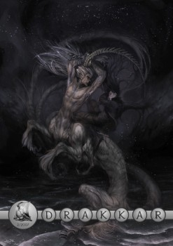

--- 
Title: Úvodní slovo
Authors: Zrzavec
Tags: úvodník
Color: red 
Discussion: http://rpgforum.cz/forum/viewtopic.php?t=4528
Fulltext: yes
--- 
Mám tu čest vás přivítat již u druhého čísla internetového dvouměsíčníku o fantasy a RPG hrách, Drakkaru. V poslední době se toho událo jistě hodně. Nejen v našich osobních životech – přichází doba maturit, vysvědčení a pro mnohé i zkoušek a zápočtů. Ale ani pracující čtenáři to nemají lehké. Proto budu rád, pokud vám Drakkar poskytne příjemné a poučné četní – ať jste kdekoliv a děláte cokoliv. Avšak, i v naší redakci se toho událo hodně. A s tím vás seznámím.

Snad první a velmi důležitou věcí je to, že o Drakkaru vyšel i článek v Dechu Draka, který je přílohou Pevnosti. Tento článek vznikl v mé nepřítomnosti a skvěle ukázal, jak funguje spolupráce v Drakkaru – bez možnosti přístupu k internetu jsem kontaktoval Vikinga, ten předestřel problém ostatním a brzy se ozval Zayl, který článek celý sepsal a v předepsaném termínu odeslal. Nejen Viking a Zayl se zasloužili o článek, ale i další pomohli – Dalcor, Gran a Wan-To. Patří jim můj velký dík, protože bez nich by článek v Pevnosti nevznikl.

A co vás čeká v tomto čísle? Pár změn nastalo. Struktura časopisu se příliš nezměnila, vyslyšeli jsme vaše prosby a lecčemu se přizpůsobili. Stejně jako v minulém čísle se dočtete o zajímavých projektech, systémech a snad si přečtete i nějakou dobrou povídku. Smutné je, že článek o První pomoci nebude mít pokračování, ale byl nahrazen něčím (snad) prospěšnějším – rozborem románské architektury. Stejně tak jsme pro toto číslo vypustili zamyšlení, které se objeví v dalším čísle. Ale přidali jsme obsáhlou listárnu, kde si budete moci přečíst deset nejvýznamnějších reakcí na vydání prvního čísla. Další novinkou je, že časopis Drakkar je od tohoto čísla vydáván jak v PDF, tak v HTML formátu. A stejně tak plánujeme zavést i uveřejňování článků na webu. A abych vás namlsal ještě více, pracuje se i na prázdninovém speciálním čísle Drakkaru.

Naše plány jsou smělé, však máme velmi náročné čtenáře a snažíme se pro ně udělat maximum. Proto se nebojte nám psát své reakce, návrhy a nápady na zlepšení či jen pochvaly. Víme, že kritika i chvála je nutná, a proto přijímáme oboje s povděkem a radostí.

Nebudu vás již nyní zdržovat od, jak všichni doufáme, příjemného a dlouho očekávaného čtení. Těším se s vámi na setkání u dalšího čísla.

----
V PDF verzi naleznete navíc jako přílohu několik papírových figurek připravených k vytištění.
