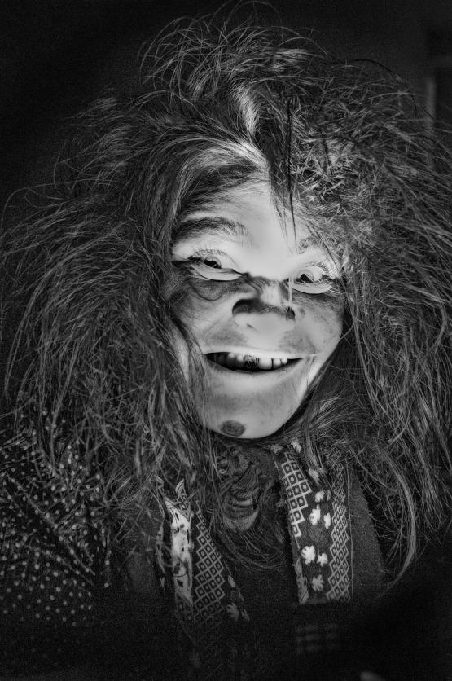
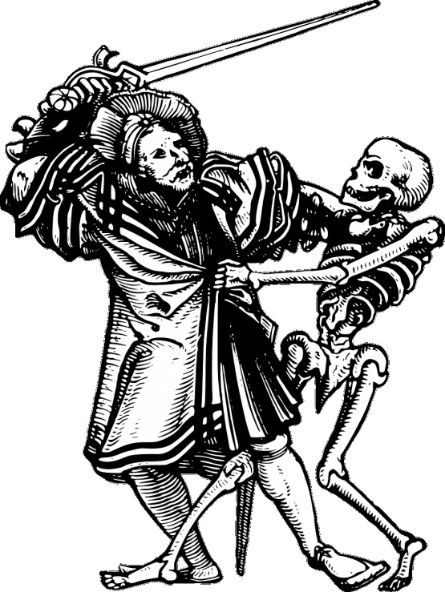
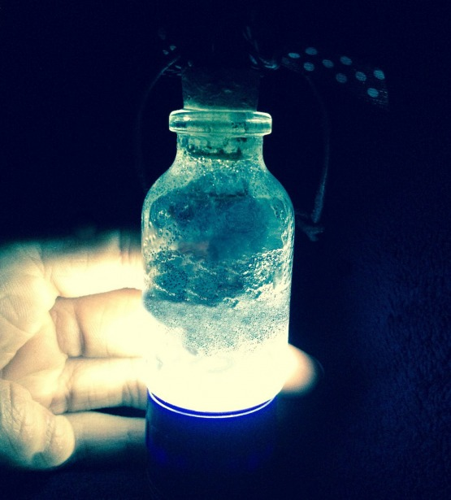
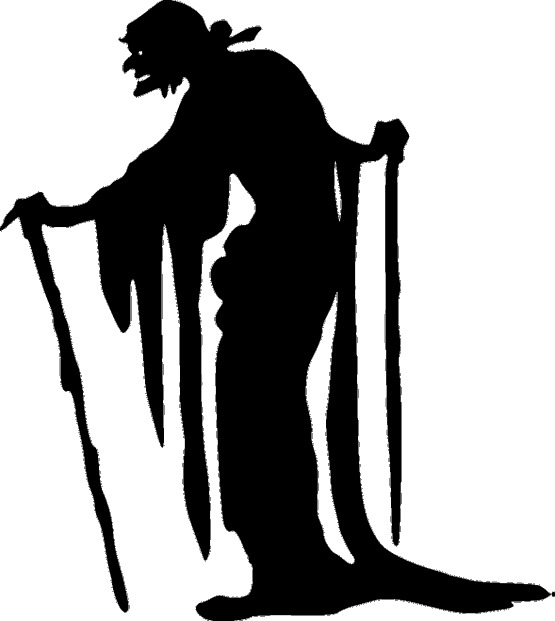
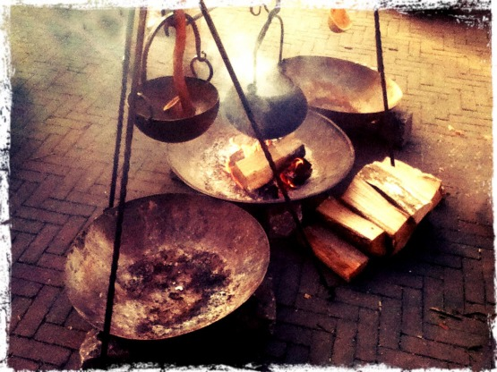

Prosila mě Archileska, bych jí poradila, že jest na jistého člověka laskava, ale on na ni odpolu laskav. Radila jsem, aby vzala ze psa umrlého chlupy a kosti a téhož psa hlavu. Z těch kostí aby nastrouhala prach a jej do piva dala, skrze hlavu psí třikrát prolila a jemu píti dala, že na ni laskav bude.

Výpovědí jisté Magdalény, která byla roku 1556 vyslýchána v Nymburce pro podezření z čarodějnictví, začínám článek o čarodějnických kouzlech a pověrách evropského novověku. Téma se lehce dotýká tématu démonické magie, jehož jsem se dotkl ve 27. čísle Drakkaru v článku [Středověká nekromantie](http://drakkar.sk/27/stredoveka-nekromantie.html). Vzhledem k obsažnosti tématu berte můj příspěvek jako stručný úvod či ochutnávku problematiky, rozhodně se nejedná o vyčerpávající pojednání.

Pověry a čáry měly své místo v lidském životě doslova odnepaměti a v evropské kultuře byly silně přítomné velmi dlouho. Ačkoli christianizace přinesla značný tlak na odstranění či přizpůsobení všeho, co souviselo s předkřesťanskými zvyklostmi obyvatel, rozhodně nezpůsobila žádný úbytek pověrečného chování. Až racionalizace a industrializace společnosti odsunula nadpřirozeno na okraj lidského vědomí.

V již zmiňovaném článku Středověká nekromantie zmiňuji klasifikaci na přírodní a démonickou magii, kterou pro usnadnění zavedli dnešní badatelé. Zatímco v démonické magii jde o vědomé vzývání nadpřirozených bytostí (andělů, ďáblů, démonů, pohanských božstev), přírodní magie je širším pojmem označujícím tak trochu „vše ostatní“. Tedy povětšinou snaha dosáhnout konkrétních cílů nadpřirozeným způsobem pomocí obřadů, ovšem bez personifikace nadpřirozených sil. Někdy jsou vzývány živly, zaklínány nemoci a podobně, ale nedochází ke zjevování démonických bytostí. Není pochyb o tom, že osoby, spojované později s čarodějnictvím, provozovaly (pokud vůbec) především to, co označujeme za přírodní magii. Mezi tyto osoby patřily nejen obligátní „babky kořenářky“ a „porodní báby“, ale i běžní sedláci, lidé žijící na okraji, jako lesní pracovníci, kováři a mlynáři, a dále lidé neusedlí, tuláci, potulní klerici, cikáni a podobně.

V historii evropského středověku a novověku můžeme pozorovat jev, který by se dal nazvat démonizací magie. Původní lidové obřady a rozličné magické úkony, jasně klasifikovatelné jako přírodní magie, jsou postupně zvnějšku formovány do podoby ďábelské. Rozhodující je přitom tlak představitelů církve (především kazatelů, exorcistů a inkvizitorů), jejíž doktrína oficiálně neuznává jiné nadpřirozené síly než božské a ďábelské. A protože zázraky jsou vyhrazeny Bohu, který je koná skrze vzácné jedince, poustevníky, mystiky a světce, je jakákoli magická činnost prostých lidí krajně podezřelá. V novověku, což je období, kterým se v článku hodlám zabývat, je čarodějnictví postupně vydefinováno jako užívání magie za pomoci ďábla. Naproti tomu pověrečné chování je považováno za mnohem lehčí prohřešek, který je v lidové kultuře tolerován (ne-li vyžadován) a církevními i světskými autoritami trestán jen mírně, pokud vůbec.

Hranice mezi čarodějnictvím a pouhou pověrčivostí ovšem byla velmi tenká. Například v konkrétních soudních procesech velmi často záleželo pouze na tom, k čemu všemu se obviněný pod tlakem vyslýchajících přiznal. Ze soudních zápisů je patrné, že mnohdy skončili špatně ti, kteří se snažili z obvinění vymluvit nebo vyslýchající přechytračit. Naopak účinná byla, jak se zdá, metoda zapírání a předstírání naprosté nevědomosti.

Protože v šestnáctém a sedmnáctém století byla stále většina obyvatelstva Evropy negramotná, byly magické spisky a knihy jen okrajovým prvkem lidové magie. Klíčovou roli hrálo ústní předávání postupů a návodů. Používané pomůcky byly často podobné pomůckám k démonické magii, tedy části rostlin, zvířecích těl, neobvyklé nerosty. Také se ale ke kouzlení používaly předměty denní potřeby:

* Nůž zabodnutý do trámu chránil proti uřknutí matku a dítě při porodu, krávy při dojení, máslo při stloukání a podobě.
* Koho bolí hlava, proleje vodu koštětem a umyje se jí.
* Kdo náměsíčník jsa v nocech měsíčních ven vychází z příbytku svého, na tohož dveře ať se přibije podkovka, a nebude vycházeti.

Cíle lidové magie se do jisté míry shodovaly s cíli nekromantů: rozbití přátelství či lásky dvou osob, způsobení nemoci nebo bláznovství, vzbuzení lásky (nebo spíš tělesné touhy), snaha přičarovat si bohatství, čarovné odhalení škůdce nebo zloděje, věštění budoucnosti, získání informací o blízkých na cestách. Pochopitelně méně nebo vůbec se vyskytuje touha po neomezeném vědění a tvorba čarovných iluzí. Samostatnou kapitolou je léčení chorob a neduhů, kde se léčebné postupy mísí s pověrami a čarováním:

Proti vzteklému psu: Toto jest výborné proti ukušení psa vzteklého, slova tato řecká napsaná na papieře, i dán hovadóm v chlebě, a lidem na perníce psaná černidlem, a ta slova na perníku napsaná dáti sniesti:

† kyron † kyrion † kaframaton † kamazan † zam † kyzan † kyzion † kafracon † Taito †

Kdo trpí na neduh nazvaný krtice a chce ho pozbýti, ať si opatří z krtka před svatým Jiřím chyceného játra a žluč, ty utře a na neduh přiloží. Když přílep uschne, vezme se a před sluncem východem nese ho někam do hromady od krtka vyryté, ten se do té krtiny zahrabe, a na ni trpící na holá kolena klekne a třikrát Otčenáš a Zdrávas se pomodlí, potom odejde pryč, neohlížeje se. To musí opakovati třikrát vždy ráno před sluncem východem; kdyby krtek přílep vyryl ven, musí ho zase do oné hromady vtlačiti, až tam zůstane a neduh se ztratí.

Čarodějnictví (ve významu působení škody pomocí kouzel) je velmi starý fenomén a rozhodně se neomezuje pouze na židovsko-křesťanskou kulturu. Můžeme vést diskuze o tom, kolik osob obviňovaných z čarodějnictví se takovými věcmi skutečně zabývalo, nicméně dochované návody jsou jasným dokladem o existenci takových pokusů:

Způsob očarování, aby se člověk zbláznil: Vezme se prsť z čerstvého hrobu na den sv. Jana Křtitele a čertův kořen, který se nalezne pod lískovým keřem, smíchá se spolu a hodí se tomu, kdo má býti očarován, za krk; člověk se hned zblázní.

	Chceš-li poslat na někoho vši, musíš jíti o 12 hodinách na krchov a musíš vzíti kostku z nebožtíka z rodiny toho, na koho je chceš poslati. Kostku na popel spal a tím popelem když poprášíš toho, komu poškoditi chceš, dostane vši, jichž se nezbaví až do smrti. Ty vši jsou tak žravé, že mu vyžerou hlavu až do mozku, pak ten člověk umře.

V roce 1428 byla souzena kvůli čarodějnictví jistá Matteuccie Francisci z Todi. Když se podíváme na její recepty, nemůžeme se příliš divit, že byla lidmi udána. Pro léčení nemocí doporučovala použít kost nepokřtěného dítěte, zakopat ji na rozcestí a devět dní nad ní pronášet zaříkání a modlitby. Někdy také zbavovala klienty nemocí tak, že je přenesla na nic netušící cizí osoby, které byly zrovna nablízku. Provozovala i milostnou magii a vyráběla antikoncepční přípravky. Tímto svým uměním si podle všeho slušně vydělávala. Mezi její klienty patřili bohatí lidé ze širokého okolí.

Matteucie Francisci je typickým příkladem čarodějky, která kouzlí v zájmu platících klientů, bez ohledu na nějakou vyšší morálku. Takové osoby si pochopitelně nadělaly mnoho nepřátel, třeba už jen tím, že pomohly jedné z nesvářených stran. Riziko obvinění, udání úřadům, či dokonce lynčování, zde bylo značné.

V patnáctém století ještě čarodějnictví nebylo všeobecně spojováno s ďáblem (_Kladivo na čarodějnice_ bylo vydáno až roku 1486). Zásahy proti čarodějům tedy nebývaly příliš důrazné, pokud nešlo o vážná obvinění (vražda). Inkvizice sice už nebyla přímo pod kontrolou papeže a církev se zmítala v problémech (schizma, dvojpapežství), nicméně stále byl přítomen jakýsi oficiální názor církve , že magie a čarodějnictví nemají reálnou moc a jde jen o iluze poblouzněných jedinců (Canon Episcopi z 10. století). Proto byly soudy a pověření invkizitoři ve věci čarodějnictví poměrně zdrženliví, někdy až vyloženě laxní.

Názory biskupů a církevních vzdělanců ovšem zdaleka neodpovídaly lidové víře, či spíše pověrečnosti. Není pochyb o tom, že strach z očarování byl mezi obyvatelstvem velmi rozšířený a byl denně prožívanou skutečností. Nemoci lidí a dobytka, neštěstí a neúroda byly připisovány zlým silám, ať už v podobě nadpřirozených bytostí (duchů, démonů, strašidel) nebo kouzlících osob (čarodějnic, tuláků, cikánů, kleriků...). Běžný byl tak výskyt osob, které o sobě tvrdily, že jsou vybaveny mocí tyto zlé síly odvracet. Kromě usedlých obyvatel šlo často i o potulné kleriky, řádové bratry a podobně.

Jakoby organizovaného až sektářského charakteru byli tito „dobří čarodějové“ ve Furlandsku (území v dnešní Itálii na pomezí se Slovinskem). Jedná se o natolik zajímavé téma, že u něj chvíli zůstaneme. Ze soudních záznamů vyplývá, že sami sebe nazývali „benandanti“ (z „bene andanti“, neboli „dobří chodci“) a považovali se za jakési vyvolené a Kristem pověřené ochránce lidí před čarodějníky (malandantes). Zachovalo se několik výslechů inkvizitory ze 16. a 17. století, v nichž tito benandanti přinášejí pozoruhodná svědectví.

Ústředním motivem je vyvolení. Benandanty se stávají lidé, kteří se narodili v plodovém obalu. Je tu tedy společný motiv se zmrzlíky, nezranitelnými muži, které známe ze zaalpského prostředí. V něm ovšem netřeba hledat nic víc než doklad všeobecné pověrečné pozornosti, která se takto narozeným lidem přikládala. Jakmile dosáhli benandanti určitého věku, došlo k jakési iniciaci. Byli kontaktováni starším benandantem (či rovnou nadpřirozenou bytostí) a v noci odvedeni na místo (louku, mýtinu), kde docházelo k rituálním bojům s čarodějníky. Benandanti bojovali obvykle lodyhami fenyklu, zatímco čarodějníci stvoly čiroku, v případě žen pak někdy lopatami na pečení chleba či tyčemi na čištění ohniště. Na výsledku boje závisela budoucí úroda. Bitvy se prý odehrávaly v postních dnech před čtyřmi velkými církevními svátky. (Tyto motivy se shodně objevily v mnoha výpovědích na sobě nezávislých.)

V těchto bojích hráli benadanti jasně kladnou roli. Někdy byli na místo odvedeni přímo andělem a bylo jim řečeno, že bojují ve jménu Krista a pro dobro lidí. Již se neshodovali v tom, zda na místo odcházeli fyzicky, či zda šla pouze jejich duše, zatímco tělo zůstalo ležet v posteli. Na požadavky vyšetřovatelů, aby udávali čarodějníky z nočních srazů, odpovídali benandanti výmluvami. Prý nemohou prozradit své nepřátele z obavy před pomstou. Čarodějníci se totiž umějí udělat neviditelnými a v této podobě ztlouci své nepřátele. (Tento motiv najdeme i v pověstech z českých zemí.)

Ze soudních záznamů je patrné, že vyšetřovatelé si s benandanty nevěděli příliš rady. V té době již byla vydefinována podoba čarodějnického sabatu, která se ovšem neshodovala se svědectvím benandantů. Je zřejmá snaha zařadit vyslýchané do této škatulky. Padají otázky, zda se dotyční před cestou natírali mastmi, zda se na místě klaněli nějakému pánu (rozuměj ďáblu) či zda byli nuceni zříci se Krista. Někdy byli benandanti otázkami natolik zmateni, že přiznávali a odvolávali, různě si protiřečili atd. Takové procesy se často táhly s přestávkami i několik let (dotazovaní byli obvykle stíháni na svobodě, řečeno dnešní terminologií) a končily buď mírnými tresty (krátkým vězením, domluvou), nebo byly odloženy na neurčito. Jen v několika případech se vyslýchaní nešťastníci opakovaně přiznali k uctívání ďábla a nakonec skončili na hranici. (Důležitou roli hrál i fakt, že hlavní agendou inkvizitorů mělo být potírání kacířství a nedoporučovalo se jim zabývat se čarodějnicemi. Na území Itálie toto bylo dodržováno více než za Alpami.)

Postupem času se benandanti vyprofilovali jako samozvaní léčitelé, udavači čarodějnic a vysloužili si nedobrou pověst. Byli vnímáni jako potížisté, kteří svým vychloubáním a udavačstvím vnášejí chaos mezi poklidné vesničany. Označené čarodějnice (ženy převažovaly) si stěžovaly u místních duchovních, kteří pak posílali rozhořčené dopisy biskupům a inkvizici. Následné procesy končily spíš trestáním a výstrahami pro benandanty než pro čarodějnice (protože ty obvykle všechna obvinění popíraly). Benandanti prosluli arogancí a cynismem, s nímž požadovali platby za radu proti nemocem a uřknutím. Neměl-li někdo ihned na zaplacení, benandanti ho zpravidla nechali jeho osudu. Koncem 17. století již bylo slovo benandant vnímáno stejně negativně jako „čarodějník“, přestože původně bylo jeho protikladem.

Jsme tu svědky již zmíněné démonizace, kdy se pod tlakem církevních autorit původně pohanské obřady (boje dvou skupin lidí o budoucí úrodu) transformují v ďábelské sabaty. Čarodějnický sabat byl fenoménem, který se pronásledovatelé čarodějnictví snažili přesně popsat a definovat. Jeho reálný základ je tedy zastřen myšlenkovými konstrukty inkvizitorů, do nichž se snažili vměstnat všechny typy podezřelých, a to včetně benandantů. Badatelé se dodnes neshodnou na tom, zda popisovaná setkání se skutečně v nějaké formě odehrávala, či zda šlo jen o výplod myslí omámených drogami, popřípadě duševně nemocných (odhlédněme teď od jedinců, kteří si svou účast na sabatech vymýšleli, aby přilákali pověrčivou klientelu). A co je ještě zajímavější, tato diskuze existovala již v 16. století. Rozvoj medicíny a humanismu spolu s děsivými zkušenostmi honů na čarodějnice, daly vzniknout pochybnostem o reálnosti sabatů (Johann Weyer byl první, kdo označoval ženy obviněné z čarodějnictví za duševně nemocné). Tyto názory se šířily mezi katolíky (Cornelius Loss) i protestanty (Reginald Scot). Zároveň byly napadány postupy inkvizice a bylo poukazováno na to, že nevinní, pokud se dostanou do jejích spárů, nemají o moc větší šanci na osvobození než zločinci (Friedrich Spee).

K takzvaným benandantům se okrajově váže další zajímavý fenomén lidové slovesnosti, a sice průvody mrtvých. Ale nejdříve pár slov na úvod o samotných průvodech. Děsivé zkazky o procesích zemřelých, kteří táhnou po nocích krajem, najdeme v různých podobách po celé Evropě (a později samozřejmě i v Americe, viz popkulturní odkaz v písni Ghost Riders in the Sky). Starší varianty ze severní Evropy uvádějí družinu válečníků vedených Wotanem. Pozdně středověké a novověké regionální variace nejčastěji mluví o lovcích („Divoký hon“) či obecně zemřelých. Vůdcem bývá buď přímo ďábel, některý z místních legendárních tyranů (např. hrabě Arnau v Katalánsku, Hans von Hackleberg v Německu) nebo démonizovaná postava pohanské mytologie (Diana, Perchta).

Některé pověsti uvádějí, že průvod mrtvých měl moc vzít s sebou duše živých lidí, zatímco spali, a ukázat jim peklo, očistec a ráj. Tam se tito lidé obvykle setkali se svými blízkými zemřelými, dozvěděli se, jak se jim daří (nebo spíš jak moc trpí), a byli nabádáni k modlitbám a nápravě života. Ve výpovědích některých čarodějníků a benandantů se vyskytuje tvrzení, že byli k cestám na noční shromáždění vyzváni houfem zemřelých vedených nejčastěji ženskou postavou (Diana, Perchta, Holda). Zde se setkali s dušemi mrtvých příbuzných a sousedů, kteří je prosili o nápravu života. Oklikou se tak prastarý mýtus spojil s konceptem sabatu a tím zapadl do schémat vytvořených církevními autoritami.

Zajímavou pozdější transformací je příběh takzvaných bokkenrijders, což byly skupiny lupičů, které řádily na území dnešního Nizozemí, části Belgie a Německa. Tito bandité využívali legendu o ďábelských přízračných lovcích, aby vzbudili větší hrůzu u svých obětí, venkovských obyvatel. Výsledkem bylo, že byli soudy obviňováni kromě loupení také ze spojenectví s ďáblem a bylo s nimi zacházeno mnohem přísněji než s běžnými lupiči. Čarodějnické procesy připomíná i skutečnost, že bokkenrijders byli mučením nuceni udávat další společníky, což vedlo k mnoha falešným obviněním.

Bude mě těšit, pokud se tento článek stane inspirací vašich her či literární tvorby. Pokud byste téma chtěli studovat podrobněji, je to velmi snadné: pozůstatky čarodějnických legend a pověr můžeme najít v mnoha sbírkách lidových pověstí. Pro inspiraci tedy není třeba chodit do odborných zahraničních publikací, ale stačí sáhnout do knihovny (pra)rodičů nebo zajít do antikvariátu. Čím dál více materiálu se objevuje také přímo na internetu, stačí zadat do vyhledávače třeba „pověst o čarodějnicích“ a výsledky se jen sypou...
