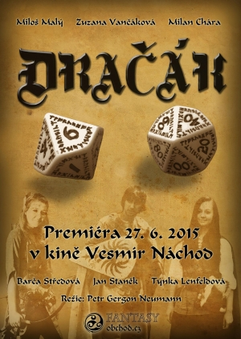

---
Title: "Dračák, článek o filmu"
Authors: Petr „Gergon“ Neumann
Tags: film, recenze, Dračí doupě
Color: green
Summary: Film Dračák vypráví o skupině hráčů, kteří se sejdou, aby si zahráli Dračí doupě. Na počátku se sejde poměrně nesourodá družina. Postupně se naučí spolupracovat a dovést své první dobrodružství ke zdárnému konci.
Fulltext: yes
----
Film Dračák vypráví o skupině hráčů, kteří se sejdou, aby si zahráli Dračí Doupě. Na počátku se sejde poměrně nesourodá družina. Válečník, který myslí pouze na sebe a jde po zkušenostech a úrovních pro svou postavu, bez ohledu na ostatní. Zlodějka, zkušená hráčka, která si chce skutečně hru užít, a hraničářka, která je ve světě Dračího doupěte naprostým nováčkem a snaží se vyrovnat s pravidly i systémem hry. Postupně ovšem dojde ke změnám nejen mezi postavami, ale i v chování hráčů mezi sebou. Družina se naučí spolupracovat a dovést své první dobrodružství ke zdárnému konci.

Dějové linie reálného světa a fantasy se prolínají přirozeným způsobem a vykreslují vztah hráčů k jejich postavám. Ze začátku jsou více vidět rozdíly mezi reálnou linkou a herní, ale postupně, jak se hráči vžívají do svých postav, se stává fantasy svět přirozenějším.

Film Dračák najdete

<ul>
<li>na <a href="https://youtu.be/z_5-5Fko6Zo">YouTube</a> </li>
<li>i na <a href="http://www.csfd.cz/film/52518-dracak/">ČSFD</a></li>
</ul>

Může se zdát, že se nejedná o žádný převratný příběh, který by oslovil geniální myšlenkou nebo překvapivým zvratem. Ale to ani nebylo účelem. Smyslem filmu bylo totiž předvést hru Dračí doupě tak, jak ji zná většina hráčů. A to se povedlo na 100%.
 
Během let jsem viděl několik filmů se stejnou tématikou. Některé lepší, jiné horší, ale u všech jsem měl zásadní problém. Kvůli dramatu filmu se stávalo, že se hráči hádali, posedávali u piva a víc je zajímaly hádky než hra, případně hráči dělali nesmyslné akce, aby dostali násilím do filmu nějakou humornou scénu. A v takových situacích jsem si říkal dvě věci, za prvé, že takhle přece naše hra nevypadá, a za druhé, že pokud tohle uvidí někdo kdo hru nezná, tak si o nás hráčích bude myslet jen to nejhorší. Takové filmy mohly přinést divákům předsudky o hráčích RPG. A to jsem chtěl změnit. Proto by v našem filmu měli hráči vypadat jako skupina normálních inteligentních lidí, kteří si jdou zahrát velmi zajímavou hru. Stálí hráči by měli poznat příjemnou atmosféru a zavzpomínat na svá vlastní sezení u Dračího doupěte. A lidem, kteří o RPG nikdy neslyšeli, by zase mělo být srozumitelně ukázáno, jak taková hra funguje, jak to probíhá a co mohou od RPG očekávat, pokud by je to zaujalo a chtěli by si také zahrát.

Film vznikal zhruba dva roky. Od prvních příprav scénáře, kostýmů a lokací přes shánění herců i štábu až po premiéru v kině. První etapa předprodukce trvala odhadem přes půl roku. Základní myšlenka již byla připravená a museli jsme dát dohromady všechno, co na natáčení budeme potřebovat, a mít to připravené, protože samotné natáčení jsme chtěli stihnout během pár dnů na jeden zátah a potom už by nebyl čas něco dohledávat. Šili jsme kostýmy, vyráběli zbroje, sháněli herce a procházeli lesy okolo Náchoda a vybírali lokace. Nejtěžší bylo vždy najít vhodnou lokaci, která vypadá opuštěně, uprostřed přírody, ale přesto se tam dostaneme s autem a kompletní technikou.
Druhá etapa bylo samotné natáčení. Natáčeli jsme 5 dnů za sebou 12 hodin denně. Z toho celý jeden den byl vyhrazen pouze pro interiér herny a poslední den byl pouze natáčení Pána jeskyně a jeho replik. Tři dny natáčení v exteriérech, z toho jeden pracovna mága a další dva lesy a skřetí tábor.
 
Pro některé bylo natáčení velmi vyčerpávající, neboť například herec hrající válečníka přes den natáčel a v noci chodil na noční do práce, takže v průběhu tří dnů natáčení spal zhruba dvě hodiny denně. Skřeti zase museli v den natáčení být v maskérně již v 5 hodin ráno, abychom je stihli nalíčit a připravit na natáčení od 8 hodin.

Ve skřetím táboře jsme jako rekvizity měli opravdové kosti od řezníka a  skutečné  uzené ryby, takže během pár hodin se nám tábor skutečně hemžil hromadou much, jak je ve filmu také vidět. To sice bylo nepříjemné pro štáb i herce, ale filmu to dodalo reálnou atmosféru skřetího tábora. Zvuk mušího bzučení byl nahrán zvlášť a je zvukovým podkresem pod celou scénou ve skřetím táboře.

Poslední etapa postprodukce trvala celý rok. Ale většinou to bylo způsobeno spíš nedostatkem času než náročností postprodukce. Během této doby bylo nutné hlavně synchronizovat zvuk s obrazem, protože zvuk se natáčel na externí mikrofon. Potom samozřejmě střih, zvuky, hudba a efekty.

Celkově se náklady na film vyšplhaly na 9000,–.

Následovala  premiéra  v  kině,  na  kterou jsme pozvali všechny herce i celý štáb. Dokonce přišlo i docela dost dalších lidí, kteří chtěli náš film podpořit a podívat se na něj na velkém plátně.  Po  uveřejnění  filmu  na  internetu  nás velmi mile překvapil velký zájem a nadšené reakce diváků. Právě oni nás přesvědčili, že jsme svou práci udělali dobře, protože reagovali tak, jak jsme si přáli, aby diváci reagovali: „Takhle je to u nás taky.“ „Přesně takhle to znám.“ „Zase bych si někdy zahrál Dračák.“ Přesně pro tento typ lidí jsme film dělali a jsme rádi, že se jim líbí. Další cesta našeho filmu vedla na pár festivalů – Gamecon a Festival fantazie. A dále se chceme účastnit co nejvíce soutěžních festivalů amatérských filmů. Naším cílem je oslovit široké publikum, protože teď ze všeho nejvíc potřebujeme podporu lidí okolo, kteří by se s námi pustili do dalších projektů, protože lidí a techniky máme stále nedostatek. A bez jednoho ani druhého další díl vzniknout nemůže. Nicméně věříme, že se podaří opět sehnat vše potřebné a další díly budou. Vždyť naše družina je teprve na začátku své cesty a mají před sebou ještě mnohá dobrodružství.

**Poznámka:** Petr „Gergon“ Neumann je režisérem filmu.
