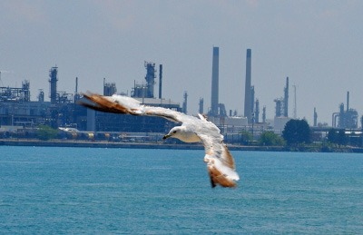

Zavítala Vaše družinka na neznámé pobřeží, kde ani pán jeskyně neví, jaké městečko se může vyskytnout? Jste už delší dobu v přístavu a chcete trochu narušit klid? Nebo jen ozvláštnit pobyt u moře nějakou zajímavou tematickou figurkou? Pak můžete využít následující tabulky, stačí hodit k100 a podívat se, co se také může stát. Na závěr je přidaná ještě tabulka pro hry z moderní doby a tabulka pro počasí na moři. K přípravě dobrodružství na mořském pobřeží lze využít též článek [Přístavní zápletky](http://drakkar.sk/42/pristavni-zapletky.html) z Drakkaru č. 42, případně obecnější informace o přístavech jako takových z článku [Přístavy a přístaviště](http://drakkar.sk/41/pristavy-a-pristaviste.html) (Drakkar č. 41).

# Přístavy

* 1/76	Má to být malý místní přístav, tak proč místní tolik dřou na stavbě obrovského mola?
* 2/77	Malinkatý malebný rybářský přístav, kterému vévodí jediná klasická konoba s výbornou rybí polévkou v nabídce. Tak proč se tu družinka cítí tak stísněně? (Třeba proto, že na klid a přátelské sousedství není vůbec zvyklá)
* 3/78	V kdysi blahobytném rybářském přístavu je všechno jinak, ryby už nikdo neloví, všichni se honí za Zlatým delfínem – a městečkem se šíří hlad.
* 4/79	Významný dopravní přístav je zablokován ledovcem, který se náhle objevil v ústí zálivu.
* 5/80	Přístav má být vcelku rušný, ale v tomto je pusto, žádní lidé, žádné lodě. Jinak je vše na svém místě, oběd na plotně...
* 6/81	Přístavní bazén je okupován mládětem mořského hada, námořníci se jej bojí zabít ze strachu z pomsty jeho rodičů.
* 7/82	Malý, okrajový přístav, ale přesto v něm někteří lidé náhle zbohatli. Může to souviset s nárůstem prodeje drog v nedalekém městě?
* 8/83	Velký a rušný přístav začal náhle upadat. Čím si jen zasloužil přízeň zákazníků nedaleký konkurent?
* 9/84	Dva přístavy jsou si podobné jako dvojčata, každý na jedné straně zátoky. Který pak získá licenci královského poštovního přístavu?
* 10/85	Byl to vždy docela spokojeně vyhlížející ten druhý přístav vzadu, ale s novými cly není pro stříbrné medaile místo.
* 11/86	Tuctový přístav, převážně rybářský, ale obyvatelé se chovají až neskutečně agresivně, verbální konflikty neustávají a k ráně nikdo nemá daleko. Jejich agresivita jistě není přirozená.
* 12/87	Tuctový přístav, převážně rybářský, nyní ale špinavý, lodě neopravované a obyvatelstvo se jen plouží sem a tam. Na pár místech lze najít podivné kresby, snad znázorňující velké vlny.
* 13/88	Menší přístav, rybáři odmítají vyplout po sérii špatných znamení a místní hladoví, napětí se dá krájet.
* 14/89	Někdo vykradl místní poštovní stanici; jestli se ztracené zásilky rychle nenajdou a nevrátí, tak fatálně utrpí pověst přístavu.
* 15/90	Přístavnímu městečku se začalo dobře dařit, hledá něco, cokoliv, jak si udržet přízeň štěstěny.
* 16/91	Dřevařský přístav, spousta slušně placené a fyzicky náročné práce a smrtelně vážní lidé kmeny jsou těžké a není s nimi lehká práce.
* 17/92	Rybářská osada je na pokraji hladomoru – kdosi nebo cosi plundruje místní loviště.
* 18/93	Kdysi rušný přístav připadl místnímu klášteru, nyní je uklizený, čistý, dobře opravený, ale žádné bordely, žádný alkohol a celkově přísný režim odrazuje námořníky.
* 19/94	Kdysi úspěšné přístavní městečko se propadá do bídy, rybáři nemohou nic ulovit, přepravci ztrácí zákazníky – a to všichni mají zbrusu nové magické pomůcky!
* 20/95	Ves jménem Sluneční přístav na půlnoční straně Bílých pahorků zní podivně, ale název je pravdivý – půlka vesnice leží pod povrchem, na břehu podzemního jezera.
* 21/96	Malý přístav na skalnatém pobřeží má jen jediný účel – zásobovat tři velké majáky v okolí; za každých okolností musí být majáky zásobeny jídlem, pitím a obrovským množstvím lampového oleje.
* 22/97	Tento přístav mohl být v klidu zapomenut všemi, kdyby se dosud stejně bezvýznamný hrad uprostřed zátoky nestal věznicí pro prominentní politické vězně. Od té doby je vše podřízeno potřebám hradu.
* 23/98	Velké přístavní město slouží momentálně jako shromaždiště válečné flotily, proto jej nesmí nikdo opustit.
* 24/99	Impola je pyšné a prosperující přístavní městečko, velká část jeho pýchy pramení z prastarého systému opevnění, které jejich přístav opatřilo řetězovou bránou. Vždy bezpečný přístav se tak stal vyhledávanou zastávkou mnoha obchodníků. Ovšem nedávno se ve věži, která řetězový systém ovládá, usídlili duchové či nějací jiní pekelníci a řetězová brána je pod jejich kontrolou nebezpečím.
* 25/100	Taurnia je pyšné a prosperující přístavní městečko, velká část jeho pýchy pramení z prastarého systému opevnění, které jejich přístav opatřilo řetězovou bránou. Vždy bezpečný přístav se tak stal vyhledávanou zastávkou mnoha obchodníků. Jenže řetězová brána se nedávno rozbila, a pokud se to rozkřikne, tak je konec dobré pověsti i bezpečí.
* 26/51	Malý přístav u ne již tak malého městečka je přeplněn k prasknutí, ač místa na jeho zvětšení, stejně jako lidí a materiálu, je po ruce dost.
* 27/52	Přístav Kebork je slušným královským městem, jen jeho karanténní stanice je poněkud přeplněná. Jsou cizinci opravdu nemocní, nebo je za tím něco jiného?
* 28/53	Brestina je od zbytku země oddělena palisádou, chráněnou královskými vojáky. V přístavu se prý objevila zvlášť nebezpečná forma moru.
* 29/54	Nový tři sta stop vysoký maják u přístavu Trubeg je vítaným pomocníkem každého lodivoda, ale kromě námořníků vábí k přístavu i nájezdy mořských ďasovců, pár stop vysokých, ale o to agresivnějších obyvatel moří, a občas jim pomáhají i obávaní mořští trolové.
* 30/55	Ostronosé pobřeží není příjemné místo k životu, v horách jsou početné skřetí kmeny a ani místním nevadí častá ztroskotání lodí, proto tábor Červená 5, který má zbudovat maják na Větrném útesu, není nejbezepčnějším místem k životu.
* 31/56	Por Manzana, malinkatý přístav, zažívá nebývalý boom, neb se mezi námořníky stala velmi populární místní jablka bezpečného návratu. Problém je, že jabloně nemají dost plodů.
* 32/57	Malé rybářské městečko docela spokojeně prospívá, jen nikde není vidět žádná loď. Místní totiž mají dohodu s vůdcem místních kosatek – nebudou lovit na moři, za to jim kosatky naženou ryby do sítí u břehu.
* 33/58	V sítích místních rybářů uvízlo a zemřelo několik rybolidí – z rasy, která s člověkem přichází do styku minimálně, ale o to krvavější střety to jsou. Nikomu už se moc na další lov vyplouvat nechce.
* 34/59	Mangor, přístavní městečko, které se nikdy dlouho nezdrží na jednom místě. Je tvořeno prámy, loděmi, vory a podobnými věcmi a neustále se přesouvá podle toho, jak se mění delta řeky Nektary. Slouží k překládání zboží z vnitrozemí na námořní lodě.
* 35/60	O osadě Oslit málokdo slyšel a ještě méně lidí se odsud kdy vrátilo, okolí je totiž zamořeno lidožravými tuleni. Nebo snad to platí i o samotné vesnici?
* 36/61	Městečko vypadá jako klasický antický přístav, má prostě všechno, jak má mít, až na to, že nemá moře. Dá hodně práce vypátrat, že obrovská sníženina, u níž stojí, se kdysi dala (a třeba ještě dá?) uměle zaplavit, neboť sloužila k pořádání námořních gladiátorských her.
* 37/62	Přístavní městečko je zoufalé – vilejši a šášně, které najdete v každém přístavu, se zde nějak rozmnožili a narostli. Jsou zhoubou pro každou loď která tu kotví.
* 38/63	Věří se, že Západní ostrovy jsou nejzápadnější pevnina vůbec, dál už je jen širý oceán. Soumračný přístav je pak nejzápadnější výspa Západních ostrovů a zdejší nejen že vědí, že dál na západ jsou další země, ale taktéž vědí, že obrovská válečná flotila Pána Západu je na cestě.
* 39/64	Přístavní město poblíž ústí větší řeky bylo zničeno na dálku patrným ohnivým výbuchem. Nikdo neví, co se stalo, ale všichni se ptají, kdo disponuje takto ničivou zbraní a zda se bude útok opakovat. A uvěří družince někdo, že v moři jen explodoval nahromaděný metan?
* 40/65	Evantrop – ano, je to přístav, ale proč je ho většina na moři? Na pevnině jsou vlastně jen stáje a dílny na výrobu a opravu kočárů. Navíc obehnané vodním příkopem.
* 41/66	Pro přicházející družinku jde až o podivně klidné městečko. Dalo by se říci až mrtvě klidné. Výron nahromaděného CO zabil vše živé. Bude se to opakovat, nebo je na pár set let opět bezpečno?
* 42/67	V Dadamově postavili nedávno nové luxusní vnitřní molo, vypadá krásně, má obsloužit mnoho lodí najednou, a to rychle. Realita je ale taková, že z něj vypadávají prkna, trhají se provazy a několikrát zvětšovaná parta opravářů má stále plné ruce práce. Asi nebyl nejlepší nápad použít dřevo z lodí nedávno potopených v krvavé námořní bitvě.
* 43/68	Obyvatelé Milétu nejsou přímo nepřátelští, ale dávají jasně najevo, že cizinci nejsou příliš vítáni, vyřídit si svoje, zaplatit a pryč. Nechtějí totiž přijít o své tajemství – v okolních zátokách lze sbírat Afroditinu pěnu, látku se silnými afrodisiakálními účinky.
* 44/69	Obyvatelé malého přístavu na odlehlém pobřeží trápí podivný kašel. Družinka jej však již někde slyšela, právě takhle přišel mor i na jižní pobřeží.
* 45/70	Městečko Vasjen je rozpolceno – lidi potřebuje jak přístav, tak doly. Obě strany sahají k lecjakému triku, aby si zajistily pracovníky.
* 46/71	V Kelanzintu se dělají ty nejlepší plachty na světě. Jejich tajemství by chtěl znát každý, proto jsou místní více než podezřívaví.
* 47/72	Vatleros byl ještě nedávno významný přístav, zdejší doky dokázaly stvořit ty nejlepší válečné galeony v celém království, ale poté, co válka skončila, jsou již doky k nepotřebě.
* 48/73	Nikdo vlastně neví, jak to vzniklo, ale přístav Cintoris se stal pohřebištěm lodí, na nic dalšího tady skoro není místo.
* 49/74	Dan Siego byl nejprve obchodní přístav, pak se ale tok zboží obrátil jinam, loviště ryb se taky ukázala nestálá, tak se nakonec stal útočištěm zkrachovalců a ještě podezřelejších existencí.
* 50/75	Harbour of Ending Day je zvláštní přístav, malý, téměř bezvýznamný, vyjma výjimečných příležitostí jednou za několik let, kdy z něj vyplouvá loď, jež odváží krále nebo členy královské rodiny na jejich poslední cestě. Proto jsou budovy větší a vznosnější, než by odpovídalo ekonomice města, a vybudované z tmavého mramoru.

# Lodě

* 1/76	Bachratá loď z hrubých fošen, nemá žádná okna, dveře ani odkryté paluby.
* 2/77	Válečná galéra, pamatující lepší dny, přiváží posádku tvořenou bojovým společenstvem žen, které hledá dobrodružství či záminku k potyčce s muži...
* 3/78	Připluje obyčejná místní bárka, ale podle ponoru naložená po okraj, posádka se tváří jakoby nic.
* 4/79	Malá, původně rybářská šalupa s jedním stěžněm, na ní se plaví sympatická rodinka, prý pro zábavu.
* 5/80	Velká loď hrubých tvarů, její trup je tvořen z podivné šedavé hmoty, která se nejvíce podobá cihlám. Je beton loďařským materiálem budoucnosti?
* 6/81	Královská galéra nepřátelského státu vlajkou žádá o právo vody – krátké zakotvení na méně než jeden den a doplnění zásob pitné vody.
* 7/82	Připluje školní plachetnice, která hledá rekruty, ale bere i příliš mladé chlapce nebo dívky (na prodej do otroctví)...
* 8/83	Připlouvá loď, vypadá to, že je tvořená z netesaného dřeva – celé větvě jsou zakroucené do sebe a mezery mezi nimi vyplněné jakousi hmotou, plachty mají barvu listí. Druidská loď?
* 9/84	S prvními paprsky dne připluje omšelá plachetnice, jen co se vyváže tak se neděje vůbec nic, posádka leží na svých místech a nehýbe se, ožije až se soumrakem.
* 10/85	K přístavu se blíží velmi oprýskaná galeasa (starší již nepoužívaný typ lodi), chová se divně, asi proto, že na ní není posádka.
* 11/86	O tvarech této lodi lze říct, že jsou velmi klasické, byť škarohlíd by možná řekl zastaralé. Ovšem na dokonalém černém laku by nikdo nenašel smítko nebo šmouhu. Spolu s černými plachtami dodává lodi pohřební vzhled. K vylepšení dojmu neposlouží ani posádka s vážností funebráků, bodejť by, když slouží upířímu kapitánovi.
* 12/87	Loď elegantně připlouvá, je vznešenost sama, posádka je zjevně vedena přísnou rukou, ale onoho schopného kapitána není nikde vidět, jen na kormové palubě se rozvaluje veliký šedomodrý kocour.
* 13/88	K přístavu se blíží ta nejpodivnější loď, plachty nemá, zato šíří oblak kouře smrdícího uhlím a navíc je celá z kovu. Trpasličí posádka se snaží dělat jakoby nic, ale nelze zakrýt, že je na své dílo hrdá.
* 14/89	Docela malý dvojstěžník nevypadá vůbec zvláštně, ale jen do chvíle, než si pozorovatel uvědomí, že práci na palubě vykonávají perfektně vycvičené opice různých druhů.
* 15/90	Obchodní karavela připlouvá očividně z daleka. Jaké zboží asi přiváží posádka tvořená opolidmi?
* 16/91	Prostá dřevěná šalupa ze severské borovice je vyzdobená jako nějaký kostel. A nic jiného to také není než plovoucí modlitebna.
* 17/92	Za blížící se bouře vpluje do přístavu nízká dlouhá veslice s jediným stěžněm, znalejší se mohou domnívat, že připlouvá z dalekého severu. Zůstane osamocená, nebo se jich objeví více a dojde k nějakým násilnostem?
* 18/93	Naprosto obyčejná obchodní loď, dva stěžně, objemné boky a posádka… posádka, která jeví překvapivě menší zájem o obchod, zato se čile rozhlíží kolem. Druhý den se začnou ztrácet mladí lidé. Že by skrytí otrokáři? Ne, kanibalové.
* 19/94	Plavidlo patřící skupince gnomů nevypadá zrovna elegantně, spíš jak pracovní stroj než elegantní plachetnice; a co teprve ta podivná kovová koule u jednoho z boků, vždyť má i okýnka, ploutve a nějaká jakoby tykadla. Ten obrovský buben řetězu s ní bude určitě souviset.
* 20/95	Přetížený obchodní plnoplachetník se z východních moří vrátil nejen s nákladem zlata, santalu a perel, ale přivezl taky na čtyři desítky rodin uprchlíků (prý z náboženských důvodů). Převáží touha obchodovat nebo se chránit před jinověrci?
* 21/96	Nenápadná menší loď se snaží tvářit ještě nenápadněji, ale ve velkém nakupuje ovoce, koření a pár technických udělátek. Dá se odhalit, že na palubě funguje palírna. Některé produkty jsou výtečné.
* 22/97	Na lodi samotné není nic divného, byť její plavební rozvrh je lehce neobvyklý. Kdokoliv se vyzná, ví, že v jejích útrobách se skrývá kasino.
* 23/98	Mocný čtyřstěžník zaujme v leckterém přístavu svou velikostí, ale dlouho se nezdrží a zase jede dál. Jen ten, kdo vědět má, se může dozvědět, že se na palubě odehrává krvavé divadlo – aréna na život a smrt, za veliké peníze.
* 24/99	Na pláž poblíž městečka byl vyplaven divný hranatý kovový předmět velikosti malého domu, copak je asi uvnitř?
* 25/100	Fungl nová válečná galéra státu, který je s místními neustále na pokraji války. Na palubě jsou zakryté nějaké nové zbraně... Vyplatí se to očíhnout, nebo pokus o to má být záminkou další války?
* 26/51	Napůl loď napůl pracovní prám stavitelů lavic pro chov mušlí, v posádce lze najít představitele různých ras. Z počátku jsou překvapení tím, že mušlí lavice tady nikdo nezná a nežádá si jejich práci…
* 27/52	Velrybářská loď s opravdu, ale opravdu vystrašenou posádkou.
* 28/53	Rychlý dvouapůlstěžník, vypadá dobře, udržovaně a nebyl by ničím zajímavý, kdyby jeho galionová figura nevypadala přesně jako (postava z družinky, např. ta s nejvyšším charismatem).
* 29/54	Loď s plachtami z železných kroužků, je pomalá, děsivě chrastí, ale plachty opravdu nejdou zapálit.
* 30/55	V přístavu se staví nový královský šestistěžník, vypadá velkolepě, ale všichni jsou nervózní – nikdo se neodváží panovníkovi říci, že loď je příliš veliká a při plavbě se rozlomí.
* 31/56	K molu dorazí loď, na níž je vše vyvedeno s motivy pavouků. A kdekdo z místních říká, že tolik pavouků v životě neviděl.
* 32/57	Obchodní galéra stojí v přístavu pod bedlivou ostrahou posádky i početných zbrojnošů, přitom podle výtlaku je prakticky prázdná.
* 33/58	Z daleka dorazivší plachetnice je plná rychle se kazícího zboží a kupec, jenž si jej objednal, nikde. Kapitán je již zoufalý
* 34/59	Zoufalý kapitán hledá někoho, kdo by vyřešil problém s jeho nákladem, exotické ovoce je totiž plné vajíček neméně exotického hmyzu.
* 35/60	Tato loď již odplula své míle a bez stěžňoví a palubních nástaveb slouží jako prachobyčejné molo. Jaká tajemství skrývá kdysi zjevně mocný trup?
* 36/61	Docela pohledná obchodní galeona byla nedávno zcela přemalována a zjevně dost nakvap.
* 37/62	Na pohled vcelku normální plachetnice, ale při bližším pohledu je patrné, že není tvořena z planěk, ale snad z jediného kusu dřeva – zapracovali zde druidové nebo se někde vyskytují tak obrovské stromy?
* 38/63	Tohle plavidlo by v žádném případě nemělo plavat! Vždyť je z kamene! Ale přesto se pemzovému voru daří na vlnách docela dobře – zejména trpaslíci rádi zaplatí za možnost cestovat lodí ze solidního materiálu.
* 39/64	Do přístavu se přibelhá loď zjevně poničená strašlivou bouří. Zcela vyčerpaná posádka tvrdí, že ji vichřice zastihla minulou noc jen nedaleko od přístavu. V přístavu však nikdo o žádné bouři neví.
* 40/65	Po silné bouři se v přístavu objeví dvě lodě – elegantní a rychlé poštovní plachetnice Siant Nicholas a Sveti Talva. Obě potřebují co nejrychlejší opravy, neb spolu soutěží o titul nejrychlejší poštovní lodi na světě.
* 41/66	Dosti neobvyklá loď s mohutným kovovým sudem místo klasického trupu a v posádce je dokonce několik obrovských chlupatých snégů, kteří na moře nevyplouvají. Navíc loď nabízí čerstvé ovoce a maso z mnoha míst a totéž i nakupuje. Kovává část lodi je na omak studená, hodně studená.
* 42/67	Loď z daleka má jméno po někom z družinky a se zvláštním přívlastkem – např. Donarova Zhouba, Orbinova Sláva, Hrunův Hněv.
* 43/68	Kercinus je šťastná loď, přečká každou bouři, doveze každý náklad, je rychlá a ani vilejši jí netrápí. Je tomu tak proto, že je ze dřeva dubů z posvátného háje. Toto štěstí má však svou cenu, krvavou cenu. Na Sv. Klementa vyžaduje lidskou oběť.
* 44/69	Elegantní třístěžník se střeleckou lávkou mezi stěžni si s sebou veze malou otřískanou šalupu s mohutným ráhnovím. Patří lovcům a obchodníkům se vzácnými ptáky. Je libo rajčí peří do spacáku, vejce orla mořského či vycpaného albatrose královského, ochočeného vodojeda?
* 45/70	Připlouvá elegantní a hbitá loď jménem Poseidonova kočka, podobu kočky má galionová figurína i samotná loď. Psi začínají výt.
* 46/71	Loď neobvyklých tvarů a proporcí s neznámým praporem, posádku tvoří kostliví námořníci. Jaké asi bude mít úmysly?
* 47/72	Loď plná uprchlíků pronásledovaných Nepřítelem. Poskytnout azyl, ale tím přivolat hněv na vlastní hlavy, nebo je nechat nejspíš zemřít na moři?
* 48/73	Zvláštní dvoutrupá plachetnice z dalekých ostrovů připlula za obchodem a platí zlatem a perlami, jako by to byla měď a oblázky...
* 49/74	Dlouho očekávaná loď z královského města přiváží jen náklad hodně agresivních a hladových zombií.
* 50/75	Ze zakotvené lodi volá hlásek mladíka, který byl pověřen střežením nákladu, když všichni ostatní loď už opustili. A z nákladového prostoru se ozývají divné zvuky.

# Lidé

* 1/76	Králův mladší bratr se sice snažil být nenápadný, ale přesto nelze pochybovat, že se sešel s kapitánem Černého žraloka, obávané pirátské lodi.
* 2/77	Na tuctově vypadající velrybářské lodi slouží mladý námořník, který jako by z oka vypadl ztracenému královu synovi
* 3/78	Ne již mladý námořník trvá na tom, že družince vypoví historku o tom, jak plul lovit mořské krávy do krajiny věčného ledu. Když nebude dostatečně rázně odmítnut, tak se na družinu nalepí a vykládá něco pořád dál.
* 4/79	Postarší námořník vypadá dosti znuděn životem, nabízí odměnu za láhev chlastu, který ještě neochutnal.
* 5/80	V zapadlé uličce leží mrtvý mladík, u sebe má prsten ze zlatého dublonu, symbol dříve velice obávaného Pirátského spříseženství. To ale mělo zaniknout před dobrým čtvrtstoletím.
* 6/81	Moře vydá tělo důstojníka královského námořnictva. Po ohledání lze zjistit, že byl popraven roztržením hrdla mooringovým hákem, způsobem typickým pro Jacka Vlasatce, piráta, který dosud působil v mořích daleko odsud.
* 7/82	Mladý důstojník z válečné plachetnice se s družinkou vsadí o nemalou částku peněz. Pokud prohraje, naléhá na družinku, aby se účastnila další jeho sázky s někým jiným, aby získal nějaké peníze zpět.
* 8/83	Na kameni u mola posedává komicky vyhlížející stařík, snad žebrák. Je to ale Beamie, legendární bocman, který sloužil snad na všech lodích království.
* 9/84	V přístavní krčmě sedí mladý muž, osamoceně, hlavu má zahalenou v kápi. Nejpozornější z družinky zahlédne, že nejde o člověka, ale o mořského elfa.
* 10/85	Na okraji přístavní vesnice živoří rodinka mořských skřetů. Tito obávaní mořští lupiči jsou ale dobří námořníci, mohli by být vesnici užiteční.
* 11/86	Pomenší kulatý mužík celý v hnědém odění, připomíná trochu mnicha nebo chudého kněze, jeho oděv je zdoben mořskými korály a jednou hvězdicí.
* 12/87	Kolem hostince se potlouká místní blázen, ještě docela mladý člověk. S trochou snahy lze vyslechnout jeho příběh o tom, jak byl ze své rybářské loďky unesen obrovským ptákem s kovovým peřím a těmi největšíma očima, jaké si lze představit. Ten jej odnesl do svého hnízda, které bylo vlastně lodí. Tam bylo více takových ptáků, stejných, ale vlastně úplně jiných. Lidští služebníci těch ptáků do něj píchali a pak ho stejný pták odnesl zase někam pryč.
* 13/88	Postarší opilý námořník vypadá dosti znuděně životem, nabízí odměnu 300 zl. za láhev chlastu, který ještě neochutnal. Uspokojí ho cokoliv, ale po vystřízlivění chce své zlato zpátky.
* 14/89	V koutě taverny sedí zamlklý chlap jménem Svat. Z narážek místních se dá vytušit, že to není první den, kdy nejlepší a nejodvážnější rybář vesnice místo moře kouká do zdi. Dá to dost přesvědčování, ale nakonec přizná, že na posledním rybaření vyplul příliš daleko, zastihla jej bouřka a byl by se utopil, kdyby jej nezachránila veliká a podivná kovová loď, která se pak před bouřkou skryla pod mořskou hladinu.
* 15/90	Kudůk Zachariáš prodává spoustu zajímavých předmětů, je ve spojení s piráty, nebo má nějaký přístup k vrakům na dně?
* 16/91	Podomní obchodník – píšťalka na vítr, nehořlavá impregnace na plachty, kouzlený kompas, vždy použitelný sextant a další podobné propriety.
* 17/92	Sally Longbrett, asi čtyřicetiletá potápěčka a lovkyně všeho možného z moře. Dřív bývala pohledná, ale náročná práce zanechala ve tváři své stopy, přesto není nehezká.
* 18/93	O’Cean – mlčenlivý šermíř, nenosí zbroj, jeho obouruční katana je velmi obávaná.
* 19/94	Odoahu – mistr kuchař, který tvrdí, že uvaří cokoliv, co pochází z moře. Jeho jídlo je výtečně (většinou) a má (slabší) léčivé účinky.
* 20/95	Daenra, proslulá a drahá krutizána, má tři prý dračí vejce a touží ovládnout nedaleký kontinent.
* 21/96	Po nábřeží se potlouká hezká dívka plnějších tvarů. Ráda si s družinkou popovídá, je přátelská a má pár dobrých rad. Jen její smích je nepřirozeně pisklavý (aby ne, když většinu doby tráví jako delfín).
* 22/97	Ten člověk je od pohledu nepříjemný, podivně drsná kůže, malá očka a strach nahánějící zuby. Jeho chování není o moc lepší. Snaží se vyprovokovat střet, vylákat oběti k vodě, pak do vody a tam je jako žralok zabít…
* 23/98	Lamentující babka je figurka v pravdě komická, šourá se přístavním městečkem a vše hlasitě komentuje. Nezdárníkům hrozí svou holí, na níž je kresba tornáda, unášejícího několik žraloků. Když ji někdo opravdu naštve, či dokonce jí ublíží, hrozí deštěm žraloků a nadaní mohou vidět, že kolem její hole se střádá oblak magické energie…
* 24/99	V menším přístavu pracuje jako dokařský dělník golem. Tito neúnavní pracanti jsou nesmírně vzácní, tak proč je tady?!
* 25/100	Cobbera, dobře vypadající starší pán sebejistého vystupování, hledá velrybářskou loď a posádku na jeden zřejmě náročnější úkol, trvá to dlouho, než se z něj podaří vytáhnout, že kraken, nedávno zabitý královskou družinou, měl údajně mládě, které by velmi rád ulovil.
* 26/51	Slaný Ruud, bodře vypadající prostý obchodník, umí celé hodiny vyprávět o soli, s níž obchoduje, která je nejlepší, jestli je lepší ji drtit nebo mlít. Je docela dost bohatý.
* 27/52	Kraut Nadr, neuvěřitelně chlupatý člověk, hledá práci na lodi mířící do krajiny věčného ledu, je pracovitý a z námořnictví umí snad skoro všechno.
* 28/53	Mladý, sebejistý námořník vykřikuje, že má kompas v hlavě, nikdy se neztratí a vždy nalezne bezpečnou trasu tam, kam je potřeba. Přesto má ale hodně hluboko do kapsy a škudlí každý měďák.
* 29/54	Alchymista neurčitého věku docela zasvěceně trousí poznámky o tom, jak otrávit moře, aby se ryby nedaly jíst. Možná to už někdy dělal…
* 30/55	Ian Nurd býval obávaným pirátem, jenže nyní, ač řádně omilostněn, vysedává okolo přístavu a o práci nemůže zavadit, což je poznat na jeho omšelé kamizole z černé kůže. Pohled pak zaujme především párek kvalitních šavlí.
* 31/56	Starý Benš s každým rád soutěží, kdo vydrží déle pod vodou a vždycky vyhraje. Že by jeho mohutný plnovous skrýval žábry?
* 32/57	Mistr řezbář se ocitl v menším přístavu bez prostředků, dělat na čemkoliv menším než na galionové figuře odmítá.
* 33/58	Žena specializující se na půjčování dětí přístavním ženštinám za účelem mámení alimentů z navrátivších se námořníků.
* 34/59	Pár námořníků ostře debatujících o tom, jaké mořské zvíře by se nejlépe hodilo k tahání lodi.
* 35/60	Erdewik Dorridan nabízí vyrobit zaručeně nehořlavé, lehké, a přesto silné plachty do každého počasí… z lidských kůží.
* 36/61	Smidgenon, starý muž, skoro nevychází z hostince. Může si to dovolit, neboť je královsky placen za své předpovědi počasí pro plavbu kolem mysu Corn.
* 37/62	Gnomský vynálezce Mitro hledá ke koupi dvě lodě se stejnými trupy. Chce vytvořit nákladní katamarán, ale konzervativní loďaři mu nechtějí prodat ani pramičku.
* 38/63	Mladý trpaslík Freemo přišel o bratra, když se jeho loď utrhla při kotvení a potopila se. Jako kovář se rozhodl vyvinout lepší kotvy. Myslí si, že uspěl, ale nikdo nechce jeho zboží otestovat – díky lepším materiálům a nové konstrukci jsou totiž i menší.
* 39/64	Lador je charismatický gentleman středního věku, usměvavý, movitý – aby taky ne, živí se lovem tuleních mláďat.
* 40/65	Janitta prodává všelijaké léky na mořskou nemoc, proč ale nabízí i zdobenou dýku? (Je to marketingový trik, když zákazník uslyší,že jediným zaručeným lékem na třetí stupeň mořské nemoci je sebevražda, rád si zaplatí pilulky)
* 41/66	Přístavní kurtizána Kristiána žádá od kunčaftů, aby jí propašovali do pokoje káď mořské vody a čerstvou rybu. Je opravdu uvězněná mořská panna?
* 42/67	Den Burd je magicky nadaný mladík, ani neví, jak to dělá, ale umí přivábit řadu mořských tvorů – kosatky, tuleně, ale nejlépe mu to jde s mláďaty velryb a vorvaňů.
* 43/68	Zan Calussi, proviantní důstojník královského loďstva, nabízí velkou odměnu tomu, kdo vymyslí způsob, jak uchovat maso a zeleninu poživatelné i na těch nejdelších cestách.
* 44/69	Té ženě říkají Muréna, sedí v koutě hospody a vše jen pozoruje, ale běda tomu, kdo ji vytrhne z jejího klidu, pak umí zabíjet.
* 45/70	Sorbík, dobrý námořník, zkušený, ale nevěří si, myslí si, že jej nikdo nemá rád poté, co byl zajat a přinucen sloužit v loďstvu nepřítele.
* 46/71	Mladý namyšlený kouzelník Avenir o so­bě tvrdí, že je nejlepším větromágem na světě, a je fakt, že výkony má úctyhodné. Ovšem klíčem k nim je zajatý nebezpečný démon, který se již brzy osvobodí.
* 47/72	Navetis je vysoký černoch, svalnatý a hbitý ale totálně ztracený v končinách, kde je mu stále zima. Zachránila jej totiž obchodní loď, která dříve nestavěla...
* 48/73	Kdysi slavný a uznávaný alchymista trčí v zapadlém přístavu, protože slíbil či se snad vsadil, že jej neopustí, dokud nevytvoří nátěr na ochranu proti vilejšům.
* 49/74	Vysoký muž, vlasy a vous sůl a pepř, disponuje nemalých charisma a skromným vystupováním, ovšem jen dokud nezačne kázat o Veliké vlně, která pohltí celou pevninu.
* 50/75	Orri ben Baker malý kulatý sympatický kněz nepříliš horlivě šířící výru v Zafreho, boha dobrých větrů. Pokud zrovna nesedí v krčmě, tak se ometá kolem přístavu, není těžké uhodnout, že to není skutečný kněz, ale co tedy vlastně dělá? Pro koho asi tak sbírá informace o lodích v přístavu?

# A taky něco pro hry ze současnosti

* 1	Dřevařský vor
* 2	Replika obchodní kogy
* 3	Velrybářská loď
* 4	Tanker s LPG.
* 5	Mořský kajak
* 6	Regata klasických plachetnic
* 7	Pašerácká ponorka
* 8	Školní trojstěžník
* 9	Drakkar
* 10	Rybářský kutr
* 11	Experimentální historické plavidlo
* 12	Letadlová loď
* 13	Cigaretový člun
* 14	Výletní loď
* 15	Supertanker
* 16	Turistická jachta
* 17	Raketová fregata
* 18	Kolesový parník
* 19	Trawler pro digiboj
* 20	Závodní trimaran

Dřevařský vor – pevně, ale ne zcela uspořádaně svázané klády určené k dalšímu zpracování. Obvykle se vyskytuje na řekách, ale co když nějaký uplaval až na moře? Dnes se vyskytuje spíš v rozvojových regionech, zato se ale často plaví velmi cenné dřevo (wenge, teak, mahagon).

Velrybářská loď – na blízku bude určitě patrola greenpeace.

Tanker s LPG – je snem většiny teroristů, lze z něj poměrně snadno vyrobit vzduchovopalivovou bombu (FAE).

Mořský kajak – někteří blázni na něm převeslovali Pacifik.

Pašerácká ponorka - pašeráci drog zkouší všechno možné, aby se vyhnuli celníkům. Cesta pod hladinou je riskantní, ale efektivní.

Školní trojstěžník – k výcviku nových kadetů válečných námořnictev se dosud používají plachetnice.

Drakkar – must be!

Experimentální historické plavidlo – na­pří­klad rákosový nebo balzový vor Thora Heyerdahla.

Cigaretový člun – podlouhlý, velice rychlý člun, používaný dříve k pašování cigaret a podobného lehkého zboží.

Výletní loď – může to být leccos, od superluxusního cruiseru s bazény na palubě po malou lodičku se skleněným dnem.

Supertanker – loď dlouhá stovky metrů s výtlakem taky třeba 400 tisíc tun.

Trawler pro digiboj – Sovětský svaz vyrobil celou řadu plavidel zvenčí vypadajících jako obyčejná rybářská bárka, ale uvnitř vybavených celou řadou systémů na sledování kde čeho. Také lákadlo pro teroristy.

Uvedené lodě mohou například: být ztroskotané na skalisku, mělčině, či dokonce v ledovém krunýři, plout docela opuštěné (bez posádky), stát opuštěné v zapadlé části přístavu, kotvit ve skryté zátoce (třeba maskovány) nebo prostě obyčejně plout.

# Tabulka počasí (k10)

## Hladina moře

* 1	Hladina je jako zrcadlo. (1)
* 2	Malé šupinovité vlnky, bez pěny. (2–3)
* 3	Větší vlny, sem tam trocha pěny. (4–7)
* 4	Vlny mají většinou malé pěnové chocholy, do metru výšky. (8–11)
* 5	Dosti velké a výrazně prodloužené vlny. Všude bílé pěnové vrcholy, ojedinělý výskyt vodní tříště.(12–13)
* 6	Vlny kolem dvou metrů, zalamují se, spousta pěny, objevuje se vodní tříšť. (14–15)
* 7	Ostré vlny se lámou, pěna vytváří souvislé pruhy. (16–17)
* 8	Vlnové hory, spousta vodní tříště, moře hučí bouří. (18)
* 9	Mocné valící se vlny, přes tři metry výšky. (19)
* 10	Zalamující se vlnové hory, 5 a více metrů, všude vodní tříšť. (20)

## Vítr

* 1	Úplné bezvětří, plachty visí bez pohybu. (1–2)
* 2	Vítr je slabě cítit, plachty občas chytají tvar. (3–4)
* 3	Plachty drží tvar a vlajky se třepetají, loď pluje. (5–7)
* 4	Ideální pro plavbu menších lodí, zvedá prach a hýbe větvičkami. (8–10)
* 5	Ohýbá menší stromky, lodě s podélnou plachtou plují v náklonu. (11–13)
* 6	Silný vítr, ohýbá silné větve, plavba se stává neklidnou. (14–15)
* 7	Ohýbají se i silné stromy, nepřipraveným lodím hrozí velké riziko škod. (16–17)
* 8	Láme větve, chůze proti větru nemožná, plavba vyžaduje silně zrefované oplachtění. (18)
* 9	Poškozující vítr, plavba možná jen s bouřkovým oplachtěním. (19)
* 10	Vyvrací stromy, devastuje domy, řízená plavba nemožná, lodě bez plachet driftují. (20)

## Obloha

* 1	Mléčná mlha přecházející v oblaka, dohled v metrech.
* 2	Mlha šedavá, téměř souvislá, dohled do 40 m.
* 3	Velké cáry mlhy všude kolem, tmavé mraky.
* 4	Těžká mračna se hrozivě valí nízko nad mořem, není vidět ani kousek oblohy, dohled do 2 NM.
* 5	Ocelově šedá obloha, slunce lze jen tušit, dohled do 5 NM.
* 6	Obloha z více než tří čtvrtin pokryta mraky.
* 7	Mraky zabírají o něco víc než polovinu oblohy.
* 8	Čtvrtina oblohy je pokryta nadýchanými beránky.
* 9	Prakticky jasno, sem tam stopa mraku, dohled neomezený.
* 10	Jasno, azurovo, nebe bez jediného mráčku, u hladiny se tvoří opar.

Vychází to ze známé Beaufortovy stupnice, ta má sice dva další stupně, které ale nedoporučuji nasazovat na základě náhodné tabulky – plavba je prakticky nemožná. Doporučuji házet na každou z položek zvlášť, nejzajímavější (a nejnebezpečnější) jsou právě situace, kdy stav větru a hladiny je odlišný. Právě tato situace (mrtvé vlnění bez větru) darovala Nelsonovi vítězství u Trafalgaru. Taková situace netrvá dlouho (zejména přítomnost větru bez vln), ale přesto dost na odehrání drsné námořní scény.

V závorkách jsou uvedena čísla pro hod k20, pro hru zaměřenou o něco více simulačně.

