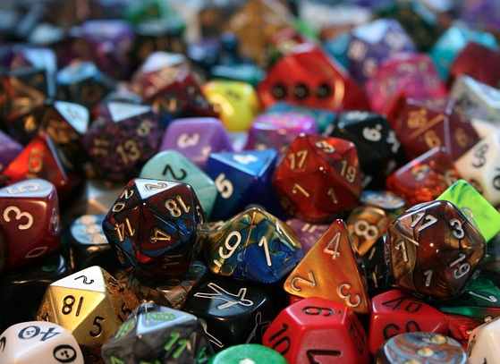

„Mrkvič prochází opuštěnou budovu,“ popisuje vypravěč
Petr hráči Markovi, v jaké situaci ve hře se
nachází jeho postava, „až dorazí do kanceláře ředitele.“

Marek letmým pohledem zkontroloval čísla
v Mrkvičově deníku a odvětí: „Moje postava se pokusí
najít hledané tajné dokumenty.“

„Dobrá, hoď si na Hledání,“ vyzve Marka Petr.

Zachřestí kostky a Markovi padne úspěch.
Petr pokračuje v popisu: „Úspěšně jsi prohledal
místnost. Ve stole jsi našel starý diktafon, nějakou
smlouvu a na stole leží fotografie jakési tmavovlasé
ženy.“

„Hm, ale já myslel, že si hážu na nalezení
těch tajných dokumentů,“ zamručí si nespokojeně
Marek pod fousy a tázavě se podívá na Petra.

Neshody mezi hráči na téma, co je vlastně výsledkem
vyhodnocení, jsou s RPG hraním spojeny
snad odnepaměti. Potřeba tyto neshody
odstranit historicky vedla k vymezení dvou pojmů,
které měly původně vnést trochu světla do
této problematiky. *Task* a *Conflict Resolution* –
dva termíny, o kterých byly popsány celé stránky
textů, dva herní styly, které byly rozebírány
napříč internetovými fóry po celém světě tak
důkladně, že když se dneska zeptáte tří lidí na
jejich význam, dostanete čtyři různé odpovědi.

Nyní začínáte číst první ze seriálu pěti
článků, které jsou a zároveň nejsou pojednáním
o *Task* a *Conflict Resolution*. Jsou jím, protože
se velmi úzce dotýkají problematiky, kterou
v diskusích o *Task* a *Conflict Resolution* většinou
najdete. Nejsou jím, neboť namísto stoprvního
rozboru již stokrát rozebraného, tyto
termíny odloží stranou a pokusí se vám nabídnout
pohled na vyhodnocování v RPG jako na
skládačku různých dílků, které dohromady tvoří
obraz celé hry a jejichž obměnou můžete od hry
dostat přesně to, co očekáváte. Pokud zvolíte
nějakou konkrétní hru či herní systém, některé
z níže uvedených voleb už za vás autoři hry
provedli – a pokud vám v takovém případě vybraný
dílek nesedí do vaší skládačky, většinou
nezbyde než sáhnout po jiném herním systému.
U jiných dílků však autoři hry často ponechávají
volbu na hráčích – a byla by škoda této možnosti
nevyužít a neposunout tak hru co nejblíže vašemu
preferovanému hernímu stylu.

Články se postupně budou věnovat pěti
dílkům této skládačky:

*   Co vyhodnocujeme? – Činnost, záměr a
zoom vyhodnocení
*   Proč vyhodnocujeme? – Hra, drama nebo
simulace světa
*   Co s výsledkem? – Interpretační pravomoc
*   Uzavřená, otevřená hra a pravomoc manipulovat
s jinými postavami
*   Jak vyhodnocujeme? – Postupné či souhrnné
vyhodnocování

Dílek prvý – Činnost nebo záměr?
=================================
Hraní RPG se většinou točí kolem povídání si
o tom, co provádějí hráčské i cizí postavy. Popis
jejich činností dává hráčům společnou představu
o tom, co se v příběhu odehrává. Hráči i vypravěč
se zároveň při hře snaží naplnit určité záměry.
Může se jednat jak o záměry samotných
postav, tak o záměry hráčů či vypravěče např.
na dalším směřování příběhu či ztvárnění určitých
situací. Konkrétní motivaci k vyhodnocování
i k záměrům se budeme věnovat v příštím
dílku tohoto seriálu, nyní si vystačíme s tím, že
od sebe oddělíme právě termíny **činnost** a **záměr**.
Pokud je budeme v 
Fulltext: yesnásledujícím textu používat,
pak v tomto významu:

<ul>
<li><strong>Činnost</strong> je vždy svázána s postavou, jedná
se o popis toho, co postava provádí
v příběhu.

Skáču přes propast, páčím dveře od trezoru,
udeřím skřeta, jedu rychle na koni.

</li>
<li><strong>Záměr</strong> je cíl, kterého se hráč nebo postava
snaží dosáhnout, o jehož naplnění usiluje.

Přeskočím propast na druhou stranu, získám
tajné dokumenty, omráčím skřeta,
vyhraju dostih.

</li>
</ul>

Jednotlivé hry a herní systémy se liší v tom, jakým
způsobem umožňují hráčům se záměry a
akcemi pracovat. Většina her se však ve větší či
menší míře přiklání k jednomu z těchto dvou základních
principů:

*   Vyhodnocení úspěšnosti činnosti
*   Vyhodnocení naplnění záměru

Vyhodnocení úspěšnosti činnosti
---------------------------
*   Hráči při hraní mechanicky pracují pouze
s činnostmi. Své záměry buďto nehlásí vůbec,
nebo je oznamují bez vlivu na mechanické
vyhodnocení.
*   Při vyhodnocení je výstupem z herní mechaniky
zpravidla kvalita či úspěšnost
provedení činnosti – jak daleko jsem doskočil,
zda jsem trezor otevřel či kolik času
mě to stálo, jak silně jsem skřeta udeřil,
jak rychle jedu na svém koni. O tom, zda
se záměr podařilo nebo nepodařilo naplnit,
se rozhodne až srovnáním dosaženého
výsledku s požadovaným.
*   Posloupnost vyhodnocení tedy je: Nahlášení
činnosti &#8594;  mechanické vyhodnocení &#8594; 
interpretace výsledku v příběhu &#8594;  případné
určení, zda byl záměr naplněn.

Vyhodnocení naplnění záměru
---------------------------

*   Hráči při hraní vyhodnocují, zda se jejich
záměr naplnil či ne. Své záměry tedy buďto
explicitně hlásí, nebo jsou implicitně
obsaženy v hlášených činnostech.
*   Výstupem z mechaniky vyhodnocení je
zpravidla rozhodnutí o tom, zda se záměr
naplnil, či ne – propast se podařilo přeskočit,
získal jsem dokumenty, skřet byl
omráčen, v dostihu jsem zvítězil.
*   Posloupnost vyhodnocení tedy je: Nahlášení
záměru > mechanické vyhodnocení >
určení, zda či jak moc byl záměr naplněn >
interpretace výsledku v příběhu.
*   Za povšimnutí stojí, že při vyhodnocování
záměru nám výstup z herní mechaniky
nutně neříká, jak úspěšná byla postava při
provádění činnosti.

Rozdíl mezi těmito dvěma přístupy si nejlépe
ukážeme na příkladu, ve kterém se Markova
postava snaží utéct z domu, ze kterého mají
na konci kola vyběhnout pronásledovatelé.
Markův záměr je dostat se pronásledovatelům
z dohledu.

Při použití <b>vyhodnocení úspěšnosti činností</b>
si Marek hodí na svou dovednost
„běh“ a poté, co známe výsledek vyhodnocení
(např. vzdálenost, kterou uběhl),
je zřejmé, jak daleko v příběhu Mrkvič
doběhl.

*   Pokud to situace v příběhu dovolí, může
to znamenat i to, že např. ho již pronásledovatelé
nemají v dohledu, protože uběhl
dost daleko na to, aby zmizel za rohem.
Markův záměr tedy mohl být naplněn, ale
poznáme to až po interpretaci a promítnutí
výsledku do situace v příběhu.

Naopak při použití <b>vyhodnocení naplnění
záměru</b> budeme už před hodem deklarovat
záměr, který se snažíme naplnit –
Marek tedy ohlásí, že Mrkvič má v úmyslu
zmizet nepřátelům z dohledu. Výsledkem
jeho hodu na dovednost „temné uličky“
bude rovnou určeno, nakolik se Markově
postavě podařilo z dohledu zmizet.

*   Pokud by to situace v příběhu nedovolovala
(např. není poblíž žádný vhodný roh
či místo, kde by se mohl schovat), Marek
bude muset svůj záměr vyměnit za jiný
(např. získám obstojný náskok).
*   Výsledek hodu nám může a nemusí kvantifikovat,
kolik metrů nakonec Markova
postava uběhla a zda doběhla až za vzdálený
roh nebo zda a jak dobře se někde
skryla.

Při praktickém hraní mohou občas činnost i záměr
splývat nebo je obtížné je odlišit. Např.
popisuje-li hráč svou akci jako „sekám obludě
hlavu“, v našem dělení to znamená, že jeho postava
provádí činnost „úder na krk obludy“ a jejím
záměrem je „oddělit hlavu obludy od těla“.
Při hře ale samozřejmě takovéto rozbory provádět
nechceme a je naopak žádoucí, aby hlášení
byla jednodušší a hra odsýpala. Proto je dobré
vědět, co vlastně ve hře vyhodnocujeme – zda
činnosti nebo záměry. A podle toho si činnost
nebo záměr domyslet, případně se zeptat, pokud
něco není jasné či nesedí.

Občas se navíc může stát, že se záměr a
činnost rozcházejí. Např. později v příběhu se
Markova postava účastní dostihu a Marek by
byl rád, aby v dostihu dojela těsně na druhém
místě. Proč takový výsledek může Marek chtít,
si rozebereme až v příštím dílku našeho seriálu.
Prozatím předpokládejme, že tomu tak je.

Při **vyhodnocení naplnění záměru** je vše
jednoduché – hráč deklaruje záměr „dojet
těsně druhý“ a vyhodnocení nám prozradí,
zda se to podařilo či ne, případně jak
dobře či špatně.

Pokud používáme **vyhodnocení úspěšnosti
činností**, může být na vyhodnocení
pohlíženo dvěma způsoby:

*   Výsledkem vyhodnocení může být, jak
rychle postava na koni jede. Hráč se pak
snaží v dostihu hrát tak, aby požadovaný
výsledek mechanicky dosáhl a jeho kůň
opravdu dojel jako druhý. Úskalím tohoto
přístupu je, že úspěch postavy v prováděné
činnosti může ve skutečnosti vést
k tomu, že hráčův záměr nebude naplněn
– Mrkvič pojede příliš rychle a vyhraje.
*   Alternativou také je, že pokud Mrkvič jako
postava opravdu chce dorazit do cíle těsně
druhý, vyhodnocovaná činnost bude
např. „ovládání koně“ a výsledkem z mechaniky
nebude přímo ujetá vzdálenost,
nýbrž kvalita toho, jak se Mrkvičovi daří držet
koně na uzdě. Úskalím tohoto přístupu
je, že předpokládá, že záměry hráče i jeho
postavy jsou ve shodě. Pokud je záměrem
Marka prohrát, protože se mu líbí takové
zakončení scény, ale přitom chce popisovat
rozčileného Mrkviče, jehož záměrem
bylo zvítězit, jen těžko může popisovat, že
se Mrkvič snažil držet koně na uzdě.

Čím častěji tedy ve své hře máte momenty, ve
kterých se motivy či **záměry** hráčů a jejich postav
rozcházejí, tím vhodnější je vybrat si takovou
hru, která umožňuje **vyhodnocovat naplňování
záměru**. Je to hlavně proto, že **činnost**, jak
jsme si na začátku řekli, je velmi úzce svázána
s postavou a záměry hráče se při **vyhodnocení
úspěšnosti činnosti** nezohledňují. Zároveň je
ale dobré si uvědomit, že čím silněji se tento jev
projeví, tím více se vzdalujete své postavě a hra
se z polohy „hraní rolí“ posouvá více do polohy
„vyprávění příběhů“. Záleží na vás, zda vám
tento posun vyhovuje či se mu naopak chcete
vyhnout.

Zoom scény, délka kola či vyhodnocení, který je i není jedním z dílků…
======================
Na závěr dnešního článku bych rád zmínil často
diskutovaný jev, který může při rozhodování
o tom, zda vyhodnocovat *úspěšnost činnosti*
nebo *naplnění záměru* působit jako matoucí.
Pokud zároveň se způsobem vyhodnocení budete
měnit i zoom, s jakým nahlížíte na jednotlivá
vyhodnocení, může se vám stát, že vám oba
pojmy začnou splývat. Při oddálení pohledu na
scénu se vám totiž může zdát, že to, co bylo ještě
před chvílí naplněním záměru, se najednou
stává pouze činností směřující k naplnění jiného
záměru.

Příklad:
Ve scéně námořní bitvy hlásí hráč kapitána
Nelsona, že povede své lodě kolmo napříč
řadou francouzského loďstva. Chtěl
by tím získat ideální pozici k jejich ostřelování
a zároveň minimalizovat možnost
zásahu vlastních lodí.

*   Pokud **vyhodnocujeme úspěšnost činnosti**,
z hodu se dozvíme, jak dobrý byl kapitán
Nelson ve svém manévru a zda se podařilo
lodě správně stočit.

Pokud poté, co si výsledek převedeme do
situace v příběhu, můžeme zjistit, do jakého
postavení se Nelsonovy lodě dostaly.
A jestliže opravdu protínají francouzské
loďstvo v kolmé linii, dojde k naplnění
hráčova záměru, a to i tehdy, když nebyl
vyřčen.

*   Pokud **vyhodnocujeme naplnění záměru**,
hod nám určí, zda kapitán Nelson opravdu
dosáhl skvělého palebného postavení
a pro Francouze je obtížné jeho lodě
zasáhnout.

Pro názornost si teď představme jinou
hru, která používá velmi oddálený zoom.
V takové hře je celá bitva u Trafalgaru pouhým
jedním kolem probíhající Napoleonské
války, může být rozbití francouzského
loďstva pouhou činností se záměrem odradit
Francouze od invaze na britské ostrovy.
Opět ale můžeme v tomto konkrétním
zoomu odlišit, zda budeme vyhodnocovat
pouze úspěšnost činnosti nebo i naplnění
záměru.

Proto je dobré, pokud se rozhodujete o tom,
jaká pravidla zvolit či jakým způsobem hru vést
tam, kde systém dává možnost volby, posuzovat
obě možnosti na stejné scéně a stejně zvoleném
zoomu. Jedině tak budete mít jistotu, že
to, co pozorujete, je opravdu rozdíl mezi **vyhodnocováním
úspěšnosti činnosti** a **vyhodnocováním
naplnění záměru** a že váš pocit ze hry není
zkreslen volbou zoomu.

Zároveň ale můžete tuto vlastnost využít
i k tomu, abyste si přizpůsobili hru k obrazu svému
právě s pomocí práce se zoomem. Při hraní
her, které používají **vyhodnocováním úspěšnosti
činnosti**, občas hráči naráží na to, že hra se příliš
drobí a oni mají pocit, že za své úspěchy nedostávají
to, co očekávali, a vypravěč oddaluje jejich
vítězství dalšími a dalšími vyhodnoceními.
A nebo naopak hráči mají tendenci situaci si
ulehčovat a za jeden hod by chtěli příliš a sami
se tak mohou okrádat o zábavu, kterou jim Vypravěč
na sezení připravil.

Příklad:

Vraťme se opět k Markovi a jeho postavě
agenta Mrkviče, na samotný začátek jejich
dobrodružství. Mrkvič se chce dostat do
přísně střežené vily z úvodního textu. Marek
s Petrem hrají hru, která vyhodnocuje
úspěšnost činností. Marek hlásí Petrovi,
že se jeho postava pokusí proniknout dovnitř.
Petr chce po Markovi nejprve vyhodnotit,
jak dobře se dokázal plížit ke zdi,
přelézat ji, plížit se kolem stráže, šplhat do
okna ve třetím patře a nakonec toto okno
z venku otevřít. Marek by rád celou akci
zvládnul jedním vyhodnocením a nelíbí se
mu, že za každým jeho úspěchem se objeví
další překážka.

Obvyklou radou, kterou najdete v internetových
diskusích, bývá přejít na **vyhodnocování naplnění
záměru**. V následujícím odstavci si ukážeme,
proč tato rada sice pomůže, ale přitom je nepřesná,
a dokonce může být i zavádějící.

Kdyby se Marek s Petrem řídili touto radou,
Marek by hned na začátku vyhodnocování
hlásil záměr „Mrkvič se chce dostat dovnitř
střežené vily“. Tím, že deklaruje takovýto záměr,
provádí jako hráč hned dvě věci zároveň.
Jednak si vymezuje, čeho chce za svůj případný
úspěch dosáhnout. Ale zároveň s tím také nastavuje
odlišný zoom vyhodnocení – deklaruje,
že chce celé vniknutí do vily řešit jedním hodem.
A toto je skutečná podstata problému, který ve
hře nastal. Hráč i vypravěč měli odlišnou představu
o tom, v jakém zoomu se scéna pronikání
do vily bude odehrávat. Ve skutečnosti nám
tedy **vyhodnocování naplnění záměru** pomohlo
hlavně tím, že deklarace záměru umožnila oběma
hráčům sjednotit si představu o tom, jaký
zoom se ve scéně použije.

A proč je rada zavádějící? Protože Petr,
který si celý průnik do vily připravoval jako důležitou
část dobrodružství, může i s použitím
**vyhodnocování naplnění záměru** Markovi říct,
že nechce, aby se celá scéna přeskočila jedním
hodem. A může trvat na tom, že se postupně
vyhodnotí úspěšnost naplnění jednotlivých dílčích
záměrů, které nakonec budou: připlížit se
nespatřen ke zdi, překonat ji, proplížit se nepozorován
kolem stráže, vyšplhat do třetího patřa
a vniknout oknem do budovy.

To, že sáhnete po **vyhodnocování naplnění
záměru**, vám tedy problém s přílišným drobením
scény, odsouváním vašeho vítězství či naopak
přeskakováním zajímavých částí hry nevyřeší,
ale může vám to pomoci s identifikací toho,
kde přesně to ve vaší hře skřípe. A pokud váš oblíbený
systém používá **vyhodnocování úspěšnosti
činnosti** a vám se stane něco podobného jako
Petrovi s Markem, nemusíte ho hned opouštět.
Stačí se domluvit se svým vypravěčem, že vám
zvolený zoom nevyhovuje, a pokud to systém
umožní, odehrajte klidně celou scénu v zoomu
vzdálenějším a přitom stále s **vyhodnocováním
úspěšnosti činnosti**. Naopak pokud vám vyhovují
kratší kola či chcete scéně dodat detail,
nebojte se i u her používajících **vyhodnocování
naplnění záměru** přiblížit zoom a hlásit jen dílčí
záměry, které vás budou k tomu hlavnímu přibližovat
po menších krocích.

To, zda pro vás bude snadné či obtížnější
si zoom hry přizpůsobit, do velké míry záleží
na tom, jakým způsobem hru autoři připravili.
Např. pokud hra obsahuje dvě různé dovednosti
„šplh“ a „skrývání se ve stínech“, pak zjevně autoři
zamýšleli hrát spíše při detailnějším zoomu
– a jestliže budete v takové hře chtít vyhodnotit
dlouhou akci, ve které postava použije obě tyto
dovednosti, nevyhnete se nějakému kompromisu
či zjednodušení. A naopak, volba příliš blízkého
zoomu ve hře, která obsahuje jen obecnější
popis postavy, jako „je dobrá ve zlodějských
kejklích“, může vést ke zbytečnému opakovanému
vyhodnocování téhož.

V příštím dílku seriálu o Vyhodnocování
v RPG se podíváme na to, proč vlastně chceme
vyhodnocovat a co od vyhodnocení mohou očekávat
hráči nebo vypravěč.