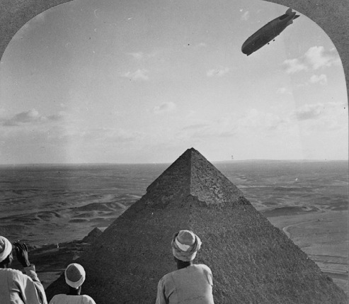
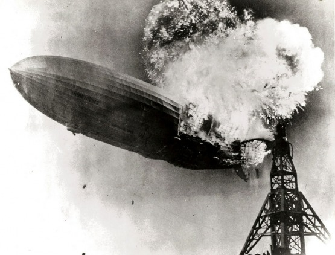
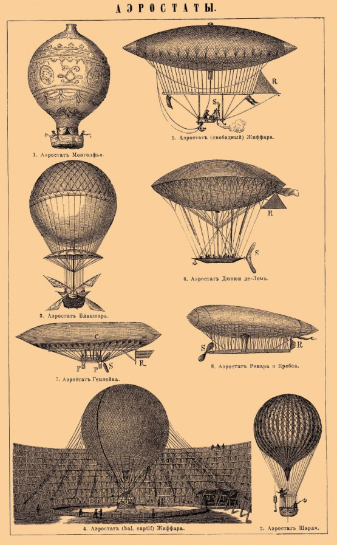
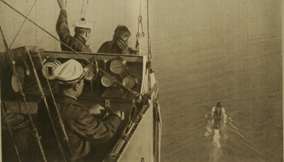
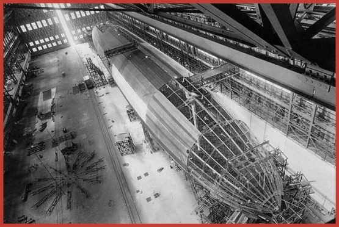

Před časem jsem si položil otázku: Co vlastně potřebuje vědět hráč nebo organizátor larpu, či případně pisatel steampunkové povídky o vzducholodích, pokud chce takový prvek zařadit do příběhu? Důvody, které mě k této otázce vedly, byly hned dva a jeden pádnější než druhý. Především jsem měl vypracovanou rozsáhlou přednášku o vzducholodích pro autory povídek z žánru steampunku, která však byla až tak rozsáhlá, že ji přežilo jen minimum duševně zdravých posluchačů. Přepracovat ji do lidštější podoby tedy bylo žádoucí.

Druhým důvodem bylo to, že se sami steampunkeři mají tendenci jaksi samovolně organizovat do „posádek“ vzducholodí. Posunout tuto tendenci někam dál bylo také lákavé.

Tento článek na onu snahu tedy volně navazuje.

# Vzducholodě nelétají, vzducholodě plují!

Než vás začnu trápit technickými detaily, musím převést vaši mysl do stavu vzduchoplaveckého. Z jistých důvodů máme totiž tendenci uvažovat o vzducholodi jako o letadle.

Letadla v našem dnešním vnímání mají ale vlastnosti, které se s pojetím vzducholodi neslučují. I když se i v letectví dosud setkáváme s mnoha výrazy a pravidly pocházejícími z mořeplavby, přece jen nějak víme a vidíme, že létající stroje těžší než vzduch nejsou lodě, což je právě ten zásadní rozdíl mezi řekněme boeingem a zeppelinem.

Vzducholodě totiž opravdu lodě jsou!

To, co drží vzducholoď ve vzduchu, není pohyb, jako u letadel a ptáků, ale není to vlastně ani nosný plyn. Je to Archimédův zákon:

Těleso ponořené do tekutiny je nadlehčováno silou, která se rovná hmotnosti tekutiny tímto tělesem vytlačené.

Vzduch je také tekutina, protože plyny jsou tekutiny. Jeho hmotnost (respektive hustota) je to, co nese vzducholoď. Je to naprosto stejné jako v případě lodí plujících po moři. Je to také moře, ale vzdušné!

To je první poučení, které si musí vzduchoplavec vštípit:

Vzducholodě nelétají, vzducholodě plují!

Pokud byste si dali tu práci a vyhledali v knihovně například knihu „Zeppeliny útočí“ o válečných akcích zeppelinů za 1. světové války, dočetli byste se že „loď vyplula“, ovšem ta loď by byla vzducholoď a plavba by vedla vzduchem. Není lepší doklad toho, že vzduchoplavci skutečně uvažovali o vzducholodích (zvláště o těch velkých) jako o lodích.

Tomuto myšlení je podřízen systém hodností, strojní vybavení, ale především celý slovník.

Vzducholoď může na rozdíl od letadla zakotvit, nepilotuje se, ale kormidluje, většinu své historie neměly vzducholodě knipl, ale kormidelní kolo, vlastně většinou hned dvě, ale to bych předbíhal.

Pro začátek je důležité, abyste se naučili uvažovat o vzducholodích jako o lodích.

Základní částí vzducholodě je samozřejmě aerostat – samotné těleso vzducholodě – které můžeme v podstatě považovat za plovák. Aby se dalo se vzducholodí vůbec přistávat, musí být aerostat opatřen ventilem nebo i mnoha ventily pro vypouštění nosného plynu a naopak pro chvíle, kdy je třeba udělat vzducholoď lehčí, je zase vybavena přítěží, kterou může podle potřeby vypouštět.

Ve steampunku se jako nosný plyn automaticky uvažuje vodík, jiný plyn bychom měli vždy výslovně uvádět.

Pouze u nejstarších vzducholodí byla písková přítěž po vzoru prvních balónů. Všechny velké vzducholodě ale používaly vodní vaky dělené většinou po 100 litrech tak, aby se daly vypouštět postupně.

# Základní rozdělení

Na to, abyste věděli, jak bude ve výsledku vaše vzducholoď vypadat, už musíte o vzducholodích pár věcí vědět. Všechny vzducholodě se řadí do tří skupin – neztužené, poloztužené a ztužené (zeppeliny).

Pro steampunk jsou charakteristické právě vzducholodě posledního typu – ztužené vzducholodě označované též jako zeppeliny. Je to do značné míry paradox, protože rozvoj ztužených vzducholodí byl umožněn až díky vynálezu Dieselova motoru, což je ovšem motor s vnitřním spalováním, na rozdíl od parních strojů, jež mají vnější spalování a jsou pro steampunk typické. Nicméně vzhledem k tomu, že je steampunk retrofuturistický směr, můžeme nad tímto detailem lehce přimhouřit oko.

Obliba zeppelinů je možná způsobena tím, že si je představujeme prostě jako opravdu velké vzducholodě, v nichž mohou být vyhlídky, jídelny, kavárny a salóny s klavírem, zatímco neztužené a poloztužené vzducholodě vnímáme spíše jako cosi malého s gondolou tak těsnou, že do sebe členové posádky navzájem narážejí lokty.

Není to úplně pravda, i když faktem je, že se největší neztužené a poloztužené vzducholodě svými rozměry vyrovnaly nejmenším vzducholodím Zeppelinovy výroby – mívaly kolem sto dvaceti metrů délky. To je ovšem jen poloviční délka největších postavených ztužených vzducholodí.

Přesto se už v krytých gondolách takových vzducholodí dalo často vzpřímeně chodit a byly v nich kajuty pro posádku. Proto vám něco povím i o těchto typech vzdušných lodí.

# Neztužené vzducholodě

Nejstarší neztužené vzducholodě mívaly přes aerostat nataženou závěsnou síť a dlouhou otevřenou gondolu s vrtulí na přídi. Tento zvláštní vzhled měl rozumný důvod – dlouhé těleso aerostatu by se při nerovnoměrném rozložení váhy mohlo deformovat jak samotnou hmotností gondoly, tak pohyby a odporem vzduchu při letu. Proto se vzducholodě s dlouhými gondolami označovaly někdy také jako „ztužené gondolou“.

Největší vzducholodě „ztužené gondolou“ bývaly „křižníkové typy“ za první světové války. Například francouzská křižníková vzducholoď Dupuy de Lôme tohoto druhu měřila na délku 89 metrů. Ta měla v dlouhé gondole ovšem už zabudovanou uzavřenou kabinu pro posádku.

Neztužené vzducholodě mívaly a dodnes mívají uvnitř aerostatu malý balón (jeden nebo více) nafukovaný náporem vzduchu od motorů, nebo dokonce samostatnými pumpami (jako v systémech Goodyear) – ballonet. Je tam proto, aby dodával tělesu vzducholodi dostatečnou tuhost při letu vpřed.

# Poloztužené vzducholodě

Poloztužené vzducholodě mají některé dobré vlastnosti neztužených vzducholodí, jako například tu, že se dobře převážejíí, protože se dají snadno vypustit a rozložit, ale zároveň se něčím také podobají ztuženým vzducholodím.

Hlavní rys, podle kterého poloztužené vzducholodě většinou poznáte (vyjma moderního systému Zeppelin-NT), je to, že mají zepředu charakteristický tvar obrácené kapky. Všechny gondoly a zařízení jsou totiž zavěšené na trojúhelníkovém kýlu, který se táhne po celé délce aerostatu.

Uvnitř aerostatu už mívaly poloztužené vzducholodě plynové oddíly, což jim dávalo proti neztuženým vzducholodím výrazné výhody především při nasazení v boji.

Tyto vzducholodě bývaly za 1. světové války typické pro Itálii, ale ještě dříve se stavěly v mnoha zemích světa, včetně Francie, Německa a USA. Předválečné poloztužené vzducholodě poznáte snadno podle zcela rovného kýlu. Teprve za války začal tvar kýlu kopírovat křivku aerostatu.

Takovou vzducholodí s rovným kýlem byla například America, která se jako první pokusila o přelet Atlantického oceánu a její posádka se zachránila jen díky zprávě vyslané tehdy poprvé na vzducholodi použitým telegrafem!

Také poloztužené vzducholodě byly stavěny na počátku války jako „křižníkové typy“ a nějakou dobu konkurovaly nastupujícím ztuženým vzducholodím hraběte Zeppelina.

V meziválečné době se pak proslavily především vzducholodě Norge, Italia a Roma. První dvě posloužily ve třicátých letech dobyvatelům severního pólu, třetí byla poslední vzducholodí USA plněnou vodíkem, což se jí také stalo osudným.

# Ztužené vzducholodě

Největší vzducholodě, které kdy pluly vzduchem, byly velké ztužené typy – německé zeppeliny, britské vzducholodě R-100 a R-101 a americko-německé vzducholodě Akron a Macon, což byly vlastně létající letadlové lodě.

Jak napovídá název, mají ztužené vzducholodě pevnou konstrukci. Skládá se z podélných nosníků, nosných prstenců, pomocných prstenců, kýlu a neuvěřitelného množství drátů a kovových lan. Teprve ta dávají celé konstrukci dostatečnou pevnost. Kromě toho ale také oddělují od sebe plynové oddíly.

Takový plynový oddíl tvoří vak ze zlatotepecké blány, která se získávala z hovězích střev. Běžně ho ovšem neuvidíte ani na fotografiích, protože ho zakrývá vnější potah z lakované bavlněné tkaniny. Tyto technické detaily mají ztužené vzducholodě většinou společné. I když by se i v tom, pravda, pár výjimek našlo.

Mají ovšem i dostatek odlišností, od přelomu 19. a 20. století do 30. let 20. století prodělaly totiž takovou proměnu, že by si zasloužily rozdělení do mnoha různých samostatných skupin. Protože ale z tohoto článku nechci dělat atlas, rozdělím pravé zeppeliny jen do tří skupin a o dalších se zmíním jen v jejich odlišnostech.

Úplně první zeppeliny měly v podstatě válcovitý trup a dvě otevřené gondoly za sebou. V každé z nich byl motor s náhonem na dvě vrtule po stranách. Celkem tedy dvě gondoly a čtyři vrtule. Posádka byla rozdělená do dvou skupin, které se spolu dorozumívaly strojním telegrafem (viz níže). Tyto první zeppeliny měly také výrazný vnější kýl, do kterého byla u linkových verzí zabudována pasažérská kabina.

Za války se zeppeliny úplně změnily. Staly se více aerodynamickými. Kýl měly stále, ale už nebyl vidět, protože byl v konstrukci obrácen dovnitř. Používal se už jako chodbička, spojující velitelskou gondolu s motorovými gondolami a také s šachtami vedoucími k hřbetním střelištím.

Po stranách skrytého kýlu vznikl prostor, kde odpočívali členové posádky, kteří nebyli právě ve službě.

Teprve v meziválečné době dorostly vzducholodě do čtvrtkilometrové délky a staly se luxusními transatlantickými loděmi s luxusem, který nabízely tehdejší zaoceánské lodě. Takové už měly velitelskou gondolu přisedlou k tělesu vzducholodi, a tedy bez motoru. Prostory pro cestující se skrývaly v tělese vzducholodě a díky tomu se také staly nesmírně prostornými. Byly v nich vyhlídkové promenády, jídelny, kavárny a kajuty.

V největších vzducholodích přibyla také další chodba – catwalk. Ta procházela po délce středem celého aerostatu. Byla to samozřejmě služební chodba.

# Gondoly

Už jsem zmínil, že vzducholodě používaly otevřené a uzavřené gondoly. Popravdě u některých z nejmenších vzducholodí může člověk i trochu váhat, jestli nějakou gondolu mají, protože ji tvoří pouhých pár bambusových tyčí. Spokojme se ale s tím, že máme dva druhy gondol.

Otevřené gondoly bychom mohli ještě dále rozdělit na koše, dlouhé gondoly a „loďky“, tedy otevřené gondoly určené pro přistání na vodní hladině. Zmiňuji je ale vlastně hlavně proto, že právě takové „loďky“měly první zeppeliny.

Pro nás jsou samozřejmě zajímavější už uzavřené gondoly. První dopravní a válečné vzducholodě zrovna prostorem pro posádku příliš neoplývaly, což se zlepšilo zavedením skrytého kýlu, ale prostoru i ve velitelské gondole bylo stále poměrně málo.

Na počátku 1. světové války měly zeppeliny stále dvě gondoly s motory v zadní části, ale už byly uzavřené a měly náhon pouze na tlačnou vrtuli. Dostaly se proto poněkud níž pod aerostat a byly s ním spojené vertikálními šachtami.

Válečný vývoj vedl od zeppelinů se dvěma gondolami, v nichž byla posádka i motory, k typům s výrazně odlišnou velitelskou gondolou a několika specializovanými motorovými gondolami.

Motorové gondoly byly stále skutečnými gondolami. Mechanici v nich mohli chodit a za plavby motor nastavovat i opravovat.

Po válce se všechny motory přestěhovaly do motorových gondol a velitelská gondola těsně přisedla k tělesu aerostatu.

Tento vývoj ovlivnil i jiné typy vzducholodí.

# Motory

Na počátku vývoje vzducholodí spolu bojovaly o právo pohánět první řiditelnou vzducholoď vlastně jen dva typy motorů – parní a elektrické. První souboj vyhrál Krebsův elektromotor (čímž si celý spor i Arthur Constantin Krebs vysloužili zvěčnění ve Vernově románu Robur Dobyvatel). Nicméně rozvoj velkých vzducholodí umožnily vlastně až dieselové motory.

Snad proto stále žije představa, že jakýkoli jiný motor než s vnitřním spalováním se pro vzduchoplavbu nehodí. Není to vlastně pravda. I vzducholodě by mohly pohánět naprosto odlišné typy motorů včetně parních.

Jejich problém byl v nedostatečně rychlém vývoji. Už v roce 1906 byl k dispozici dostatečně výkonný parní motor od firmy Stanley Steamer. Ovšem v té době už měly dieselové motory mnohem lepší poměr výkonu a hmotnosti.

Ve třicátých letech dokonce bratři Beslerové vybavili své letadlo parním motorem s dvojitou expanzí a na mnoha filmech je zaznamenáno, že tento stroj skutečně létal.

Problémem by se mohlo zdát používání pevného paliva, jako je uhlí nebo dřevo, ale 19. století už znalo dostatek technik zkapalňování a zplyňování paliv. Ostatně poslední vzducholodě používaly jako palivo blaugass čili palivový plyn určený původně pro bóje a majáky.

U vzducholodí v alternativní steampunkové přítomnosti nebo budoucnosti tedy není problém používat parní stroj ve vzducholodích.

Jako kapalné palivo by mohl být používán petrolej, líh, olej nebo zvířecí tuk (parníky za polárním kruhem opravdu někdy používaly ohniště na mroží tuk).

# Zbraně vzducholodí

Vzducholodě samozřejmě plnily určitou úlohu také ve válce, vlastně v obou světových válkách. Za první světové války se používaly vlastně jako bombardéry. Vzducholoď na rozdíl od letadla dokázala tehdy unést jakýkoli typ bomby.

Nejobávanější ale byly velké termitové bomby, které dokázaly zapálit ve městech rozsáhlé požáry.

Při bombardování se často musely vzducholodě skrývat v mracích, a proto se k zaměření používal „spähkorb“ – malá aerodynamicky tvarovaná gondolka spouštěná na laně pod vrstvu mraků.

Proti letadlům se mohly vzducholodě bránit kulomety umístěnými zprvu v gondolách, později i ve hřbetních střelištích.

A konečně existovaly i vzducholodě pro námořní službu, vyzbrojené hlubinnými pumami proti ponorkám.

Nejpodivnější zbraní vzducholodí byly ale letadla. Pokusy s vypouštěním letadel ze vzducholodí začaly poměrně brzy potom, co se objevily vzducholodě dostatečně velké, aby je unesly, teprve na amerických letadlových vzducholodích Acron a Macon ale dokázali piloti na podvěsné háky i přistávat. Tyto vzducholodě měly v trupu zabudované hangáry, kam se letadla vtahovala.

# Přístrojové vybavení

Drama toho, co se děje se vzducholodí, ukazují přístroje. Také všechno vypadá mnohem věrohodněji, když víte, čím je taková vzducholoď vybavena. Na druhou stranu není úplně nutné vybavovat ji naprosto vším, co se kdy na vzducholodích objevilo.

Pro tyto účely je lepší si rozdělit přístroje po­dle toho, jestli na vzducholodi být musí nebo nemusí.

Pominu teď moderní hybridní druhy řízení, které kombinují řízení odvozené od letadel s tím vzducholodním, a napíši, že na palubě vzducholodi najdete za normálních okolností dvě kormidelní kola. První kormidelní kolo je směrové a nachází se přímo za příďovým oknem nebo prostě v přední části velitelské gondoly (ať vypadá jakkoli).

Jde-li o dálkovou vzducholoď, je před ním zabudován hlavní kompas s dvojitou stupnicí.

Kromě velkého napevno namontovaného kompasu před směrovým kormidelním kolem by­ste při pečlivém hledání našli na můstku ještě několik malých přenosných kompasů s výklopnými mířidly. Používaly se k určení polohy podle náměru, tedy zaměřením orientačních bodů na zemi.

Napravo od směrového kormidelního kola býval u větších dálkových vzducholodí „drift indikátor“, což je přístroj, kterým se měřilo snášení větrem. V principu je to kolmo postavený dalekohled s mřížkou, zabudovaný objektivem do podlahy, kterým se dal měřit pohyb vůči zemi mimo kompasový kurz.

Druhé kormidelní kolo je výškové a tradičně se nachází na levé straně gondoly. Nad ním byste našli sklonoměr, barometr, panel přítěže a strojní telegraf. V některých případech však mohl být strojní telegraf umístěn naproti, tedy na pravé straně gondoly.

Vzducholoď v podstatě potřebuje sklonoměr jen při dynamickém stoupání nebo klesání. Boční náklon nebýval u vzducholodí ovladatelný a také by neměl za následek nic jiného než zhoršení ovladatelnosti. Žádné skluzové a výkluzové zatáčky tedy od vzducholodi čekat nelze.

Barometr býval pro vzducholodě na dálkových letech životně důležitý. To musí být samozřejmě jasné všem, kdo vědí, jaké nebezpečí představuje pro vzducholoď bouřka.

Panel přítěže je deska s nakresleným obrysem vzducholodě a s vyznačenými umístěními vodních vaků se zátěžovou vodou. Z její spodní části jsou vedena táhla, kterými lze vodu z vaků vypouštět.

Konečně strojní telegraf ve skutečnosti vlastně žádný telegraf není. Představuje jej kruhový ciferník s ukazatelem. Po obvodu jsou napsány povely. Bývá vybaven táhlem vedoucím k zvonku. Stejné ciferníky se nachází v motorových gondolách nebo jejich blízkosti. Nastavením na můstku se mechanicky – lankem – přenáší povel k mechanikům, kteří za letu ovládají motory.

Na zadní stěně kabiny se pak nachází panel plynových oddílů. Také na něm je nakreslena silueta vzducholodi, ovšem tentokrát se zakreslenými plynovými oddíly. Pod každým plynovým oddílem je táhlo, kterým lze vypouštět nosný plyn. Pokud je některý plynový oddíl prázdný, změní se v malém kruhovém okénku pod ním barva na červenou.

V zadní části byste u modernějších vzducholodí našli také palubní telefon pro spojení s mechaniky a další zajímavý kus vybavení převzatého z lodí – zvukovod neboli „speaking tube“. Je to vlastně jednoduchá trubka vedoucí z velitelské gondoly do kýlu, kde odpočívali členové posádky, kteří nebyli právě ve službě. V gondole byla trubka zakončená jakýmsi širokým náustkem, překrývajícím celá ústa důstojníka, který do trubky křičel rozkazy.

Ve velitelské gondole se kromě lodního můstku nacházejí někdy i další místnosti, především je to navigační místnost a radiotelegrafická místnost.

Hlavním vybavením navigační místnosti byl mapový stůl, na němž se pomocí navigačního spočtení a dalších navigačních údajů (astronavigace, radio, navigace pomocí orientačních bodů na zemi) zakreslovala trasa plavby do map. K takovým mapám pak nezbytně patří krokovací pravítka, úhloměr a odpichovátko (kružidlo), sextant.

Pokud budete někdy opravdu plánovat vzducholodní larp, asi tušíte že jeho „srdce“ je vlastně právě tady.

Kromě stolu je v navigační místnosti také skříňka s hodinami. V tomto případě nejde o těžké námořní chronografy, ale o co nejpřesnější kapesní hodinky, kterých je kvůli vzájemné kontrole hned několik. Ve skříňce jsou také zpravidla umístěny stopky kvůli ověření rychlosti a driftu vzducholodi pomocí druhého „drift detektoru“, ale také pro měření výšky pomocí „echolotu“.

Ano je to tak, poslední z velkých vzducholodí měly opravdu na palubě „echolot“. Nebyl to ale přístroj, který si pod tímto názvem představujeme dnes. Šlo vlastně o akustický výškoměr.

První rádiové spojení zaznělo při záchranné akci vzducholodi America roku 1910, od té doby bývaly vzducholodě bezdrátovými telegrafy vybavovány celkem standardně.

Vysílačky nebyly ale vždy pro vzducholodě jen záchranou, protože už od roku 1916 dokázal Marconi-Belliniho-Tosiho detektor nepřátelských radiostanic určit jejich polohu.

I tento detektor je dostatečně malý na to, aby jej mohla nést vzducholoď, a později byl používán jako primitivní radiokompas.

Zkrátka na vzducholodích byste našli spoustu tehdy špičkových přístrojů, ovšem ne na všech a ne vždy. Poslední velké ztužené zaoceánské vzducholodě měly dokonce i mechanického autopilota na principu gyrokompasu.

# Jak přistát?

Vyplout se vzducholodí je překvapivě jednoduché, stačí uvolnit kotevní lana a upustit trochu vody z vodní přítěže. O to těžší je dostat ji zase zpět na zem.

Nejstarší (a nejmenší) vzducholodě mohly přistát na zemi s pomocí kotvy, což je asi nejnebezpečnější a nejdrastičtější způsob přistání. Pokud si ovšem vymyslíte průzkumnou vzducholoď, budete muset možná počítat i s takovým přistáním. Pomocí kotvy se vzducholoď vlastně jen zachytí, následně se musí do země zatlouci dostatečně daleko kolíky a vzducholoď se přes ně pomocí kotevních lan stáhne k zemi.

Žádná velká vzducholoď v historii takto nikdy nepřistávala.

Další možností je přistání zachycením s pomocí letištního personálu. Je to způsob, který byl kdysi typický pro německé zeppeliny. Vzducholoď se snese dostatečně nízko a vypustí vlečná lana. Pozemní personál je zachytí a uváže vzducholoď k vázacím kruhům na úvazištích, zapuštěných do velkých betonových kvádrů zakopaných pod zemí. Těmto kvádrům se někdy také říká (nesprávně) vzducholodní kotvy.

Další možností je přistání na vodě. Většina ztužených vzducholodí, byla stavěna tak, aby dokázala bez újmy přistát na vodní hladině. Na vodě lze vzducholoď zakotvit v podstatě stejně jako jakoukoli obyčejnou loď, hodně ji ale ohrožuje vlnobití, a proto je zvláště při přistání na moři nebo na velkých jezerech nutné neustále hlídat počasí.

Konečně netypičtější způsob přistání, který se poměrně rychle rozšířil z Ameriky, je přistávání na kotevních věžích. Vzducholoď se k nim upoutává pomocí tří lan, která vypouští z přídě. Na zemi tato tři lana napojí obsluha věže ke třem lanům vedoucím k navijákům ve věži. Po přitažení je vzducholoď upevněna ke kotevní věži jako korouhvička. Nastupovat a vystupovat z ní lze příďovými dveřmi přes ochoz pod vrcholem věže.

# Jak ztroskotat?

Vzducholoď bychom tedy měli, teď jí začneme v zájmu příběhu ubližovat. Navzdory filmovému klišé, podle kterého musí každá vzducholoď vybouchnout, je zničení vzducholodě poměrně náročné.

Běžné palné zbraně na ně měly nepatrný účinek. I když střely dokázaly snadno prorazit aerostat, byl únik plynu tak pomalý, že vzducholodě mohly ještě dokončit bombardování a vrátit se za svou linii. Standardním způsobem ničení vzducholodí bylo bombardování, což s sebou neslo nemalé riziko pro útočící letoun, protože na hřbetech vzducholodí bývala kulometná střeliště. Nebezpečné bylo ale i úspěšné zničení vzducholodě, protože v té době býval útočící letoun nad ní.

Kromě bombardování bylo další možností už jen taranování vzducholodi vlastním letadlem.

Výraznou změnu sil přineslo zavedení nábojů pro kulomety s fosforovou stopovkou. Ty dokázaly vzducholoď zapálit už běžnou palbou při průletu.

Jenže požár ve výšce není zrovna to, co bychom si představovali. Nedá se totiž přežít, a proto je pro příběh úplně nevhodný.

Další možností, jak se vzducholodí ztroskotat, je překročení tlakové výšky. Každá vzducholoď má stanovenou výšku, kterou nesmí překročit, protože by se nárůstem tlaku začaly trhat plynové oddíly. Pro tento případ byly ventily vzducholodě udělané tak, aby začaly vypouštět plyn, pokud k takové situaci dojde.

Stát se to může jen proto, že vzducholoď má vlastně dvě měřitelné výšky dostupu – aerostatický a aerodynamický. Aerostatický dostup je výška, do níž je vzducholoď schopná dostoupat prostě jako balón. Aerodynamický dostup naproti tomu říká, jaké výšky by vzducholoď dosáhla s maximálním tahem motorů, tedy v režimu, kdy se aerodynamicky chová spíše jako klasické letadlo.

Asi už jste se dovtípili, že aerodynamický dostup vzducholodí bývá výrazně vyšší, než jaká je jejich tlaková výška. Dál už nechám pracovat vaši fantazii.

Další možností je únik nosného plynu. Ten může způsobit diverzant, silný poryv větru, útok létajícího prehistorického monstra nebo také námraza. Let v namrzajícím dešti totiž vytváří na listech vrtulí ledovou krustu, která se chvílemi odtrhává a může aerostat i prorazit.

Jinou nepříjemnost způsobíme vzducholodi nárazem do terénu. To se opravdu stávalo při zhoršené viditelnosti. Zákeřné byly zejména mírné svahy, které nebyly dostatečně jasně z výšky vidět. Když vzducholoď narazí do terénu, bývá to její konec. Pokud není náraz veden přímo na gondolu, může to posádka přežít, protože aerostat zafunguje jako deformační zóna. Někdy se při takovém nárazu vzducholoď rozlomila na dva kusy a oddělila tak od sebe dvě části posádky. Takový prvek se dá v příběhu také dobře použít.

# Jak se ztratit?

Asi jste si všimli, že v minulosti bývaly vzducholodě hodně závislé na zraku a radiokomunikaci. Pokud tedy chcete vzducholoď ztratit, například proto, abyste ji mohli nechat objevit nějakou neznámou zemi, o níž nikdo neví, kde leží, musíte vymyslet, jak jí oslepit tyto dva smysly.

Dobře se pro to hodí let v mlze, bouři a nejlépe ještě potmě nebo nad mořem, kde nejsou žádné orientační body. V takových situacích se v podstatě nedá změřit rychlost snášení větrem, a pokud se loď dostane mimo dosah vysílaček, máte vyhráno, tedy ztraceno...

Základní věci teď tedy už víte, zbývá už jen vzít do ruky tužku a svou vzducholoď nakreslit. No a potom už vzhůru za dobrodružstvím!
