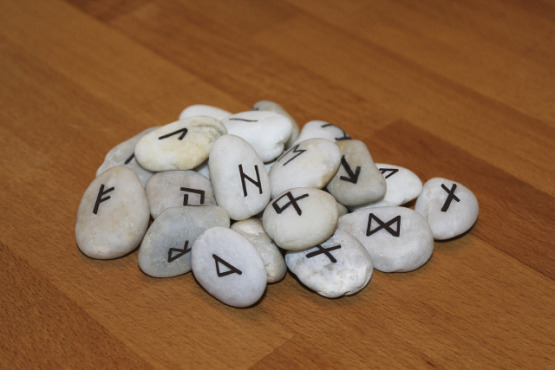
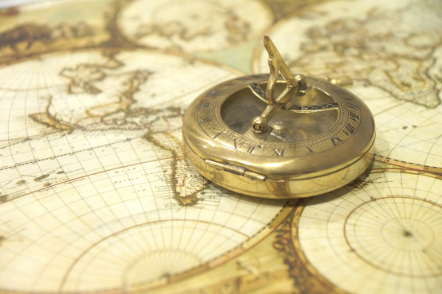
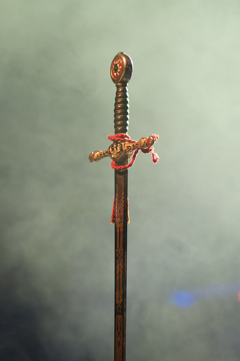

Hoďte 2k6 a přečtěte čísla vedle sebe jako jednu cifru. Směna je přibližně jedna scéna nebo deset minut.

__11	Abrahámův prsten__ – Kdokoli tento stříbrný prsten s drobným rubínem nosí, má místo krve černý jed. Původně využíváno k lovení upírů.

__12	Balistický kámen__ – Jednoduchý oblázek s jedinou drobnou runou. Při roztáčení v praku jasně září a hlasitě sviští. Automaticky zasáhne, způsobí kritické zranění a roztříští se ve vílí prach.

__13	Barlumův mozek__ – Nezničitelný mozek mága Barluma. Dotkni se jej holou rukou a můžeš se zeptat na libovolnou otázku z historie, zeměpisu, kosmologie nebo arkány. S každým použitím se do tebe dostane část Barlumova charakteru a vypravěč za tebe v budoucnu může udělat jednu akci. Účinky dlouhodobého využívání nechávám na vypravěči.

__14	Batát sytosti__ – Velká fialovooranžová sladká brambora. Neustále dorůstá a denně pohodlně nasytí jednoho člověka. Při dlouhodobé konzumaci se strávníku obarví pleť do ruda.

__15	Bedenkerovo oko__ – Bronzová bulva, pokrytá geometrickými ornamenty. Lze vložit do očnice na místo chybějícího oka, propůjčuje pak nositeli infravizi a schopnost jedenkrát denně vyslat z bulvy laserový paprsek, který vždy přesně trefí zamýšlený cíl.

__16	Boty elfích špehů__ – Lehké boty z jemné kůže, které negují veškerý zvuk kroků a nezanechávají žádné stopy.

__21	Broukozbroj__ – Výtvorem nemilosrdné magie byl obří šváb proměněn v chitinovou zbroj. Dokáže se pohybovat samovolně, pít, krmit se, ale v případě potřeby se ihned obepne kolem majitele jako zbroj. Lehčí než gambeson, pevnější než plátová. S každým zásahem slábne a nakonec zemře, pokud nemá dost času na zhojení.

__22	Chakram__ – Necelou stopu široký ocelový kruh s čepelí na vnější hraně. Nebezpečný jako vrhací nůž, s tím rozdílem, že po prvním zásahu nekončí, ale odráží se směrem k dalším cílům. Hráč hází na útoky, dokud nemine, nebo dokud nezasáhl všechny nepřátele v dosahu.

__23	Černá dýka__ – Trojhranný bodec z černého kovu, kalený v krvi. Zabití touto zbraní pokračují v (ne)životě jako hnijící umrlci ve službách svého vraha.

__24	Deštník první dámy__ – Stylový renesanční deštník se složitým krajkovým vzorem a dekorativními korálky. Vzplane a shoří na popel, pokud je nositel cílem útočného nebo negativního kouzla, které je tím plně neutralizováno.

__25	Duhové korále__ – Po dobu nošení omladí nositele v sedmileté dítě.

__26	Dvojknihy__ – Dvojice prázdných knih vázaných v jemné kůži mladých impů. Cokoli napsaného do jedné se objeví i v druhé a obráceně.

__31	Dýmka skaldů__ – Majitel může vyfukovaný kouř libovolně tvarovat a měnit vlastními myšlenkami.

__32	Hodiny lítosti__ – Složitý kapesní mechanismus, který ukazuje přesný čas. Při rozbití vrátí čas o hodinu zpět.

__33	Hůl začátku konce__ – Rudě orezlá čarodějná hůl ze zvučného kovu se stopu vysokým obsidiánovým krystalem. Lze využít k posílení libovolného kouzla nebo k nasátí energie na nové kouzlo. Každé použití promění v popel všechnu vodu, floru a drobnou faunu v kilometrovém okruhu.

__34	Kamenná pecka__ – Zasaď, zalij, do zítra vy­roste opevněná strážní věž.

__35	Korunka posměchu__ – Třpytivý diadém. Sám nic netuší, ale pro všechny ostatní vypadá nositel groteskně ošklivý; odstáté uši, napuchlé tváře, opičí čelo, téměř prasečí nos apod.

__36	Krysa neštěstí__ – Nositel tohoto vyschlého, ohavného přívěsku nemůže zemřít. Smrt nositele dožene hned, jak o něj přijde.

__41	Mnohošat__ – Oblek, který při skládání změní podobu na libovolný oděv dle majitelova přání.

__42	Módní past__ – Oblek, který se vždy postupně samovolně mění do podoby oděvu vrcholného stylu u královského dvora. Ihned po oblečení se sevře a sváže jako svěrací kazajka.

__43	Mušle tajemství__ – Mořská mušle, ze které při poslechu krom ozvěn moře vychází i všechny zvuky z nejbližší lodi.

__44	Nátepníky spojenectví__ – Chrániče předloktí s polovinou runové brány na každé ruce. Existují dva páry. Kdykoli nositel srazí předloktí k sobě tak, aby se spojil obraz brány, teleportuje se před něj druhý pár i s jejich nositelem.

__45	Nulorb__ – Poloprůsvitný perleťově lesklý orb. Při rozbití vyšle do všech stran sotva citelnou vlnu, která na směnu vypne magii v okruhu jednoho kilometru.

__46	Obchodníkova ruka__ – Za zápěstím uťatá ruka, stále čerstvá, ale nekrvácí. Používá se k dohodám. Namísto mezi sebou si obě strany potřesou s Obchodníkovou rukou. Kdo dohodu poruší, poštve na sebe mstivého ducha.

__51	Ohnivý meč__ – Na dotek horký meč s rudě zářícími runami. Čím zuřivější, zoufalejší nebo blíže smrti nositel je, tím intenzivnějším plamenem se čepel pokryje.

__52	Rýč pracovitosti__ – Pevný, i když ošoupaný pracovní nástroj, který na rozkaz majitele sám kope. Ve skutečnosti je k němu stále přivázaný duch otroka, jenž se jím bránil v posledních chvílích svého života.

__53	Sklenice nekonečné mlhy__ – Zavařovací sklenice, po otevření vypouští těžkou šedobílou mlhu, která rychle vyplňuje prostor ve svém okolí. Během směny zahltí celou vesnici.

__54	Skokanův kompas__ – Nositel musí myslet na konkrétní lokaci, kterou už někdy navštívil. Při otevření kompasu se před ním vytvoří portál vedoucí do náhodného jiného světa. Za portálem kompas ukazuje cestu k dalšímu portálu v blízkosti, kterým se nositel dostane zpět do svého světa na původně zamýšlené místo.

1. Obchodní středisko v Dallasu během černého pátku.
1. Paluba Enterprise, právě odrážející invazi mimozemské rasy.
1. Duny pouštní planety, kde šlechtické rody bojují o koření.
1. Pyramidy s perpetuálními lidskými oběťmi pro usmíření vyhasínajícího slunce.
1. Planeta šedých mužíků s rigidně pacifistickou a byrokratickou kulturou.
1. Dinosauří džungle během zuřivé bouře a blížících se záplav.

__55	Slídičův knoflík__ – Po spolknutí z těla vypudí duši v podobě rychle se pohybujícího embrya se šmoulím hlasem. Když vleze zpět do útrob, lze tělo oživit a knoflík vyplivnout.

__56	Sluneční kyrys__ – Pro lidi zbroj blyštivá jako vyleštěné zrcadlo, pro nemrtvé zdroj bolestivě oslňující záře.

__61	Stopařský plamen__ – Olejová lampa, která hoří růžovým plamenem a rudě rozzáří všechny stopy v dosahu svého světla. Stopy tam ani nemusí fyzicky být, ukáže otisky všech průchozích i na dlážděném povrchu. Čím starší stopa, tím slabší záře.

__62	Spojená zrcadla__ – Šest stop vysoká stříbrem dekorovaná oválná zrcadla. Neodráží zpět své okolí, ale fungují jako okna od jednoho k druhému a zpět. Nejsou to plně funkční portály, nelze jimi prolézt nebo podat předmět. Propouští pouze smyslové vjemy jako obraz, zvuk, vůni, dojem tepla nebo průvanu apod.

__63	Svíce smíru__ – Po zapálení nelze sfouknout. Dokud nedohoří, nikdo v její přítomnosti nedokáže zaútočit nebo jinak kohokoli fyzicky napadnout.

__64	Větrný meč__ – Tenká lesknoucí se čepel, která při máchnutí zvedne mocný poryv větru. Lze použít k rozhození rovnováhy protivníka, odklonění nepřátelských šípů, dopomoct si k vysokému skoku atd. Funguje, jen dokud je nositel lehký jako vítr; zranění, přetížení, stres, strach či hněv schopnosti meče oslabují.

__65	Vrrčí kožich__ – Potrhaný kožešinový plášť s ošklivou zdeformovanou vlčí hlavou místo kapuce. Dává nositeli schopnost proměny ve vrrka, dost velkého, aby unesl lidského jezdce. Kožich se použitím vybije a lze jej nabít jen roztažením v měsíčním světle.

__66	Zlodějova skleněnka__ – Cvrnkací kulička, která se vždy kutálí k nejbližšímu shromáždění mincí, které je větší, než má majitel ve svém měšci.
