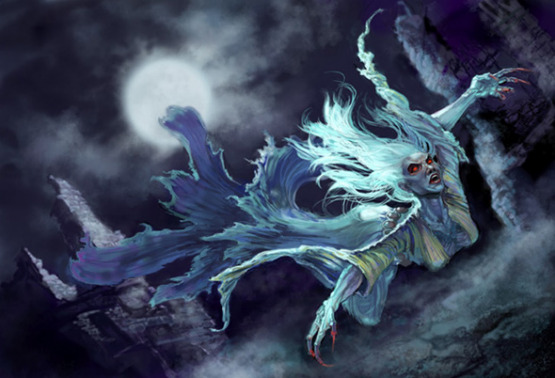
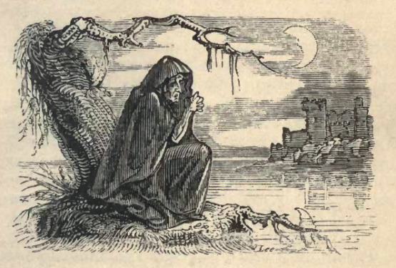

Kdykoli vystrašené komunity vybírají peníze k najmutí lovce netvorů, aby je zbavil banshee, mají pravděpodobně problém s jedním z následujících monster. Kdyby na sebe poštvali pravou Banshee, nestihli by ani modlitbu.

# Křikloun

Tak klasifikují lovci duchů pomstychtivou duši, která nejenže zemřela neprávem, ale navíc byla během života zbavena hlasu. Vytržené jazyky, spálené či rozdrcené hlasivky, vrozená či získaná němota i tyranský zákaz mluvení, všechny se kvalifikují.

Křikloun se od běžného naštvaného ducha liší tím, že umí křičet s frekvencí a hlasitostí, která dokáže vyrazit dveře, rozlámat cihly, prorazit bubínky i zastavit tep.

__V boji … (k6, hoďte každé kolo)__

1. útočí do všech, které má na dosah svých dlouhých drápů,
1. se teleportuje za nejvzdálenějšího protivníka a zaútočí na něj,
1. křičí tak vysoko, že musí všichni hodit proti zranění,
1. křičí tak hlasitě, že musí všichni hodit proti ochromení,
1. křičí tak hluboko, že se hroutí zdi, lámou trámy, praskají meče apod.,
1. zmizí ve zdi nebo podlaze, jen aby se za 2k4 kol zjevil jinde.

Křiklouna lze zahnat železem, solí, magií nebo svatým symbolem jako ostatní duchy. Pro jeho trvalé zničení ovšem nestačí spálit tělo, ale je třeba ukončit bezpráví, které ho zabilo. On sám na tom pomalu pracuje, ale postupuje v žebříčku viny odspodu, takže zabije spoustu lidí zbytečně; například svědky, kteří tyrana jen tiše trpěli a nic neudělali.

# Sgrechian

Šedozelený humanoid ženské postavy s hadí kůží a dlouhým černým opeřením kolem ramen, paží a podél páteře. Akademici nejsou rozhodnuti, zdali je Sgrechian vlastní druh, poddruh harpyje, nebo uměle vytvořená mutace člověka. Liší se od harpyje ve čtyřech bodech:

* Neumí zpívat, jen hrozivě křičet a kvílet. Namísto lákání obětí na sex je obklíčí a křikem naženou do pasti nebo takticky nevýhodné pozice.
* Při lovu žerou všechna zvířata a muže. Ženy unášejí a dlouhé týdny olizují.
* Nemnoží se pomocí pohlavních orgánů. Mají ve své do čtyř stran se rozevírající čelisti několikero jedových žláz – jedna z nich aktivuje mutaci z člověka ve Sgrechian.
* Neumí létat, ale obratně šplhají a skáčou, starší s dlouhými pery i částečně plachtí.

__V boji …__

* při nahánění obětí se pohybují rychle a mění barvu svého křiku tak, aby se zdálo, že jich je dvakrát až třikrát více než ve skutečnosti,
* mohou prskat paralyzující jed až na pět metrů, dospělého člověka ovšem musí zasáhnout několikrát, aby úplně ztuhl,
* při boji zblízka pokračují v křiku a vrhají se co nejrychleji do zápasu, aby mohli oběť rozsápat všemi čtyřmi pařáty,
* pokud ze sebe oběť Sgrechian neshodí, zakousne se do ní a vypustí smrtelný jed.

Lze je zabít poctivou ocelí jako každé jiné zvíře. Navíc mají velmi agresivní alergickou, téměř hořlavou reakci na stříbro.

# Ledová banshee

Stejně jako ostatní nemá krom křiku se skutečnou banshee nic společného. Prakticky se jedná se o magický konstrukt. Zimní královně nejsou dovoleny slabé lidské emoce jako soucit či strach. Kdykoli ji ve snech doženou smutné vzpomínky, je z ní noční můra vypuzena a v podobě potrhaného přízraku vyhnána z Azurové citadely.

Přízraky mají podobu temného odrazu vílí královny, zahalené v praskající ledové mlze. Létají nad severskými krajinami, střídají žalostný lament s panickým křikem a zničí kohokoli, koho potkají. Není to proto, že by byly vědomě kruté či zlé, jen neznají nic jiného než ztrátu a smrt.

__V boji... (k6, hoďte každé kolo)__

1. zběsile útočí zkřivenými prsty na nejbližšího oponenta, její dotek prochází skrz brnění a mrazí tělo i duši,
1. proletí skrz nejbližšího oponenta a všechny za ním, pokud stojí více či méně v řadě – všichni zasažení hází proti zmražení,
1. kvílí tak hlasitě, že si všichni v doslechu musí hodit proti zranění a dočasnému ochromení,
1. vybere nejsilnějšího protivníka a dunivě zakřičí jeho směrem, řev tvoří viditelně vibrující kužel, zasažený hází proti ohluchnutí a odmrštění o několik desítek metrů,
1. se vznese vysoko nad nepřátele, aby bouři nebo mlhu, která ji běžně provází, proměnila ve sněhový hurikán – pokud padne podruhé, začnou se ve sněhu objevovat obrazy z mládí Zimní královny,
1. zahlédne v očích některé ze svých obětí něco z královniny minulosti a paralyzovaně odklopýtá vzad – pokud padne podruhé, tak se přímo rozpláče a odletí.

Ledová banshee vyděšeně odletí a přestane útočit, pokud je svědkem lásky nebo nesobecké oběti. Nadobro zničit ji lze pouze ohněm, magií nebo magickými zbraněmi.

# Banshee

Skutečné Banshee jsou elfská orákula, kterým za jejich hříchy nebylo dovoleno zemřít. Nadpřirozeně sešlé stařeny tráví svá nekonečná tisíciletí sedáváním u hrobů těch, kteří dokázali opustit život hříchu, využili druhou šanci a stali se dobrými lidmi. Klečí nad jejich hroby a kvílí děsivé písně žalu. Přesvědčují bohy, aby vrahům a násilníkům dovolili dojít vykoupení. Možná doufají v to samé i pro sebe.

Přestože se jich lidé bojí, je velká pocta mít u vlastního hrobu Banshee. Rodina i přátelé jsou navždy zbaveni pochybností a mohou upřímně truchlit s čistým svědomím. Nemluvě o přímluvě před konečným soudem. Není nezvyklé, aby bohatý člověk sobě nebo rodinnému příslušníkovi najal profesionální zpěvačku, která pro něj bude po pohřbu kvílet.
