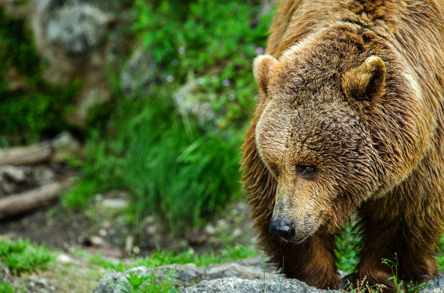
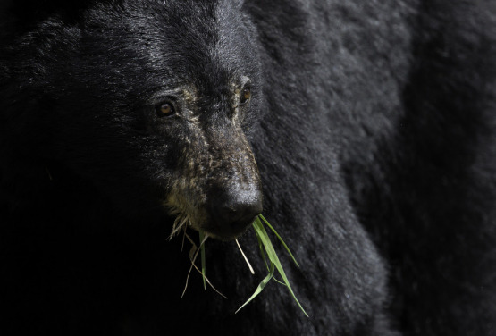

Čtyři krátké povídkové texty, čtyři rozličné pohledy na největší šelmu evropského středověku, čtyři inspirativní náměty ke hře.

# Setkání první: Bůh

Jarl Karsten vykřikl vzrušením a zaklel. Na vlastní oči viděl, jak medvěd, kterého již půl dne pronásledovali, zmizel v otvoru ve skále mezi borovicemi. Pokud nemá jeskyně druhý východ, mají kořist na dosah.

Zastavil psy a troubením na roh svolal své muže. Během chvíle se shromáždili před jeskyní. Karsten jim oznámil, že černý medvěd se ukryl právě tam. Přivázali koně ke stromům a všech šest lovců se vydalo dovnitř. Jen pár kroků za ústím otvoru však psi začali divočit a vzpouzeli se jít dál. Nepomáhal křik ani bití. Jeskyně čpěla medvědem a ohaři byli šílení strachem.

„Zatracení psi! Jdeme bez nich,“ rozhodl jarl. Jeden z mužů rozžehl pochodeň.

Jeskynní průrva pozvolna klesala, na zemi se tu a tam povalovaly stopy po jejích obyvatelích, medvědí výkaly a zbytky potravy. Zápach byl stále silnější. Jakmile zmizely poslední zbytky denního světla, chodba se rozšířila. Lovci užasli. Cesta byla z obou stran lemována kostmi, pečlivě umístěnými v pravidelných rozestupech. To muselo být lidské dílo. Neztráceli však čas zkoumáním, neboť z chodby před sebou zaslechli ozvěnu mručení šelmy. Jejich kořist je již blízko! Minuli odbočku stoupající doprava vzhůru – byla příliš úzká pro medvěda – a pokračovali dál. Chodba se opět zúžila a kosti zmizely, cesta je vedla klikatě a mírným stoupáním. Úzkých odboček, vedoucích do neznáma, přibývalo. V očích některých mužů se objevila nejistota, avšak jarl byl stále v čele a hnal se dál.

Náhle vstoupili do podzemního sálu, jehož rozlehlost byla ohromující. Světlo pochodně nedokázalo vyhnat temnotu z celého toho prostoru. Zahlédli pohyb. Zadek černého medvěda zmizel kdesi před nimi.

„Za ním!“ vykřikl jarl a rozběhl se, jeho muži s ním. Vzápětí se ale zarazili, protože to, co spatřili, jim vzalo dech. Světlo pochodně odhalilo nesčetné množství kostí, uspořádaných na podlaze ve složitých propletencích. Kosti byly bezpochyby jak zvířecí, podle mohutnosti nejspíš medvědí, tak lidské.

Když lovci přistoupili blíže, shledali, že kosti tvoří ohromný kruh, uprostřed něhož … Bohové! Na kamenné vyvýšenině tam seděla medvědí lebka neskutečné velikosti. Kolem ní se v hlíně leskly drobné mince a jiné kovové předměty. Muži se s ohromenými výrazy pomalu přibližovali. Padla na ně tíseň. Co je tohle za místo? Jarl kdysi slyšel o tom, že potomci původních obyvatel země hlouběji ve vnitrozemí ještě drží prastaré kulty se zvířecími bohy, ale pokládal to za pouhé báchorky. Všichni lidé v hustě osídleném přímoří, s nimiž se jeho kmen nájezdníků smísil před více než stovkou let, uctívali pouze Nebeské. Otřásl se odporem a hrůzou z neznámého. Pojednou ztratil chuť pokračovat v honu. A ve tvářích svých mužů četl totéž.

„Tohle místo je prokleté,“ řekl tlumeným hlasem, „vrátíme se.“ Lovci s ulehčením souhlasili. A pak to všichni zaslechli. Ozvěna k nim donesla kroky. Ne jedny nebo několik, ale desítky. Ze stínů se vylouply postavy a zastavily se na hranici světla a stínu. Byli to lidé, prostě odění a neozbrojení. V rukou však třímali kameny a bylo jich mnoho. Za zlověstného mlčení sevřeli lovce kruhem a začali se přibližovat. Jarl na ně zakřičel, aby se jich otázal, co chtějí, avšak bylo to zbytečné. Jeden z lovců zaklel a vrhl oštěp. Přesnou ranou skolil zamračeného mladíka s náručí plnou kamenů. Jako na povel se všichni zastavili a začali házet.

Jarl pochopil, že smrt je blízko. Lovci neměli štíty, jen oštěpy a tesáky. „Musíme prorazit! Za mnou!“ zavelel a rozběhl se. V tom okamžiku ho kámen udeřil do hlavy takovou silou, že se mu zatmělo před očima a ztratil rovnováhu. Jako zdálky slyšel výkřiky děsu a bolesti svých druhů. Kameny pršely jako krupobití za bouře. Lovci neměli nejmenší naději. Medvědí bůh přijal své další oběti.

# Setkání druhé: Král

Již sedmým dnem čekali obyvatelé Skaanie na návrat kralevice Mervyna z Korsberských kopců. Tím, že vystopuje, najde a zabije černého medvěda, měl potvrdit, že je hoden královského trůnu. Právě tak to učinil jeho otec, děd i praděd, který se stal prvním skaanijským králem, když sestoupil z hor a vypudil před sebou barbarské kmeny.

Král byl již celý nesvůj. Mervyn byl jeho jediný syn. První žena mu sice dala chlapce, avšak zemřela při porodu a syn ji o rok později následoval při morové ráně, zatímco on sám byl na válečném tažení. Druhá královna mu porodila Mervyna a potom už jen samé dcery. Kralevici mnozí z dvořanů vyčítali zpupnost, svévolné jednání a neúctu k tradicím. A král musel přiznat, že se mu výchova jediného syna poněkud vymkla z rukou. Ale přes to přese všechno, byl to jeho dědic a následník trůnu.

Mervyn zatím v čele své družiny projížděl kopce křížem krážem, avšak dosud neúspěšně. Zatracená tradice! Jeho předkům se snadno hledal medvěd, neboť tehdy byly zdejší lesy rozlehlejší a hlubší. Dnes se do nich zakusují ze všech stran pole a pastviny, proto není divu, že velkých šelem ubývá. Takový hon na jelena, to by byla jiná!

S takovými myšlenkami projížděl Mervyn lesními stezkami, když tu pojednou zaslechl křik svých družiníků: „Medvěd! Je tu černý medvěd!“ Okamžitě obrátil koně, zmocnilo se ho vzrušení. „Nažeňte ho ke mně!“ V té chvíli ho spatřil. Obrovský černý medvěd se kolébal mlázím a lámal tenké stromky jako stébla trávy. Lovci rozvinuli půlkruh a začali se přibližovat ke zvířeti. Šílející psy zatím drželi zkrátka. Mervyn si najel dostatečně blízko a mrštil po šelmě oštěp. Zasáhl, ale nezdálo se, že by jí rána jakkoli ublížila.

„Házejte!“ zařval vztekle na své muže. Jako na povel se na medvěda snesl déšť oštěpů. Několik z nich zůstalo vězet v jeho těle. Teď se zvíře rozzuřilo. S hrdelním řevem se vrhlo na nejbližšího lovce. Srazilo ho k zemi i s koněm. Muži pomohli svému druhovi do bezpečí, avšak osud koně byl zpečetěn. Medvěd mu tlapou roztrhl hrdlo a divoce se otočil na místě, aby si vyhlédl další oběť. Některým z lovců se vytrhli z rukou psi a vrhli se do zuřivého útoku proti šelmě.

Panoš podal Mervynovi další oštěp. Kralevic seskočil z koně a obešel medvěda, zaměstnaného rvačkou se psy. V příhodné chvíli mu vrazil oštěp do slabin, vytasil tesák a vrhl se kupředu. Než však stačil zasadit šelmě smrtelnou ránu, medvěd se bleskurychle obrátil a jeho levá tlapa dopadla na Mervynovu hruď. Muži zasténali úlekem. Medvěd odhodil jednoho z dorážejících psů a znovu udeřil na Mervyna. V tu chvíli odkudsi přiletěl oštěp a zabodl se zvířeti do oka. Jedním dlouhým skokem se tu objevil muž a dopadl mezi medvěda a zraněného kralevice. Svižně se vyhnul úderu tlapou a celou svou vahou nalehl na prsa vzpřímené šelmy, přičemž jí hluboko do těla vrazil dlouhý nůž.

Medvěd muže objal, jako by jej chtěl rozdrtit ve svém sevření. Lovci, kteří se konečně vzpamatovali, zasypali zvíře dalším deštěm ran. Medvěd padl na bok a chraptivě naříkal. Jeho přemožitel počkal, až pohyb hrozivých tlap ustane, potom se vymanil ze sevření a povstal.

Nikdo si ho nevšímal, neboť lovci se shromáždili kolem Mervyna. Byl bledý a na čele mu vyvstával ledový pot. Ztratil příliš mnoho krve. Ani včasná pomoc mužů, kteří mu obvázali rány, nebyla nic platná. Mervyn umíral.

Vrchní lovčí Askild pozvedl oči a pohlédl na medvědova přemožitele. Užasl. Ten mladík nepatřil k jejich výpravě, byl oděn do účelného prostého loveckého oděvu. Avšak jeho tvář byla tváří šlechtice. A oči, ty oči přece Askild důvěrně znal. Ale odkud?

„Šel jsem po něm již sedm dní. Je mi to líto,“ řekl prostě neznámý lovec a sklopil oči k umírajícímu. Jakmile lovčí zaslechl ten hlas, bylo mu vše jasné.

„Vašemu bratru již není pomoci. Prosím, následujte nás ke svému otci, Vaše Výsosti. Svou zkoušku jste splnil,“ pronesl Askild a poklekl.

Oči přítomných se na něj upřely. Nejvíce zmaten byl lovec. Askildovi nezbylo než přímo na místě vše vysvětlit. Prvorozený královský syn, jenž přišel o matku při svém narození, nezemřel před patnácti lety na mor, jak se všichni domnívají. To druhá žena králova, jež toužila na trůně vidět vlastního syna Mervyna, využila příležitosti, a zatímco její manžel válčil za hranicemi, zařídila jeho zmizení.

Starý lovčí, kterého k tomu činu přinutila, však měl soucit, a tak dítě nenechal napospas šelmám, ale dal je do opatrování lovcům v Korsberských kopcích. Toto tajemství svěřil svému nástupci a zavázal ho mlčenlivostí až do své smrti.

Bohové se nenechají oklamat a trůn přiřknou tomu, komu skutečně náleží. S tímto vědomím nakládali lovci Mervynovo tělo a medvědí hlavu na koně. Zatímco doprovázeli pravého dědice trůnu zpět na královský dvůr, starý lovčí na svém lůžku na hradě vydechl naposledy.

# Setkání třetí: Ochránce

Skalní hrad Torval byl v obležení už třetím týdnem. Nájezdníci byli odhodláni dobýt ho za každou cenu. Torval byl jednou z nemnoha výsep odporu starých skaanijských rodů. Dokud ten nebude zlomen, nebudou moci zemi považovat za zcela podmaněnou.

Útočníci spálili podhradí a obyvatele dílem pobili, dílem odvlekli. Sevřeli hrad kruhem, postavili valy a kryty a zasypali příkop chránící přední hrad, aby mohli udeřit na bránu. Kvůli nerovnému okolí hradu, plnému rozeklaných skal a strží, však nemohli použít velkých dobývacích strojů a věží. Nebylo kam je umístit.

Vévoda Gerulf, pán na Torvalu, stál na koruně velké věže a shlížel dolů. Již týdny marně přemítal, zda a kudy by bylo možno vést protiútok, kterým by vymanil sebe a své muže ze sevření těch cizáckých psů. Přemítal, avšak východiska nenacházel. Nepřátel bylo příliš mnoho a nebylo znát jediné skuliny, jediného slabého místa v jejich obklíčení.

Nebyla naděje na to, že by někdo přišel na pomoc. Král byl již roky ve vyhnanství a v sídelním městě seděl uzurpátor z východu. Většina rodů, které přežily válečné běsnění, sklonila hlavu a uznala novou vládu lvího krále. Ne tak Gerulf. Dokud bude živ, hrdý medvěd se neskloní před zpupným lvem z ciziny. Pohlédl vzhůru na vlající praporec s černým medvědem ve stříbrném poli. Vlál radostně, jako by netušil, že jeho sláva mizí v nenávratnu.

Bojový ryk vyrušil Gerulfa ze zamyšlení. Další vlna útoku, další pokus o proražení brány. Chvatně seběhl z věže, překonal lávku a připojil se k mužům bránícím štítovou zeď předního hradu.

Odhodlání nepřátel bylo obdivuhodné. Šlapali po tělech svých mrtvých druhů, která plnila příkop, jako snopy plní stodolu po žních. Přitáhli s sebou nového berana, jímž zběsile bušili do brány. Lučištníci zasypávali hrad množstvím ohnivých šípů. Boj byl stejně lítý a nemilosrdný jako mnohokrát předtím, avšak bylo znát, že obráncům docházejí síly i střelivo. Nedokázali včas odrazit nepřátelský oddíl nesoucí berana, brána stále bolestněji úpěla a praskala pod jeho údery.

Černý medvěd, Gerulfův zvířecí oblíbenec, ve své kleci žalostně mručel, jako by cítil blížící se konec. Děti, shromážděné na nádvoří, plakaly, zatímco ženy pobíhaly kolem, hasily zárodky požárů a sbíraly vše, co bylo možno vrhnout na dobyvatele.

Hlasitý rachot ohlásil, že brána neodolala. Gerulf dal troubit ústup, zatímco desítka mužů z posledních sil bránila útočníkům vstoupit. Jejich odpor ochabl a příval nepřátel je smetl právě v okamžiku, kdy posádka zdvíhala lávku mezi předním a zadním hradem.

Nyní padla na obránce opravdová tíseň. Zadní hrad neměl vlastní studni, jen cisternu. A horké letní dny neslibovaly dostatek vláhy na její doplnění. Gerulf se rmoutil ještě pro jedno. Černý medvěd, jeho miláček a ochránce rodu, padl zuřivým nepřátelům do rukou. Jistě si nenechají ujít příležitost, aby mu připravili potupnou smrt.

Vévodovy obavy se naplnily. Jen pár hodin po pádu předního hradu svrhli nepřátelé do příkopu bezvládné medvědovo tělo. Bylo probodané oštěpy a hlava byla napůl odsekána. Nad předním hradem zavlála standarta se zlatým lvem ve skoku. Když muži spatřili zohavenou mršinu, skřípali zuby, spílali a proklínali nepřátele. Všichni až na jednoho. Gerulfův věštec Marchon, malý shrbený stařík, stál na cimbuří a přimhouřenýma očima hleděl na ubitého medvěda. Potom se ušklíbl a kolébavým krokem se vydal za vévodou.

* * *

Louče osvětlovaly kruhový sál velké věže, za jejímiž okny byla hluboká noc. Gerulfovi družiníci stáli podél stěny a se zaujetím sledovali věštcovo počínání. Nikdo z nich dosud netušil, že ten muž zná starodávné rituály předků. Marchon dělil ostrým nožem syrové medvědí maso, přičemž pronášel strašlivé kletby, určené nepřátelům. Z dosud vlahých vnitřností vycházel nepříjemný zápach; krev, která se dosud nesrazila, se rozlévala po dlažbě.

Věštec podal každému z mužů kus masa a udělil mu požehnání. Na jeho pokyn se všichni najednou pustili do jídla. Maso bylo tuhé a odporné, někteří z družiníků stěží překonávali dávení. Marchon pozvedl hlas a začal zpívat ve starém nářečí. Tu se mužů zmocnilo vytržení, začali pojídat medvědí maso s chutí, trhali je zuby s dravčí zuřivostí. Věštec smáčel ruce v krvi a maloval jim na obnaženou hruď ochranné znaky. Temné mručení, vycházející z hrdel mužů, se mísilo s věštcovou písní. V očích se jim objevil přísvit šílenství. Tak jak byli, do půli těla nazí, popadli zbraně a vyhrnuli se ven z věže. Řetězy zařinčely a lávka dopadla na své původní místo.

Nepřátelské hlídky troubily na poplach, zaskočené tím sebevražedným útokem polonahých bojovníků. Vojáci chvatně vstávali z loží a chápali se zbraní, aby se postavili běsnícím mužům vévody Gerulfa. Jako by však nějaké kouzlo způsobilo, že zuřivci, ač nekrytí zbrojí a stojící proti přesile, necítili rány ani únavu. Čím více krve bylo na obou stranách prolito, tím více se jejich zběsilost stupňovala.

Záhy ve vojsku lvího krále zavládl zmatek a děs. Pověrčiví zbrojnoši křičeli o zlých kouzlech a nepřízni duchů, zahazovali zbraně a hledali, kudy by nejrychleji unikli, nedbajíce spílání a kleteb svých pánů. Muži prchající z předního hradu vnesli zmatek do hlavního tábora obléhatelů. Všude byly slyšet výkřiky, dusot, troubení a ržání koní.

Jakmile byl přední hrad prost nepřátel, pustili se zuřiví bijci dál mezi obléhatele. Té noci pobili stovky protivníků a ještě více jich obrátili na útěk. Vojevůdce lvího krále musel obléhání přerušit do té doby, než se mu podařilo znovu seskupit. Na předním hradě opět zavlál praporec s medvědem a vévoda Gerulf hrdinně odolával ještě několik týdnů, než podzimní bouře donutily dobyvatele odtáhnout. Z jeho družiníků však tu noc nepřežil ani jediný. Všichni zemřeli na utržená zranění ve chvíli, kdy vyšlo slunce a medvědí zuřivost pominula.

# Setkání čtvrté: Zločinec

Avrad seděl před šenkem, upíjel pivo, pozoroval ruch na tržišti a uvažoval. Jeho pán, rytíř Borgil, jej pověřil vypátráním medvěda, kterého mu kdosi v noci ukradl přímo z jámy pod hradem. Vskutku neobvyklý zločin a pro něj přetěžký úkol!

Avrad soudil, že jsou tři hlavní možnosti, kde zloděje hledat. Pověrčiví měšťané mohli medvěda uloupit, aby si z jeho těla připravili zázračné léky. Borgilův soused, rytíř Manhert, se mohl krádeží mstít za skutečné či domnělé křivdy, jak to mají urození ve zvyku. Nebo konečně církev, jež ve svém učení zpodobňovala medvěda s ďáblem a brojila proti tradičním medvědím obřadům a hrám. Že by však preláti sáhli k únosu medvěda po způsobu lapků? Nebylo by pro ně účelnější poštvat na šelmu dav věřících, aby ji ukamenoval?

Avrad se chystal začít své pátrání mezi měšťany, chtěl navštívit věštce Midhulfa. Tam to bude nejsnazší. Ten starý čaroděj by mohl vědět něco o tom, zda někteří z místní honorace neshánějí neobvyklé léky. Třeba se ukáže, že v tom má prsty on sám. A kdyby snad chtěl zapírat, Avrad to jistě pozná. Dobře ví, jak donutit lidi jako Midhulf přiznat pravdu.

Už se chystal opustit tržiště, když tu jeho pozornost upoutal příchod neznámého muže. Ten člověk nebyl ničím zvláštní, měl obnošené šaty, na bradě strniště, přes rameno brašnu; vypadal jako chudý pocestný. Za ním se však táhl zástup čumilů, kteří jako by očekávali nějakou podívanou. Avrad náhle věděl, o koho se jedná. Jistě je to jeden z těch potulných kazatelů, kteří táhnou krajem, žijí z milodarů a ve svých promluvách tepou vše, co se protiví církvi. Pověrečné zvyky, pohanské modly předků, hříšné mravy, to vše bylo terčem jejich ohnivých kázání.

Avrad se nespletl. Příchozí zaujal vhodné místo, vystoupil na bednu, kterou mu přistavil ochotný trhovec, a bez okolků začal: „Měšťané karganští, muži i ženy, mládenci i starci, panny i vdovy, páni i sluhové, kupci i sedláci, mnichové i vojáci! Slyšte slova, která vám přináším k vašemu blahu. Rozvažujte o nich, vryjte si je do srdcí a proměňte je v činy. Opusťte staré a zkažené, přijměte nové a ušlechtilé.“

Kazatel se dramaticky odmlčel a rozhlédl se. Hlouček posluchačů se mezitím zněkolikanásobil.

„Vy všichni, jak tu stojíte, jistě byste odpřisáhli, že jste se již dávno zbavili uctívání falešných model a přijali jste pravou víru. Avšak není tomu tak a nebude, dokud se neočistíte ode všech známek pohanství! Jen se podívejte na rytíře, kteří spravují váš kraj, kolik z nich stále ještě nosí ve svém znaku medvěda. To zlořečené zvíře, šelmu a falešného boha, vašimi předky v jejich nevědomosti uctívaného. Zlý bůh medvěd, temný král hvozdů, jenž se živil ohavnými lidskými obětmi, je tu stále s vámi na rytířských erbech, v panských zvěřincích i v pověrách obecného lidu země!

Medvěd, ten ohavný a chlípný svůdce! Vždyť je přece známo, že chová zálibu v lidských ženách. A běda takové, která by padla medvědu do rukou a byla mu ponechána napospas.

Poslyšte příběh, který se udál před sedmi lety v kraji u Korvugy. Jedna žena, mladá vdova po rytíři padlém v klání …“

Avrad musel kazateli přiznat, že dokáže posluchače strhnout jako málokdo. Dav muži visel na rtech, dokonce i někteří trhovci se přestali věnovat svému zboží a poslouchali. Do shromáždění se postupně vmísili lidé, které Avrad nikdy předtím neviděl. Buď to byla náhoda, nebo měl kazatel své oddané posluchače, kteří ho následovali od města k městu.

„Když tu nešťastnou ženu nalezli lovci, nevěřili svým očím a uším. Ona nesla na ruce dítě s tváří porostlou hustou hnědou srstí a spílala jim do vrahů, že jejího manžela zabili. Nikterak si to nenechala vymluvit, truchlila po zabitém medvědovi, jako se truchlí po milovaném člověku.

Lidé to ohavné dítě spálili v peci a chtěli upálit i ženu, avšak její švagr ji vzal pod ochranu na svou tvrz. Ona ovšem již dlouho žít neměla, soužila se stále pro medvěda i to dítě, přestala pokrm přijímat a nakonec duši vypustila.

Pro to všechno, dobří lidé, střezte se zvyků svých předků, mějte v úctě jen pravé bohy, a ne falešné modly, zvláště ty v medvědí podobě …“

Kazatel ještě mluvil, když čtveřice neznámých mužů přitáhla na trh rozměrný vůz přikrytý plachtou. Avrad okamžitě věděl, že tady se chystá něco víc než pouhé kázání. Zvuky, které se ozývaly z vozu, zaujaly pozornost nejbližších okolostojících.

„Dobří měšťané!“ vyzval posluchače vysokým hlasem kazatel. „Nyní prokažte, že poselství církve padlo na úrodnou půdu!“

Muži strhli plachtu z vozu a dav zašuměl překvapením. Objevila se klec, v níž znepokojeně přešlapoval medvěd. Avrad povstal, aby lépe viděl. Rozbušilo se mu srdce. Tedy již nemusí pátrat po únoscích Borgilova miláčka! I přes jeho zubožený vzhled poznal zvíře zcela bezpečně. Chudák měl uřezané drápy, mordu sevřenou náhubkem a na srsti zaschlou krev a výkaly. Pohled měl kalný a mručení, které vycházelo z jeho hrdla, pozbylo své někdejší síly.

„Zde je medvěd! Opovrženíhodná šelma a znamení temných dob, které již pominuly!“ hřměl kazatel, zatímco muži táhli zvíře za řetěz, aby je uvázali k pranýři.

„Nuže, vykonejte soud a očistěte sebe i své město od přízraků minulosti!“

Muži vyložili vědra kamení, připravená též na voze, a rozmístili je do davu kolem nebohého zvířete. Jako první se odvážily hodit kamenem děti, ale záhy se přidali i ostatní, zvláště chudší měšťané a příchozí z kraje.

V Avradovi se vařila krev, když sledoval, jak rozvášněný dav ubíjí jediného Borgilova medvěda. Ale co mohl dělat? Postavit se davu by bylo šílenství, obzvlášť když byl ponoukán vůlí církve. Nikým nepovšimnut se vytratil z trhu, vyzvedl si koně a vydal se k Borgilovu hradu, oznámit svému pánu chmurnou zvěst.
