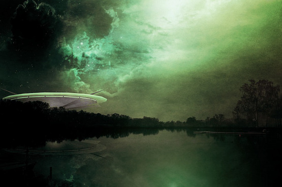
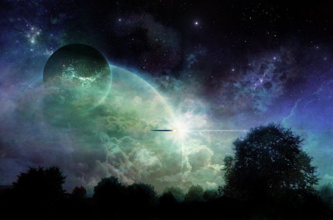
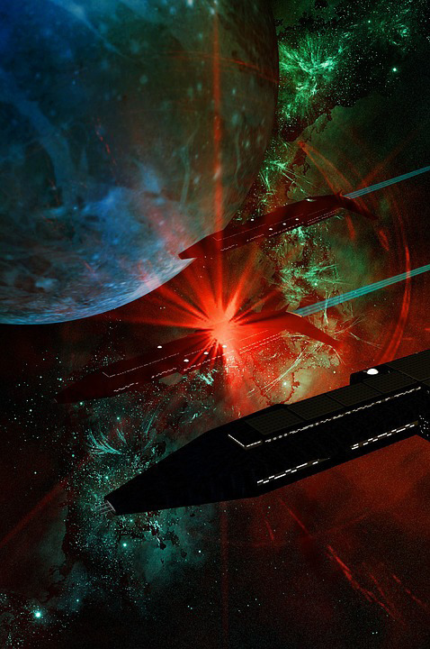

Článek představuje mimozemskou rasu Dharnaků, která má sloužit jako inspirace pro vaše hry z prostředí sci-fi nebo space opery. Zasadil jsem ji do svého vlastního světa v rámci Perseova ramena Mléčné dráhy, ale tyto reálie můžete samozřejmě změnit a použít je pro své hraní, jak potřebujete.

# Historie

Koncem 21. století začalo lidstvo expandovat mezi hvězdy. Díky inovacím v oblasti mezihvězdných motorů kolonizovali lidé během několika desítek let většinu blízkých planet a systémů, přičemž začali prozkoumávat vzdálenější oblasti v rámci Orionova ramene Mléčné dráhy. Tehdy se jedna z takových průzkumných výprav vydala navigační chybou na dalekou cestu do úplně jiné části naší galaxie – do jejího Perseova ramene. Posádka se uložila do kryospánku a zamířila k jinému vzdálenému cíli. Navigační systém lodi byl ale zmaten dosud nezmapovaným a nezvykle silným magnetickým mostem, který spojoval obě galaktická ramena. Loď byla odkloněna ze své trasy a jen shodou okolností a náhod se jí podařilo po mnohaměsíční cestě dorazit v pořádku do blízkosti Perseových hvězdných systémů, kde automatický systém probudil členy posádky z kryospánku. Dosažení tak vzdáleného cíle mělo být v té době za hranicí tehdejších technických možností.

Posádka lodi na v Perseově rameni objevila velkou mimozemskou říši Gwar a uskutečnili první kontakt s mimozemskými tvory. Většinu jejich obyvatel tvoří hubení a podobou lehce kočičí __Irri-ron__ (kterým lidé říkají prostě Irrijové), zatímco vládnoucí a vojenskou vrstvu říše představují čtyřocí __Dharnakové__. První velký stát mezi hvězdami vytvořili Irrijové, kteří také vybudovali velké autonomní stroje, které měnily podnebí nehostinných planet na podnebí podobné jejich domovské planetě. Tyto stroje jsou mnohdy stále ještě v provozu, přičemž princip jejich fungování už dnes nikdo nezná. Jejich říši __Irri-Vaë__ ale rozvrátila rasa Dharnaků, která byla sice na nižší technologické úrovni a méně početná, ale vojensky zdatnější a dravější. Během několika málo let byla říše Irrijů zničena a její území ovládli Dharnakové, kteří na jejích troskách vybudovali vlastní říši __Gwar__, ve které jsou vládnoucí třídou.

# Dharnakové

Dharnakové jsou humanoidi z planety Djaqa, z velké části pokryté rozlehlými bažinami a kyselými mokřinami. Bývají v průměru o něco vyšší, než je člověk, jejich samice přesahují lidi o dobrých třicet až čtyřicet centimetrů. Mají čtveřici očí s horizontálními zornicemi. Horní pár očí je posunutý na stranu a dodává jim výrazné periferní vidění, dolní směřuje dopředu. Díky zornicím a počtu očí mají velice dobrý přehled o svém okolí, dokážou zpozorovat blížící se nebo prchající protivníky a také kořist na velkou dálku. Nevýhodou jejich očí je určitý problém s rozlišením malých detailů, které pro predátory historicky nebyly tak důležité. Chybí jim téměř úplně obličejová mimika, pro ostatní rasy je tak obtížné číst jejich nálady a rozpoložení.

Dharnakové mají tři různá pohlaví – __samice__, __samec__ a pak třetí zvané __instar__, které je pohlavně nevyprofilované. Mláďata dorůstají do stadia instara, což je plně dorostlý jedinec, který však nemá žádné pohlavní znaky a nemůže se rozmnožovat. Základní jednotkou dharnacké společnosti je smečka nebo rodina, která se v jejich jazyce nazývá _dharn_. Samotný název jejich rasy – _Dharnakové_ – označuje člena nebo příslušníka _dharnu_.

Ten tvoří dominantní samice, samec a tři až osm pohlavně neprofilovaných instarů, kteří fungují jako jedna skupina a zároveň bojová jednotka, kde celá skupina bojuje jako celek. Všichni dospělí členové _dharnu_ jsou vojáci, kteří vyrazí do boje podle potřeby. Ve chvíli, kdy jsou samice nebo samec zabiti, nejsilnější nebo nejstarší instar se pohlavně vyprofiluje, aby nahradil zemřelého jedince. Profilují se na základě společenské potřeby, a jakmile se tak stane, je tato změna nevratná. Většina instarů se však do jiného pohlaví nikdy nevyvine. Instaři také migrují mezi jednotlivými _dharny_ a tím jednak utužují klanové vazby, jednak přinášejí do _dharnů_ „novou krev“. Pokud jeden _dharn_ porazil jiný, často také po zabití vedoucího páru ustavil vlastní instary, kteří byli připraveni se pohlavně diferencovat, jako nový vedoucí pár, čímž přeživší „přebrali“ pro svůj klan. Případně Dharnaci vybrali slibné instary pro posílení vlastního _dharnu_ a zbytek slabších zabili.

V dharnacké společnosti mají samice roli lovců a válečníků, které přinášejí potravu, zatímco samci hlídají líhně a starají se o mláďata, než dorostou do stádia bojeschopných instarů. Samice jsou větší, mohutnější a silnější než samci i instaři, mají v obličeji jasně oranžové pruhy, které je odlišují a slouží jako varování nepřátelům. Samci jsou hubenější a do určité míry jejich pokožka dokáže přejímat barvu pozadí, takže se snadněji ukryjí v prostředí. Dokážou také směřovat elektrické pole svého těla a vysílat elektrické výboje na několik metrů. Na ostatních planetách s nižší vzdušnou vlhkostí se tato schopnost oslabila, ale stále ji mají.

V moderním válečnictví vedou samice _dharn_ do boje a bojují v prvních řadách jakožto velitelky a bojové specialistky. Do bitev je následují instaři, kteří tvoří naprostou většinu vojáků rasy. Samci jsou v moderním pojetí specialisté na boj na dálku a díky své omezené maskovací schopnosti také experti na infiltraci. Často bojují v okolí bojové linie svého vlastního _dharnu_, ale nezávisle na něm, aby maximalizovali své výhody a pomohli svým spolubojovníkům.

# Rozmnožování

Samice kladou vajíčka do stojaté vody, kde je samec oplodní a hlídá je, dokud se z nich nevylíhnou mláďata. O ty se dál stará, dokud nedospějí do stadia bojeschopných instarů. Dharnakové sice původně pochází z planety s velkým množstvím vody, ale dokáží bez ní bez obtíží fungovat. Nedokáží se bez ní ale rozmnožovat, protože jejich vejce se musí vyvíjet ve vodě se specifickou kyselostí. V dnešní době využívají pro rozmnožování gigantické technologické líhně, kde se jejich vajíčka rozvíjejí v kontrolovaných podmínkách.

# Řeč

Na krátkou vzdálenost dokázali Dharnakové na své domovské planetě, která měla vysokou atmosférickou vlhkost, vnímat změny v elektrickém poli ostatních a číst tím jejich nálady. Dokázali spolu také snadno komunikovat gesty, změnami pozic těla a pohyby očí. Jejich řeč tak byla poměrně jednoduchá a nepokrývala příliš mnoho oblastí. Když Dharnakové opustili svou rodnou planetu, zjistili, že na sušších irrijských planetách čtení ostatních skrze jejich elektrické pole nefunguje. Navíc měli problém vlastní, značně jednoduchou řečí popsat vše nové kolem sebe. Převzali proto pro běžnou komunikaci irrijský jazyk. Dnes je jen málo těch, kteří ještě ovládají starou dharnačtinu (především pro účely tradic a obřadů). Do běžného užívání z ní přešly jen některá slova, většinou týkající se válečnictví, jinak je z větší části samotnými Dharnaky zapomenuta.

# Společnost

Jejich společnost byla vzhledem k nehostinnosti jejich planety historicky kočovnická a dodnes si udržuje kočovnické tradice a kořeny. _Dharn_ v minulosti fungoval nezávisle a o kořist a loviště bojoval s ostatními _dharny_. Vzájemně rodinně a spojenecky spřízněné _dharny_ postupně vytvořily klany, které se vzájemně podporovaly a byly schopny udržet větší území. Dharnacké klany mezi sebou kvůli nehostinným podmínkám své planety vždy soupeřily a vedly kruté a vyhlazovací války.

V jejich historii se málokdy vytvořily větší svazky klanů nebo státy a ty byly vždy podřízeny jen osobě vojevůdkyně a po její smrti se opět rozpadaly. Dharnacká technologie byla poměrně primitivní a kromě válečnictví se vyvíjela jen pomalu. Po pádu irrijské lodi se jim ale podařilo postavit vlastní vesmírná plavidla schopná dosáhnout irrijského prostoru, kde jednotlivé klany začaly provádět občasné nájezdy a plenit odlehlé irrijské stanice. Přestože byli Dharnakové zkušenými válečníky, jejich útoky byly nekoordinované a roztříštěné. Říši Irri-vaë po několik desetiletí jejich nájezdy nijak výrazně neohrožovaly.

Pak se ale mezi Dharnaky objevila vojevůdkyně, která se rozhodla sjednotit Dharnaky. Jmenovala se Gwar a její klan si začal postupně podrobovat ostatní menší klany, které se k ní buď připojily, nebo byly vyhlazeny z povrchu planety. _Dharny_ a klany se sbíhaly k jejímu praporu a Gwar po zuřivé válce porazila své protivníky a sjednotila sílu celé rasy pod své velení. Zreformovala dharnackou společnost a rozdělila klany mezi devět _armád_ (každá s vlastní barvou a symbolem, kterým velí _nawar_), v nichž _dharny_ představují bojové jednotky a klany větší vojenské oddíly, schopné společného nasazení.

Gwar pak celou sílu rasy vrhla proti Irrijům a po strašlivé válce vyvrátila jejich říši a porazila je. Irrijové byli na vyšší společenské a technologické úrovni, Dharnakové ale pocházeli z nehostinné a drsné planety, byli otužilí, uvyklí válce a vojenské disciplíně. Byli to veteráni tuctů šarvátek a bitev mezi klany a v rámci _dharnu_ byli sehranou bojovou jednotkou. Kromě mláďat jsou navíc všichni členové rasy válečníci a vojáci, které je možné nasadit do války, zatímco jen malé procento Irrijů sloužilo ve vojsku a bylo schopné se invazi postavit. Válka byla krvavá a dlouhá, ale civilizovanější Irrijové v ní podlehli primitivnějším, ale dravým a zuřivým Dharnakům.

Na troskách Irri-vaë pak Gwar vybudovala vlastní říši, kde Dharnakové (tvořící v současnosti asi 10–15 % obyvatel) jsou nyní vládnoucí rasou a Irrijové jsou podřízenou rasou, která pracuje a vyrábí vše, co říše potřebuje. Dharnakové v průběhu let přijali irrijský jazyk a kulturu, kterým nyní vládnou. Jsou považováni za válečníky a je jim zapovězeno podnikat nebo se věnovat řemeslům – namísto toho se od nich očekává, že budou spravovat své poddané, cvičit se pro válku a v případě potřeby nastoupí pod prapory vlastní armády. Všichni dospělí Dharnakové jsou vojáci říše, zařazeni do některé z barevných armád, přičemž tvoří vládnoucí válečnickou vrstvu podobnou naší šlechtě.

Po Gwařině smrti hrozilo, že se říše (jako tolikrát předtím) opět rozpadne a jednotlivé armády se postaví proti sobě. Velitelka největší, zlatočerné armády nechala zavraždit ostatní velitelky armád a prohlásila, že je Gwarou, která opustila své tělo, ale v její osobě žije dál. Dodnes je vládkyně říše nazývána Gwar a je považována za původní osobu, která sjednotila Dharnaky, vytvořila jejich říši a pouze měnila těla, ve kterých žije.
