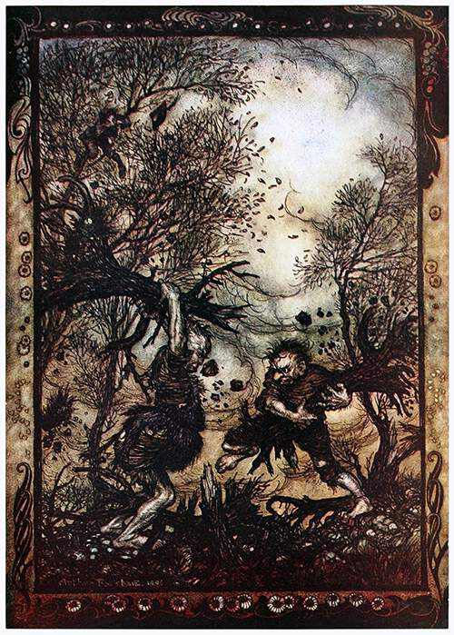
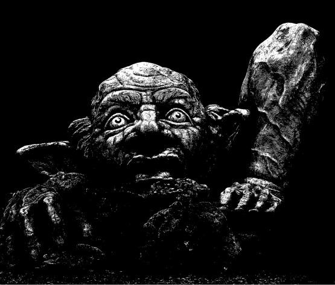
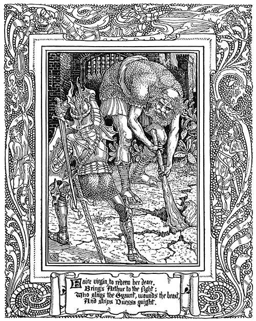

Oheň už vyhasl, měsíc je ukrytý v mracích a jen narudlé uhlíky bojují s tmavou nocí. Přitáhneš si plášť blíž k tělu a zívnutím oddálíš číhající spánek. Hlídka je hlídka. Pravidelné oddechování tvých druhů, zabalených v přikrývkách, moc nepomáhá.

	Náhle zpozorníš. Zdá se, že v lese se něco hýbe … Asi se ti něco zdálo. Ba ne! Teď zapraštělo dřevo a les zašuměl. Sotva ti problesklo hlavou, jestli bys neměl probudit ostatní, seběhlo se všechno ráz na ráz.

	Z lesa vyrazil jelen a mohutnými skoky se prohnal přes mýtinu, na které táboříte. Už už by zmizel, když s praskotem a rachotem vydusal z lesa obr, a než jelen našel spásu mezi stromy, ranou obrovské palice srazil majestátní zvíře k zemi.

	Mezi mraky se právě v tu chvíli proderou paprsky měsíce a obrova rohovitá tvář se se zuřivým úšklebkem obrátí k tobě.

	Stojíš s kopím napřaženým směrem k lovci a jeho kořisti a teprve teď konečně vykřikneš: „Poplach! Zlobr.“

# 1.	Jménem krále

Ve strážním hrádku Störvostu na pomezí Černých vrchů starý kapitán Henry Manston nabízí odměnu za odstranění hrozby pro kupce projíždějící po místní stezce. Posádka dostala za úkol zbavit se lapků, ale ukázalo se, že loupežníci se spolčili s párkem zlobrů a na ně si vojáci netroufají, vesměs jsou to staří harcovníci a k nim pár holobrádků. Posílení vojenské posádky uprostřed řídce obydlené vrchoviny je v nedohlednu, zvlášť když se na severu haraší zbraněmi a konflikt s Hanzou je na spadnutí.

Störvostský kapitán nabízí průvodce: šedovlasého stopaře Gilberta Nashe. Jako odměna kromě drobné finanční částky se nabízí královský glejt, zajišťující spolupráci královských úřadů celého širokého kraje.

Bude vděčnost kapitána Manstona pro dobrodruhy dostatečnou odměnou nebo raději po případném vyřešení hrozby zamíří rovnou za purkrabím Dayhavenu, což nejspíš bude stát Manstona místo?

Je Nash s křivým úsměvem opravdu spolehlivý společník, nebo zavede dobrodruhy do pasti nastražené loupežníky?

Co slíbil náčelník loupežníků Ethan Barton zlobrům, aby ho poslouchali?

# 2. Zkamenělý zlobr

Cestou od moře k Achsfurtu se cesta vine průsmykem mezi vrcholky hřebene Skalisek. Po nedávných lijácích se ale utrhla část svahu a cesta je neprůchodná. Při cestě po horské stezce je k vidění zvláštní úkaz. Zkamenělý zlobr kousek od stezky, upírající pohled na východ, s rukou stínící si oči před prvními paprsky slunce. To by samo o sobě nebylo ještě tak zvláštní, ve Skaliskách zlobři vždycky žili.

Když poutníci přijdou blíž, zjistí, že zkamenělý obr je pokreslený zhnědlými runami a kolem nohou se v trávě táhne vypálený kruh, jehož středem je položený železný řetěz.

Někdo se asi snaží o nějaký magický rituál s cílem získat jeho paměť a zmocnit se pokladů, které za života nakradl?

Nebo mladík ze zchátralé věže pod Achs­furtským průsmykem není jenom pomatenec, ale studiem zakázaných knih se dostal k temným tajemstvím, ke kterým potřebuje zlobří duši?

Nebo jde o zlobřího hrdinu, který následoval legendu, jež praví, že ten, kdo se dobrovolně zkamení, sto let v kameni setrvá, pak krví svých synů bude přiveden zpět a již nikdy nad ním nebudou mít paprsky slunce žádnou moc a jako bájný král sjednotí znesvářené zlobry a společně vyrvou z rukou lidí to, co jim od pradávna patří?

# 3. Perla mezi plevami

„Pod vrchem Homole, co se zdvíhá na východ od vsi Richtendorf, na severní straně – tam, co rostou dva mohutné duby, začíná stezka, co vede k jeskyni pod Homolí. Tam jsem pod třemi oválnými kameny ukryl Langhansovo kopí. Skrýš je chráněná zaklínadlem, ale stačí přečíst na místě tento svitek a můžete artefakt vyzvednout. Vidíte, říkal jsem vám, že to nebude nic složitého. Abych nezapomněl, v jeskyni se usídlila zlobří banda, která tam shromažďuje svoje nakradené poklady. Ty všechny si můžete nechat, hlavně doneste to kopí. Sejdeme se za dva týdny v ravnbuské taverně U Orlího spáru. Ne aby vás napadlo někam zmizet, účinky svitku budou trvat právě ty dva týdny, tak se zbytečně nezdržujte, jste mi sympatičtí, tak bych nerad, aby se vám něco stalo.“

Jakou náhodou tenhle šedovlasý chlapíček, Adam Sayer, narazil právě na vás, v téhle zapadlé vesnici daleko od civilizace?

Opravdu to byl on, kdo ukryl kopí v jeskyni, nebo je chce někomu vyfouknout a ten svitek s kouzlem je jenom šaškárna, aby vás nenapadlo se někam zdekovat s celou kořistí?

Jsou zlobři opravdu jenom drobnou překážkou k získání mocného artefaktu, nebo jim dlouhodobý pobyt v jeho blízkosti propůjčil magické schopnosti, jimiž se liší od jiných zlobrů, které jste dosud potkali?

# 4. Dvojí hrozba

Už několik dní sledujete z bezpečných úkrytů kolem polorozpadlý lesní hrádek Ziegeburg. Noční pohyb pětice zlobrů máte zmapovaný a začínají se rýsovat i slabiny jejich ledabylého hlídkování. Právoplatný majitel hrádku, rytíř Romuald Heggenturf vám výměnou za navrácení rodného sídla jeho děda zpět pod korouhev s kozlí hlavou slíbil uvedení na královský dvůr a přímluvu u kancléře Comptona ve vaší věci. Nadto, když jste sem přicestovali, místní kupecký spolek nabízel tučnou odměnu za zprůchodnění kupecké stezky, jež se vine po úpatí vršku pod hrádkem. Dvojí odměna za jednu práci, to nebývá často.

„Blíží se goblini, pořádná síla,“ hlásí Joachim, místní drvoštěp, který vám dělá průvodce. A už je vidíte, jak se hrnou k bráně Zeigeburgu, se žebříky a s kmenem stromu jako s beranidlem. Zlobři jsou ve dne zalezlí, takže bránu zdolají bez odporu. Nepočítaje náčelníka a jeho osobní gardu ostrých bijců vchází do hrádku na tři desítky goblinů. Přímočarý úkol s dvojitou odměnou se začíná zadrhávat. Z nádvoří slyšíte hlásek gobliního náčelníka a tlumené odpovědi schovaných zlobrů, chtějí se domluvit.

Goblini přitáhli s úmyslem zlobry vyhnat, kdyby se jim ale podařilo nějak se s nimi dohodnout, celý kraj by utrpěl. Dokážete zařídit, aby jednání skončilo krvavým finále?

Co může Heggenturf chtít z tohohle rozpadlého hrádku? Motivace kupců k odměně je zřejmá, ale šlechticovy pohnutky jsou nejasné.

Co když se v hrádku skrývá nějaký tajný poklad? Nebylo by rozumnější proklouznout kolem bojujících goblinů a zlobrů, zmocnit se cenností a zase vyklouznout a nechat Heggenturfa i kupce, ať si poradí, jak umějí?

# 5. Na pomoc potřebným

Na noční hlídce zaslechnete z lesního podrostu tiché štkaní s prosbami o pomoc. V koruně stromu ukrytá víla prosí o záchranu svého přítele, který dozajista zemře, pokud mu někdo rychle nepomůže. Odměnou slibuje mocné očarování lesní magií, ale před sdělením detailů požaduje přísahu, že jejímu příteli neublížíte. Odmítnutí zcela zřejmě povede ke zmizení víly, když jste však vzati pod přísahu ve jménu Lesní bohyně, víla vám vše popíše.

V jeskyňce pod převisem pod Kančím klem, nedalekou skálou, přebývá prastarý zlobr Heinrich. Přestože lidé z blízkého i dalekého okolí zlobra vidí jako čiré zlo, staré bytosti lesa v něm mají ochránce, který drží na uzdě rozpínavost vesničanů, kteří se snaží proniknout i do nitra hvozdu.

Teď však správci vsí na hranicích najali kumpanii trpasličích obrobijců, kterou vede Sven Haraldson. Ten Sven Haraldson, který vlastní rukou zasadil smrtelnou ránu věhlasnému obrovi Kormoránovi a mimo to sprovodil ze světa dobře přes tucet obrů a zlobrů.

Může lesní přísaha zahrnující tak zlořečené stvoření, jako je zlobr, vůbec mít nějakou moc?

Bude možné se s Haraldsonem nějak dohodnout? Trpaslíci jsou známí paličáci.

Jsou vůbec pravdivá všechna ta vyprávění o slavných skutcích trpasličí kumpanie, nebo je to jen banda podvodníků, která se o zisk dělí s trubadúrem Dorianem, jehož písně a příběhy jsou vlastně kořenem všech ostatních zkazek?
