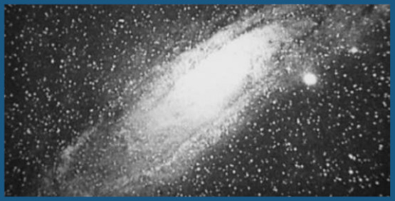
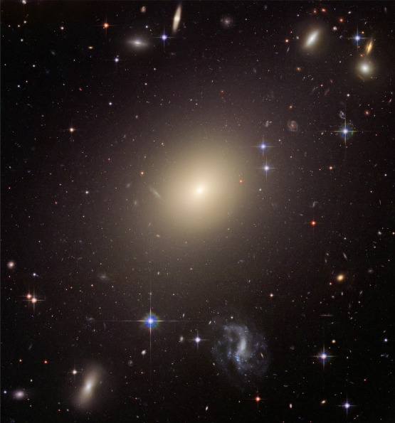
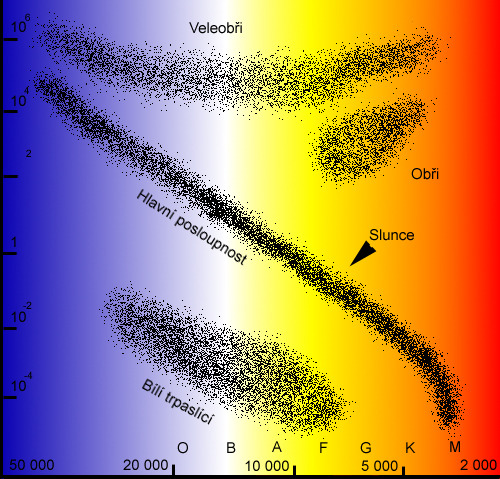

Říkali jste si někdy, co nastane dlouho poté, co naše sluneční soustava bude dávnou vzpomínkou z hlubin času a naše galaxie bude k nepoznání? Jak skončí vesmír? Kam až můžete vyslat své příběhové hrdiny a co „tam“ spatří?

Eschatologie provázela lidstvo odjakživa, i když výraz samotný je samozřejmě mladší. Jde o „nauku o věcech posledních“. Až v poslední době ale vznikla „vědecká eschatologie“ – posuzování „zániku světa“ na základě našich poznatků o něm. Podívejme se napřed na naši sluneční soustavu. Slunce je momentálně zhruba v polovině své existence na hlavní posloupnosti, kde hvězdy spalují ve svém jádře vodík na helium. Až se tyto zásoby za asi pět miliard let vyčerpají, stane se rudým obrem spalujícím vodík ve své vnější obálce. Projde ještě dalšími stadii, kdy začne spalovat helium v jádře na těžší prvky. Pak, už relativně nedlouho po jasném zážehu helia v obálce, mu dojde palivo. Odhodí svou vnější obálku a stane se velmi pomalu chladnoucím bílým trpaslíkem. Z odhozeného materiálu vznikne kolem soustavy planetární mlhovina, která přetrvá tisíce až desetitisíce let – ani ne mrknutí oka v kosmickém měřítku.

Jak dopadne Země? Je možné, že v době svého největšího rozpínání Slunce dosáhne až k její dráze a pohltí ji. Možná ale ne – a pak záleží na tom, jestli si planeta udrží stabilní dráhu, posune se na vzdálenější nebo se naopak přiblíží a bude stejně pohlcena. Už dávno předtím ale nebude obyvatelná, přinejmenším pro život, jak ho známe. Pro nás bude kvůli zjasňování Slunce neobyvatelná už za přibližně půlmiliardu let či o trochu déle, plus minus podle rozložení kontinentů, vývoje klimatických zpětných vazeb či fungování nových ekosystémů.

Ale dejme tomu, že odsud unikneme už dávno předtím, než k tomu dojde. Jaká budoucnost nás čeká dál? Naše galaxie brzy bude vypadat jinak, než jsme zvyklí. Přibližně za čtyři miliardy let dojde k její srážce se spirální galaxií v Andromedě, která se k nám přibližuje. Nepředstavujte si to ovšem jako katastrofální kolizi, kdy do sebe začnou narážet hvězdy a planety. Hvězdy jsou v galaxii daleko od sebe, celé světelné roky. Nejtěsněji „naskládané“ jsou poblíž galaktického jádra a především při okrajích galaxie v kulových hvězdokupách, kde jsou vzdálenosti mezi nimi zcela běžně pod světelný rok.

Kolize tedy nečekejte – galaxie se spíše prolnou, projdou sebou a po vzájemném kosmickém tanci splynou v jedinou eliptickou galaxii. Některé hvězdy možná budou „gravitačně vykopnuty“ mimo galaxii, ale z celkového množství půjde o hrstku. V době splynutí zřejmě dojde ke zvýšené tvorbě hvězd díky zhuštění oblak plynu v mnoha oblastech a je také možné, že nově vzniklá galaxie bude mít díky množství plynu nějakou dobu aktivní jádro.

Pořád jsme ale jen pár miliard let v budoucnosti. Co se podívat měřítkem trilionů let? Zásoby mezihvězdného plynu v „hvězdných porodnicích“ nejsou nekonečné. Tvorba hvězd se bude postupně zpomalovat. Pravda, ty nejméně hmotné hvězdy si mezitím budou v klidu zvolna spalovat své vodíkové palivo – minimální hmotnost potřebná pro zažehnutí termonukleární reakce v nitru hvězdy není ani desetina hmotnosti Slunce. Výsledný červený trpaslík na samotném dolním konci hmotnosti hvězd je pak velikostí podobný Jupiteru, byť mnohem hmotnější, a je poměrně chladný. Příkladem je třeba známý TRAPPIST-1. Takové hvězdy mohou poklidně existovat celé triliony let, než vyčerpají svou zásobu vodíku a postupně se vyvinou v heliové bílé trpaslíky, kterým pak zabere ještě neskutečně déle, než vychladnou na teplotu kosmického pozadí.

Ovšem i dolní hranice hmotnosti hvězd se postupně změní, jak se bude zvyšovat metalicita vesmíru. Pro astronomy jsou „kovy“ veškeré prvky kromě vodíku a helia. Současné hvězdy mají výrazně různou metalicitu podle toho, kde a kdy se zrodily, ale do budoucna se bude jedině zvyšovat, jak se tyto kovy uvolňují při odhození obálek rudých obrů, výbuších supernov a dalších událostech spojených s koncem života hvězd. Vyšší metalicita vede k efektivnějšímu ochlazování, nižším teplotám a pomalejší, delší hvězdné existenci. Nejméně hmotné hvězdy by v budoucnosti mohly mít poloviční hmotnost oproti současným „nejtrpaslíkovanějším trpaslíkům“ a na rozdíl od hnědých trpaslíků, objektů na hranici mezi hvězdou a planetou, skutečně splňovat kritérium hvězdných termonukleárních reakcí navzdory extrémně nízké teplotě. Ta by mohla být i kolem 0 stupňů Celsia (273 K). Představte si hvězdu pokrytou vodním ledem! I tak podivná tělesa se jednou vyskytnou v našem vesmíru. A to jsme stále v jeho mládí …

Jednou ale nevyhnutelně dojde ke chvíli, kdy už nebude dost plynu k tvorbě hvězd a existence i těch nejmenších hvězd se nachýlí ke konci. Nastává konec hvězdné éry … Většina hmoty bude soustředěna v černých dírách, neutronových hvězdách, chladnoucích bílých a hnědých trpaslících. Co planety? Ty, které nezanikly například vinou svých hvězd, stále budou existovat, avšak i ty nejmladší už dávno nebudou mít dost vnitřního ohřevu radioaktivním rozpadem, aby si udržely aktivní geologickou činnost a třeba i život. Snad jen slapové jevy budou ještě některým dodávat dostatek energie. Jen občas oblohu prozáří nějaká ta supernova, když dojde ke vzácné kolizi bílých trpaslíků či neutronových hvězd.

Co se stane kupříkladu s temnou hmotou? To záleží na tom, z čeho je vlastně složena, a zatím existuje více možností. I když osud temné hmoty ovlivní vývoj pozůstatků galaxií a černých děr, nechejme je tedy prozatím stranou … A – co pak? Natolik vzdálená budoucnost vesmíru se bude odvíjet například od toho, zda a jak rychle dochází k rozpadu protonu, spolu s neutronem jedné ze základních stavebních jednotek atomárních jader. Osud protonu částečně ovlivní osud bílých a hnědých trpaslíků a planet – šlo by ovšem i velmi mizivý zdroj energie, i pokud k němu dojde, ale povede k úbytku hmoty těchto objektů díky vyzařování. Časem se de facto vypaří do ztracena – a dokonce i černé díry se postupně odpaří díky Hawkingovu záření.

Tak. Skončili jsme s vesmírem, kde už z našeho pohledu téměř nic nezůstalo. Je temný a prázdný. Čas tu pozbývá smysl. Existuje ještě nějaká budoucnost? Záleží na tom, zda se bude zrychlovat rozpínání vesmíru, zpomalí se či zastaví, nebo dokonce dojde k jeho obrácení. A vznikne něco zajímavého třeba díky fluktuacím energie vakua? Natolik vzdálený osud vesmíru je už pro nás těžko představitelný. Možná to bude absolutní konec, možná povede ke vzniku nového … ale to už přenechejme budoucím kosmologům. Z našeho pohledu je totiž budoucnost nesmírná a jasná. Do konce hvězdné éry máme naštěstí ještě nepředstavitelně daleko.

_Hlavním zdrojem byl Adams & Laughlin (1997) – starší, ale stále relevantní a nesmírně zajímavá práce. Ohledně moderní kosmologie by se dalo čerpat z mnoha dalších prací, nicméně hlavní otázky nastíněné Adamsem a Laughlinem (Jaká je povaha temné hmoty? Dochází k rozpadu protonu? Jakou roli bude mít energie vakua?) jsou stále s jistotou nezodpovězené. Na snahu nalézt odpovědi nicméně zbývá času víc než dost …_
