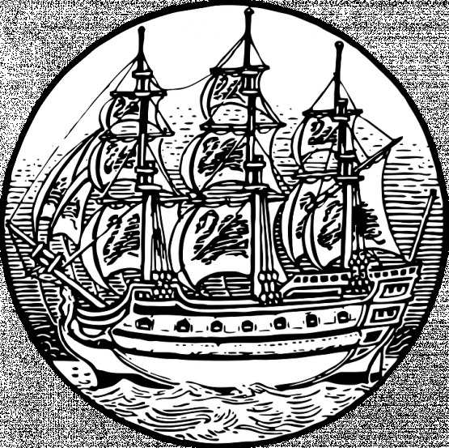

Ostřílený námořní vlk a veterán tuctu námořních střetnutí, který se cítí nejjistěji na palubě lodi na rozbouřeném moři, zatímco na suché zemi se pohybuje nejistým krokem. Jeho silné paže a hruď zdobí tetování orientálních draků a jeho zachmuřený pohled budí respekt. Na rozdíl od důstojnické šavle nosí u pasu jako ostatní členové posádky nebezpečně vyhlížející palaš, se kterým se oháněl už jako poddůstojník.

Svou kariéru začínal jako člen posádky v rámci západoafrické eskadry, která měla za úkol lapat otrokářské lodě, které se pokoušely propašovat svůj opovrženíhodný náklad do amerických přístavů. Vyznamenal se zde, když při jedné z šarvátek zachránil svého kapitána, když palašem sťal ruku s pistolí muži, který chtěl vystřelit na velícího důstojníka. Během nasazení na Dálném východě už byl zástupcem velitele HMS Ajax a účastnil se tažení proti jihočínským pirátům. Jeho loď byla v eskadře, která rozprášila pirátskou flotilu Šap-ng-tsaje, a Galaway byl vždy první v čele výsadků, které obsadily a pak potopily nepřátelské džunky. Následujících deset let byl Ajax umístěn v rámci eskadry v Hong Kongu a udělal si nepřátele mezi tajuplnou čínskou organizací Rudého lotosu, když zmařil několik jejich zlověstných plánů v kantonech. Během druhé opiové války už byl kapitánem Ajaxu a vedl ho do bitev proti čínskému námořnictvu i dělostřeleckých duelů s přístavními pevnostmi.

Zatímco HMS Ajax je po dlouhém nasazení na téměř rok umístěn do londýnských doků ke generální opravě, kapitán Galaway je na velením nařízené dovolence (první od doby, kdy se stal námořníkem), aby si odpočinul a byl připraven vyplout, až bude jeho loď hotova zvednout kotvu. Bydlí tak v Londýně u přítele své rodiny spolu se svým čínským sluhou Žengem. Každý den v docích kontroluje, jak pokračují opravy jeho lodi a také je častým návštěvníkem čínské čtvrti v Londýně. Zvěstem, že jej fanatičtí vrahové Rudého lotosu následovali až do Londýna, se jen ušklíbá.

# Aspekty

## HMS Ajax

Ta loď je víc součástí kapitána Galawaye, než si on sám připouští. Zná každý její kout a dokáže ji vést vstříc vlnám, větru i bouři. Přestože je teď v opravě, byla by stále teoreticky schopna vyplutí. Její posádka je na polovičním platu, a přestože mnozí odjeli domů za rodinami, hodně jich je v Londýně a okolí … a pokud jejich kapitán zavolá, jsou hotovi následovat ho do pekla a zpět.

## Ženg

Byl původně jedním z pirátů Čuj A-pooa, ale Galaway ho po zajetí zachránil před oprátkou, takže se stal jeho sluhou a od té doby jej následuje jako věrný pes. Vypadá jako nenápadný málomluvný Číňan s dlouhým copem a jinak vyholenou hlavou, ale zdání může klamat. Ovládá mistrně bojová umění a dokáže přehodit přes hlavu hromotluka dvakrát většího než je sám. Pro svého pána vyřizuje různé pochůzky, ale je připraven zmařit všechny pokusy o jeho život.

## Opiové vize

Na Dálném východě vyzkoušel tak jako mnozí jiní opium. Zjistil, že jeho požití u něj nevyvolává euforické stavy jako u ostatních, ale podivné sny a vize, které mají tendence se často naplnit. Naučil se naslouchat varování, která takto dostává a naučil se respektovat věci běžným zrakům skryté. Často se vyhnul ráně, která by jej jinak připravila o hlavu, protože ji ve vizi už viděl padnout.

# Dovednosti

__◆◆◆__ __Přirozená autorita__

Kapitán Galaway je zvyklý vydávat rozkazy o kterých se nedebatuje. Jeho slovo je zákon a jeho autorita absolutní.

__◆◆__ __Palaš__

Ohání se jím už dlouhé roky a držel ho v nejedné šarvátce na palubě i na zemi.

__◆◆__ __Námořnictví__

Vedení lodi v bitvě i na mořích, stejně jako znalosti, které získal za léta služby.

__◆◆__ __Sny a vize__

Opium v něm probouzí schopnost vidět cesty a možnosti, které mu nejednou pomohly.

__◆__ __Orientační smysl__

Dokud vidí hvězdy nebo má po ruce kompas, Galaway se jen málokdy ztratí.

__◆__ __Znalost Dálného východu__

Byl tam umístěn přes dvacet let, takže se dokáže domluvit v několika zdejších jazycích a zná tamější kulturu i zvyky.

__◆__ __Vyjednávání__

Málokdy se mu chce, ale když se mu zlíbí, umí starý mořský vlk být více než ucházejícím diplomatem.

