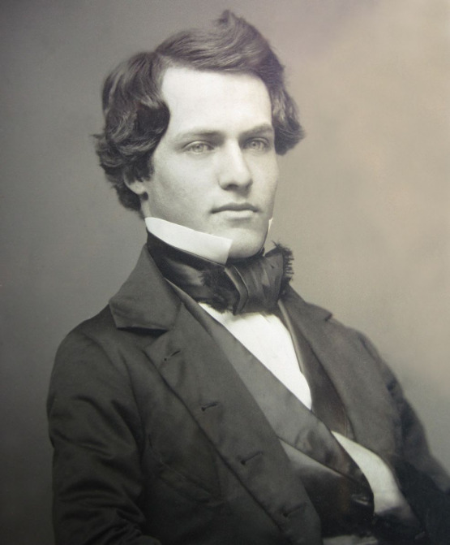

Když jsem byla před časem dotázána, jaké články o RPG bych ráda četla v Drakkaru (a jestli nechci takový napsat), dlouze jsem se zamyslela. Nejdřív jsem to chtěla odmávnout, že teoretické články o RPG stejně téměř nečtu, a tedy bych je neměla ani psát, ale pak jsem se zamyslela nad tím, co jedna z veledůležitých složek mé zábavy při hraní – tvorba a následné hraní snad až maniakálně komplexních postav. Protože postava je přesně to křeslo v pokoji tvořeném prostředím, DM a ostatními hráči, skrz které hráč prožívá příběh. A já jsem na svoje křesla poměrně náročná; musí být pohodlná, musí se mi líbit a musí přežít moje občas velmi brutální zacházení. Aby bylo lépe vidět, co se vlastně snažím sdělit, rozhodla jsem se jít formou příkladu – jednotlivé části rozeberu na jedné ze svých dlouho hraných postav. A malé upozornění: vůbec se nebudu věnovat číselným statistikám, užitečnosti ve hře a tak dále, zabývám se postavou z čistě narativního hlediska.

◆ ◆ ◆

# Kým chci být?

Říká se, že hráči mají tendenci své postavy opakovat, či dokonce hrát pořád sami sebe. Toto tvrzení není úplně nepravdivé – člověk rád hraje něco, co ho baví a co pro něj není zároveň příliš extrémně náročné, zejména v dlouhodobější kampani. Z tohoto úhlu pohledu je trochu nemoudré vybírat postavu, o níž vím, že pro mne bude náročná. Na té židli budu sedět možná několik let, neměla by být moc ostnatá. Můj oblíbený pohodlný archetyp je hyperaktivní divný mág s tragickou minulostí, hromadou obskurních vědomostí, bez výjimky bisexuál či homosexuál; umožňuje-li to hra, tak navíc ještě elf, se silně vyhraněným postojem k náboženství a velmi antisystémový typ. Může to vypadat jako kupa poměrně zvláštních požadavků, ale jsou ve skutečnosti velmi dobře přenositelné mezi jednotlivými herními prostředími, jen si je nutno uvědomovat, jakým jazykem konkrétní svět promlouvá. To, co je v klasické fantasy mág, může být ve viktoriánské Anglii umělec s mystickými sklony a v současnosti nebo budoucnosti programátor či hacker. Jen je nutno vědět a důkladně se zamyslet, koho chci hrát, ideálně si též položit otázku proč. Já si potrpím na extrémy a extrémní kontrasty a jedním ze zásadních požadavků, jaký mám na své postavy, je fakt, že musí být něčemu silně v opozici. Mimo jiné proto, že tohle nastavení generuje takřka nepřetržitě nějaký typ napětí a určitého vnitřního konfliktu postavy, což ji interně burcuje k akci, kterou následně externě ventiluje. Tedy – zeptejte se sami sebe, co rádi hrajete, co byste rádi hráli a proč – a taky se podívejte na to, co jste hráli doteď. Opakují se vám některé typy postav? Nebo je to naopak každý pes jiná ves? Z jakého důvodu jsou stejné, z jakého důvodu jsou různé? Odpovědi na tyto otázky vám dodají klíče k základům vaší postavy.

# Kde vlastně jsme a jak se tam hodím?

Setting – či prostředí –, v němž se hra odehrává, je jedna z položek, které by měly určovat, jakou postavu si vlastně člověk složí. A další důležitou složkou je žánr. Hrajeme hrdinský epos ve Středozemi nebo frašku z Divokého západu? Pochopitelně, může být, že si zrovna někdo touží zahrát cestovatele časem a vesmírem, který bude čnět všude, nicméně i pro toto jsou žánry vhodnější a méně vhodnější a pro potřeby článku se hodlám zabývat případem, kdy hráč chce, aby jeho postava do prostředí organicky zapadla. To v žádném případě neznamená, že s ním nemůže kontrastovat, ale je dost rozdíl, je-li postava divná v rámci světa, nebo z něj trčí jak kopí z mrtvoly. Proč je určení settingu tak podstatné? Svět nám totiž určuje, jakým jazykem bude postava mluvit, na jaké symboly bude reagovat, kým může v jeho rámci být, dává nám kategorie a hranice, v nichž můžeme stavět.

Jeden ze settingů, ve kterém hraju, se jmenuje Super Steam a jsou to ve své podstatě steampunkoví superhrdinové v lehce rozvinutější viktoriánské Anglii. Pro zjednodušení všeho, zejména zapojení oblíbených historických postav, bylo řečeno, že je to devatenácté století bez bližšího určení, tedy se nám tam mohou potkávat lidé, kteří se reálně potkat spíš nemohli, ať už se jedná o osoby existující historicky či literárně. Žánrově se pohybujeme někde mezi gotickým románem a penny dreadful (český ekvivalent je morzakor, ale nevím, není-li tento termín ještě nesrozumitelnější). Jak si tam naimportovat elfího mága, když tam jsou jenom lidé a magická povolání (pomineme-li superschopnosti, ale ty mají všechny hráčské postavy a také některá NPC) neexistují?

Vlastně velmi jednoduše. Postava má být vzdělaná – bude to aristokrat, kdo jiný se tehdy mohl snadno dostat ke vzdělání. Poloviční Ir, ať má v sobě trochu zdravé pověrčivosti, alkoholismu a není to anglická leklá ryba. S aristokratickým původem se snadno spojí některá traumata (studená výchova, odporná střední škola), která používám k vybudování některých vzorců chování. Výstřednost zajistí povolání malíře, neb zhýralý, lehce vyšinutý umělec je báječná kostra, na kterou se dá navěsit kdeco. A protože Sadako ráda čte divné staré věci, bude i on číst divné staré věci. Nerada hraju rodinné vztahy a čím víc traumat, tím líp – tedy měl milovanou sestru, která mu zemřela na chrlení krve, otec ho nesnáší, matka zešílela po sestřině smrti. V nějakém realistickém dramatu by asi tahle zrůdička působila trochu nepatřičně, ale na plochu gotickým románem inspirovaného RPG se perfektně hodí. A co se týče elfovitosti – nikdo a nic mi nebránilo popsat fyzicky postavu de facto jako elfa bez špičatých uší (tato má preference je pohříchu estetická, zmiňuji ji proto, že si lidé mohou potrpět na různé zvláštnosti a že není důvod si je nedopřát i v místě, kde vlastně neexistují, jen je nutno postupovat trochu kreativně). Co jsem se snažila říci – podívejte se na své požadavky, podívejte se na vaše prostředí a zkuste svá přání přeložit do jazyka onoho prostředí. A to včetně jména postavy. Já používám takřka výhradně _mluvící_ jména, tj. taková, která popisují či označují nějaký zásadní povahový rys postavy, často poměrně komplexně. Výše zmiňovaná zrůdička sluje prvním jménem Tristram, což je kombinace velšského Drust (vzpoura) a Triest (zármutek), tj. akcentuje sklony k melancholii a antisystémovosti, dále upomíná na částečný velšský původ jeho matky a naráží taktéž na slavný román Tristram Shandy, jehož hlavní hrdina mimo jiné taky strašně zmateně vysvětluje věci. A jelikož je to správný aristokrat, má těch jmen několik a k tomu ještě superhrdinskou přezdívku, všechno podobně šíleně promlouvající – ve skutečnosti ne ke spoluhráčům, ale ke mně. Když něco pojmenujete, dáte tomu určitější tvar, přesnější obraz, snáze se potom upomíná, kdo a proč to vlastně je. Slovo – a tedy i jméno – je svého druhu kouzlo, kterým vytváříte nějakou část světa, v tomto konkrétním případě vaši postavu.

# Po čem touží moje postava?

Máme prostředí a postavu, která do něj snad nějak zapadá. Jaká bude její motivace? Ve hře je určitě nějaká metazápletka, ať už to je tradiční záchrana světa nebo něco méně ambiciózního, zkrátka nějaký cíl, na kterém budou všechny postavy a příslušná NPC spolupracovat. Já jako hráč vím, že chci hrát – ale co chce moje postava? Dobrá, asi skoro nikdo nechce, aby skončil svět, ale nějaká osobnější motivace pramenící z toho, co je postava zač, to celé osladí. Pochopitelně, zrovna tohle je něco, co se dá velmi snadno pořídit až někde cestou později ve hře; postava není neměnný dřevěný panák a je v pořádku, pokud nějak reaguje na situace, které se na ni valí. Kupříkladu výše zmiňovaný Tristram, který jestli něco nenávidí, tak je to křesťanský bůh a britské Impérium, skončil ve státní službě v postavení de facto svatého/anděla a ani nemrkl, protože se cestou šíleně a osudově zamiloval do svého Impériu oddaného kolegy. Mnou původně plánované zaječí úmysly úniku z oficiálních složek nebyly realizovány, neb mi tohle přišlo jako skvělý vývoj. A prvotní motivace byla extrémně jednoduchá a bývá u mých postav velmi častá – zvědavost, protože hráč samotný je zvědavý za půl galaxie. Jedna z mých nejoblíbenějších činností v jakékoli hře je průzkum prostředí a dalších postav a přicházení věcem na kloub. Tedy – motivace do začátku vlastně nemusí být vůbec nijak zašmodrchaná a hluboká, stačí něco, co rezonuje ve vás, bude vás to bavit hrát a čím zároveň můžete bez obav vybavit svého avatára. Další střípky a přání se dají zařídit cestou podle toho, co potkáte a kam se budete chtít s postavou vyvíjet.

# Charakterové vady, osobité črty, nesnesitelné zlozvyky

Nastává čas posledních kosmetických úprav. Každý člověk se skládá ze snůšky vlastností, které dohromady tvoří jedinečný obraz. Já totéž velmi ráda dopřávám i svým postavám v RPG, neb nejrůznější drobnosti pomáhají postavu jasně identifikovat v hloučku jiných. Chcete něco a jste na to příliš líní, nebo to v naší realitě nelze uvést v život? Baví vás něco hrát, ale rozhodně by vás to nebavilo žít? Od toho (nejen) tady jsou RPG. Tristram umí spoustu jazyků, protože Sadako by ráda uměla spoustu jazyků, ale je hrozně líná. Strašně moc a komplikovaně mluví, používá šílené analogie a zběsilé metafory, protože mě takhle baví hrát. Je nesmírně teatrální a patetický, protože mi to do toho prostředí gotického románu a k němu samotnému velmi sedí a líbí se mi malovat slovy lehce přepjaté obrazy. Taky si odtáhne do postele cokoli, co vypadá jako zajímavý muž, protože mě i GM to takhle baví hrát a je to mimo jiné skvělý způsob zjišťování informací, které se jinak zjišťují velmi obtížně. Je asi důležité znát míru takových drobností, aby to jednak nepilo krev okolí a jednak nebilo do očí jako charakterové změny profesora Snapea, nicméně to je něco, co záleží na GM, spoluhráčích a samotném prostředí hry; musíte odhadnout, co projde nebo se domluvit či zeptat, když si nejste jisti.

# Závěr

K výše zmíněnému bych už jen dodala pár linků, které používám jako nástroje pro tvorbu jmen postav a nejsou to náhodné generátory fantasy jmen. Předesílám, že nejsem lingvista ani nic podobného, takže nevím, nakolik jsou na níže uvedených stránkách přesní.

* [www.behindthename.com](https://www.behindthename.com/) jména a jejich význam, velmi dobré pokrytí od Afriky, přes Evropu až po Asii

* [www.etymonline.com](https://www.etymonline.com/) etymologie slov v současné angličtině aneb přes francouzštinu a starořečtinu až k indoevropským kořenům
